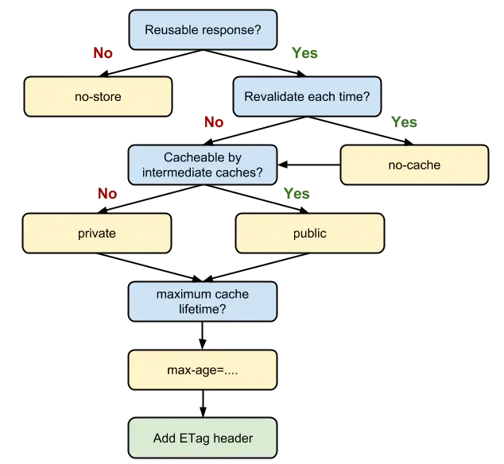

# web前端性能优化
## HTML 篇
在了解HTML方面的优化时，我们应该先了解浏览器构造dom树的过程，总的来说，浏览器构造dom树会发生以下几个阶段：
- （1）遇到 ``<`` 时，状态更改为标记打开；

- （2）当接受到一个a-z的字符时，会创建“起始标记”，状态更改为“标记名称状态”，并保持状态到接收``>``字符; 期间会形成一个标记名称，接收到``>``字符后，会把当前的新标记发送给树的构造器，状态改回“数据状态”；也就是说一个标签的开始；

- （3）当接收到下一个``/``字符时，会创建关闭标志、打开状态；接收``>``字符时，会将当前标记发送给树的构造器，并改回“数据状态”；

浏览器在创建解析器的同时，会创建document对象，在树的构建阶段，会以doc为根节点，不断的修改和添加各种标签；也就是说，每个标记都会有相应的dom，如下图，我们打印出浏览器宿主对象window下的document；


也就是说，我们在解析html标签的时候，会创建对应标记的dom，而每个dom的属性和元素也非常的庞大，一旦我们嵌套的层级越深，dom树就会越深，dom树在实际运用中是需要遍历的；

简单举一个例子：

```js
 // O(n) 复杂度，你会觉得没什么
 for(let i = 0; i<doc.length; i++){}

 // O(n^2) 复杂度，你可能会感觉到有点慢了
 for(let i = 0; i<doc.length; i++){
    for(let j = 0; j<doc[i].length; j++){}
 }

 // O(n^3) 复杂度，你可能会有点接受不了勒
 for(let i = 0; i<doc.length; i++){
    for(let j = 0; j<doc[i].length; j++){
      for(let k = 0; k<doc[i][j].length; k++){
        // 随着层级的加深，复杂度是指数级增加的，可想而知消耗的性能；
      }
    }
 }
```
所有，我们可以得出第一个HTML标签的性能优化策略：
1. 减少HTML的嵌套层级，即使你是使用react或者vue的框架，也应该避免过深的嵌套dom结构；

2. 减少空标签，无用标签的滥用，尽量多利用伪类``:before``,``:after``来完成一些例如画平行四边形的功能；

HTML标签对性能影响较大的其实是标签的属性和dom的频繁操作；dom频繁的操作会造成浏览器的频繁Reflow 和 Repaint; 这些问题具体是如何影响性能的？我们又应该如何来进行优化呢？

3. 标签的style属性
- style 属性可以直接写行内样式，一旦行内样式多又庞大，会增大html文件的体积，给解析器增加负担；降低解析性能；
- 同样，样式的维护性极低；不利于维护和可重用；

4. 标签的自定义属性
- 标签的自定属性会增加到dom结构的``attributtes``，合理的使用自定义属性可以减少dom创建之初的性能和后续遍历的性能； 

5. 合理利用模版引擎
- 模版引擎的原理，就是通过js计算dom结构的操作，利用innerHTML属性来减少重排重绘的性能；因为dom和js是存在很大的沟通成本的；前端三大框架，也是有异曲同工之秒；

6. Link 标签的秒用
- 首先多个link标签之间是异步加载的；不会有互相阻塞的问题；
- 浏览器下载link关联的资源不会停止对当前的文档处理；如果引用的是css文件，并且非常大，在一定程度上还是会对渲染造成影响；
- 其中link标签的rel属性，有一些值对性能提升有着一定的作用；
   - rel="prefetch"，prefetch原理实际上就是利用浏览器的空闲时间先下载用户指定的需要的内容，用户下次加载时，实际上是从缓存中加载，此时会发现请求状态码为304；
   - prefetch 的资源并不一定会加载，prefetch的作用并不在当前的页面，而在后续可能会访问的页面上，dns-prefetch其实也是一种预加载技术，只不过它是用来处理dns解析的；
- preload 是一项新的web标准，旨在提高web性能；让FE对资源的加载更加的细粒化；免受脚本加载器带来的性能损耗；
   - preload的做法其实是拆东墙补西墙的做法，牺牲掉一部分首屏渲染时间，来换取页面更加流程的导航，即利用浏览器空闲时间去加载资源，再次导航时候需要资源就不用再次发起请求了；

- caniuse.com 上可以查询rel的支持情况，目前谷歌浏览器较高的版本支持性都很好；

- preload 是个好东西，能告诉浏览器提前加载当前页面必须的资源，将加载与解析执行分离开，做得好可以对首次渲染带来不小的提升，但要避免滥用，区分其与 prefetch 的关系，且需要知道 preload 不同资源时的网络优先级差异。

- preload 加载页面必需的资源如 CDN 上的字体文件，与 prefetch 预测加载下一屏数据，兴许是个不错的组合。

7. 注意合理使用 img 标签
- img标签在加载的时候，格外注意得设置好图片的宽高，避免加载完成显示时候宽高不一致导致的重排；

8. 标签的src属性和href属性
- href 表示和当前页面的资源建立联系
- src 表示某个资源路径;
- 这两个属性为空时，一些浏览器会把当前页面当成资源来加载，会非常慢；排查时候误以为某个请求很慢，其实已经走偏了；

最后了解一下一些meta标签的使用
```js
<!-- uc强制竖屏 -->
<meta name="screen-orientation" content="portrait">
<!-- QQ强制竖屏 -->
<meta name="x5-orientation" content="portrait">
<!-- UC强制全屏 -->
<meta name="full-screen" content="yes">
<!-- QQ强制全屏 -->
<meta name="x5-fullscreen" content="true">
<!-- UC应用模式 -->
<meta name="browsermode" content="application">
<!-- QQ应用模式 -->
<meta name="x5-page-mode" content="app">

<!-- 启用360浏览器的极速模式(webkit) -->
<meta name="renderer" content="webkit">
<!-- 优先使用 IE 最新版本和 Chrome -->
<meta http-equiv="X-UA-Compatible" content="IE=edge,chrome=1"/>
<!-- 不让百度转码 -->
<meta http-equiv="Cache-Control" content="no-siteapp" />
<!-- 声明文档使用的字符编码 -->
<meta charset='utf-8'>

<meta name="viewport" content="width=device-width,initial-scale=1,maximum-scale=1,user-scalable=no,minimal-ui">

content的几个属性介绍: 
- width: viewport 的宽度[device-width | pixel_value]width如果直接设置pixel_value数值，大部分的安卓手机不支持，但是iOS支持；
- height: viewport 的高度(范围从223到10000)
- user-scalable: [yes | no] 是否允许缩放
- initial-scale : [数值] 初始化比例（范围从 > 0 到 10）
- minimum-scale : [数值] 允许缩放的最小比例
- maximum-scale:  [数值] 允许缩放的最大比例
- minimal-ui : IOS7.1的新属性，最小化浏览器UI
```

## CSS 篇
css 对于页面渲染的性能影响主要有以下几点：
- css选择器查询定位的效率
- 浏览器的渲染方式和css计算的算法；
- 需要渲染css文件的大小
相比其它层面的性能影响，css层面其实对性能影响不大，更多的是关注维护性和可读性上；

1. 合理的样式复用和继承，避免重复书写样式；
- 多处需要用到的样式，我们应该提取出来；
- 多利用样式的继承性质，可以减少样式的编写；比如font-size；
  - 可继承的样式大概为文本类、列表、表格、页面设置等；

2. 合理的书写样式；
- 尽量把一些影响重排的样式放在前面，不影响重排的放在后面，比如width和color;

3. 尽量避免同一类名，多次渲染；如``class-wrapper``，尽量只维护一个类名；

4. 少用高优先级选择器，慎用``!important``
- 我们先来看下选择器的优先级，即权重；
- !important(1, 0, 0, 0) > 内联style > id选择器(0, 1, 0, 0) > 类选择器(0, 0, 1, 0) > 标签|伪类|属性(0, 0, 0, 1) > 伪对象 > 通配符* > 继承

5. 忌层级过深的css选择器嵌套 
- 因为在层级过深的时候，浏览器在找的时候会对性能产生一定的影响；

6. 不用曾经的css表达式，如Expression(IE8 以前)

7. 不用通配符 *

8. 少用“昂贵”的样式成本
- 绘制阴影 box-shadow
- 绘制渐变 gradients
- 滤镜 filter
- 透明度 opacity
- 圆角 border-radius

9. 减少重排和重绘（重点）

10. 避免滥用 float
- float 也是css世界中提到的三无准则：不设宽，不设高，不浮动；
- float 在很多时候是可以利用display:inline-block来替代的，后者性能优于前者；

11. CSS Sprite 
- 多个小图标可以合成一个图，利用background-position来使用；减少请求数

12. 利用强大的CSS3，在CSS3里面，有很多利用到GPU加速渲染的属性；
- css tree + dom tree 组成的渲染树中，有大量待渲染的元素，这些元素会被分到一个渲染图层中，每个图层又会被载入GPU形成渲染纹理；图层在GPU中 transform 是不会触发repaint的，最终这样使用transform图层都会由独立的合成器进程处理；这样无需过分的处理就能完成所需的功能，使页面性能得以提升；

13. **CSS 是阻塞渲染的资源。需要将它尽早、尽快地下载到客户端，以便缩短首次渲染的时间。**

## javascript
js层级的优化，就必须得先弄清楚js的运行机制，在弄清楚运行机制后，写代码时必然会多一些考虑，从而达到性能提升的目的；当然，js层面的性能提升，也和代码的书写习惯方式，甚至代码功底有一定的关系；所以，扎实代码基本功是必不可少的；

1. 定时器是一把双刃剑，注意及时清除不用的定时器；

2. 能用CSS3完成的动画，就不要用js完成，因为操作的dom代码太高了；

3. 事件绑定
- 合理使用事件委托；减少事件绑定的消耗；
- 避免重复事件监听

4. 不需要使用的dom引用及时用null进行垃圾清楚，如``let dom = null``;

5. 合理使用闭包，不要滥用闭包；

6. 不要滥用全局变量；能用局部变量解决的事情不要用全局变量；

7. 减少不必要的变量频繁开辟，尽量利用局部缓存；

## 网路传输（资源加载）
网页性能很多时候取决于网络资源的加载，这里的资源包括媒体资源、信息资源、前端代码资源、后端资源等等；资源越多，所需的下载时间也就越长；并且资源加载到显示需要解析，解析时间越长，整体的页面性能也就越慢；时间长了，用户体验就非常的差；所以，资源加载主要从以下几方面入手：
- 资源解析
- 资源加载
- 资源缓存

1. DNS 优化
- 利用link 标签的 dns-prefetch 提前把页面可能跳转的域名进行dns解析；
- 当然现代浏览器比较智能，有些标签上的域名和当前页不在同一个域下，会提前进行解析；

2. CDN 的部署与缓存
- CDN 好比淘宝的菜鸟驿站或者京东的就近仓库，假设你买一件商品，在你本地仓库有，本地仓库发货肯定比外地仓库发货要快很多；
- CDN 的核心点有两个，一个是缓存，一个是回源。“缓存”就是说我们把资源 copy 一份到 CDN 服务器上这个过程，“回源”就是说 CDN 发现自己没有这个资源（一般是缓存的数据过期了），转头向根服务器（或者它的上层服务器）去要这个资源的过程。

3. 合理利用 HTTP 缓存
- 浏览器缓存策略
  - Cache-Control/Expires？有强缓存使用强缓存
  - ETag/if-None-match？有协商缓存使用协商缓存
  - Last-Modified/if-Modified-Since？
  - 没有过期则读取协商缓存，返回304
  - 过期直接按照正常的http请求返回200

- 缓存位置
  - Service Worker，PWA实现的基石；
  - memory Cache
  - Disk Cache
  - Push Cache，http/2 的服务端推送，会话阶段的缓存，当 session 终止时，缓存也随之释放；

- 浏览器策略
  - 比较大的JS、CSS文件会直接被丢进磁盘，反之丢进内存
  - 内存使用率比较高的时候，文件优先进入磁盘
  - 如果 Last-Modified 存在而其它缓存字段不存在，会启用一个启发式算法；缓存时间为：（Last-Modified - Date）* 10%，即报文生成时间和最后修改时间的差值乘以10%；

- Cache-Control 应用分析
  - s-maxage 优先级高于 max-age，两者同时出现时，优先考虑 s-maxage。
  - public 与 private 是针对资源是否能够被代理服务缓存而存在的一组对立概念。
  - no-store与no-cache，no-cache 绕开了浏览器直接进入协商缓存，no-store不使用任何的缓存；

- 缓存决策指南，我们直接看 Chrome 官方给出的这张图



当我们的资源内容不可复用时，直接为 Cache-Control 设置 no-store，拒绝一切形式的缓存；否则考虑是否每次都需要向服务器进行缓存有效确认，如果需要，那么设 Cache-Control 的值为 no-cache；否则考虑该资源是否可以被代理服务器缓存，根据其结果决定是设置为 private 还是 public；然后考虑该资源的过期时间，设置对应的 max-age 和 s-maxage 值；最后，配置协商缓存需要用到的 Etag、Last-Modified 等参数。

- 用户行为
  - 在“前进”“后退”“跳转”这些重定向动作中浏览器不会“夹带私货”，只用最基本的请求头，没有“Cache-Control”，所以就会检查缓存，直接利用之前的资源，不再进行网络通信。
  - 而 Ctrl+F5 强制刷新和点击刷新按钮，会和服务器进行通讯发起请求。

4. 本地存储
- WebApp 优异的性能表现，要归功于浏览器存储技术的广泛应用，这其中除了我们上节提到的缓存，本地存储技术也功不可没。
  - Cookie，不超过4KB，紧随域名，一个域名下的所有请求，都会携带 Cookie。可document.cookie读取；
  - Local Storage，除非手动删除，不然永久存在，容量5M，不会和服务器通许；
  - Session Storage 会话级别，不同的窗口不共享，容量5M；
  - Local Storage、Session Storage 和 Cookie 都遵循同源策略。

- 终极形态，IndexedDB；
  - 运行在浏览器上的非关系型数据库，容量无限制；

4. 懒加载

5. 分页加载

6. 区域无刷新ajax

7. css预处理和压缩
- css比较推荐使用预处理书写，如less sass；

8. js代码压缩
- Tree shaking，就是把没有用到的代码删除掉，减少js代码体积
```js
if(false){
   //todo....
   //不可达的代码，Tree shaking 会删除掉 
}
```
- js 代码压缩，删除没有必要的注释和调试代码；

5. Base64的妙用；
- Base64的原理是提升计算机解析的速度，但是在体积上会稍显劣势，也就是字节数比原理大；
- 以1kb为例：原ASCII需要找 1024 * 256 次，而base64最坏是 64 * 1365次；所有解析速度上占据了优势；
- Base64 是一种用于传输 8Bit 字节码的编码方式，通过对图片进行 Base64 编码，我们可以直接将编码结果写入 HTML 或者写入 CSS，从而减少 HTTP 请求的次数。

6. 图片资源
- WebP 格式是比较新的全能型选手，可以根据http请求来做兼容，的当 Accept 字段包含 image/webp 时返回WebP 格式图片；

## 页面渲染
前端工程师因为业务需要，免不了需要去处理不同浏览器下代码渲染结果的差异性。这些差异性正是因为浏览器内核的不同而导致的，因为浏览器内核决定了浏览器解释网页语法的方式。

浏览器内核可以分成两部分：渲染引擎（Layout Engine 或者 Rendering Engine）和 JS 引擎。早期渲染引擎和 JS 引擎并没有十分明确的区分，但随着 JS 引擎越来越独立，内核也成了渲染引擎的代称。渲染引擎又包括了 HTML 解释器、CSS 解释器、布局、网络、存储、图形、音视频、图片解码器等等零部件。

常见的浏览器内核可以分为这四种：Trident（IE）、Gecko（火狐）、Blink（Chrome、Opera）、Webkit（Safari）。

浏览器的渲染过程：


- HTML 解释器：将 HTML 文档经过词法分析输出 DOM 树（具体解析流程看上面）。

- CSS 解释器：解析 CSS 文档, 生成样式规则。
  - 浏览器是无法直接识别 CSS 样式文本的，因此渲染引擎接收到 CSS 文本之后第一件事情就是将其转化为一个结构化的对象，即styleSheets。
  - 这个格式化的过程过于复杂，而且对于不同的浏览器会有不同的优化策略；
  - 制台能够通过document.styleSheets来查看这个最终的结构。结构包含所有css的来源方式；
  - CSS 的解析过程与 DOM 的解析过程是**并行**的。

- 根据CSS Tree + DOM Tree 生成布局树。
  - 遍历生成的 DOM 树节点，并把他们添加到布局树中。
  - 计算布局树节点的坐标位置。


- 图层布局计算模块：布局计算每个对象的精确位置和大小。

- 视图绘制模块：进行具体节点的图像绘制，将像素渲染到屏幕上。

渲染过程说白了，首先是基于 HTML 构建一个 DOM 树，这棵 DOM 树与 CSS 解释器解析出的 CSS 树相结合，就有了布局渲染树。最后浏览器以布局渲染树为蓝本，去计算布局并绘制图像，我们页面的初次渲染就大功告成了。

之后每当一个新元素加入到这个 DOM 树当中，浏览器便会通过 CSS 引擎查遍 CSS 样式表，找到符合该元素的样式规则应用到这个元素上，然后再重新去绘制它。

有心的同学可能已经在思考了，查表是个花时间的活，我怎么让浏览器的查询工作又快又好地实现呢？见上文的CSS优化；

1. **CSS 是阻塞渲染的资源**。需要将它尽早、尽快地下载到客户端，以便缩短首次渲染的时间。
- 将 CSS 放在 head 标签里，尽早加载css资源；
- 启用 CDN 实现静态资源加载速度的优化；

2. JS 的阻塞
- JS 引擎是独立于渲染引擎存在的；
- JS 引擎抢会抢走渲染引擎的控制权。**阻塞CSS 和 DOM 的构建**
- 使用 defer 和 async 来避免不必要的阻塞；
  - 正常加载的js，会阻塞浏览器，浏览器必须等待 index.js 加载和执行完毕才能去做其它事情。
  - async 模式下，JS 不会阻塞浏览器做任何其它的事情。它的加载是异步的，当它加载结束，JS 脚本会立即执行。
  - defer 模式下，JS 的加载是异步的，执行是被推迟的。等整个文档解析完成、DOMContentLoaded 事件即将被触发时，被标记了 defer 的 JS 文件才会开始依次执行。
  - 只有defer可以保证多个脚本异步加载的JS按照引入顺序执行；因为async加载完就会立即执行；

3. 减少重排重绘的和操作dom的过路费；（参考渲染过程图）
- 读写 offset族、scroll族和client族属性的时候，浏览器为了获取这些值，需要进行回流（重排）操作 
- 调用 window.getComputedStyle 方法也会，还有一些几何属性样式等等；

- 回流（重排）过程
  - 生成dom（如果dom发生改变） -> 计算样式 -> 生成布局树 -> 建图层树 -> 生成绘制列表

- 重绘过程，会重新走一遍带Y流程；
  - 生成dom（N） -> 计算样式（Y） -> 生成布局树（N） -> 建图层树（N） -> 生成绘制列表（Y）

- 少交过路费
  - js操作dom是需要用API来调用的，也就是会产生性能消耗；
  - 把操作dom的部分尽量在js内完成，实际上前端框架也是这么干的；
  - 多利用文档碎片和innerHTML这样的属性，保证只会发生一次文档回流；

4. Event loop
- Event loop流程：执行一个宏任务并出队 -> 执行微任务至队列为空 -> 执行渲染操作 -> 处理worker任务
- 我们更新 DOM 的时间点，应该尽可能靠近渲染的时机。当我们需要在异步任务中实现 DOM 修改时，把它包装成 micro 微任务是相对明智的选择。**因为微任务更加靠近渲染操作。**

5. 图片懒加载
- 当前可视区高度
```js
// document.documentElement.clientHeight 兼容IE
const viewHeight = window.innerHeight || document.documentElement.clientHeight 
``` 
- 利用可视区高度大于等于元素距离可视区顶部；这就是懒加载的原理；
```js
// data-src先占坑放置图片资源；
</img>
// 获取所有的图片标签
const imgs = document.getElementsByTagName('img')
// 获取可视区域的高度
const viewHeight = window.innerHeight || document.documentElement.clientHeight
// num用于统计当前显示到了哪一张图片，避免每次都从第一张图片开始检查是否露出
let num = 0
function lazyload(){
    for(let i=num; i<imgs.length; i++) {
        // 用可视区域高度减去元素顶部距离可视区域顶部的高度
        let distance = viewHeight - imgs[i].getBoundingClientRect().top
        // 如果可视区域高度大于等于元素顶部距离可视区域顶部的高度，说明元素露出
        if(distance >= 0 ){
            // 给元素写入真实的src，展示图片
            imgs[i].src = imgs[i].getAttribute('data-src')
            // 前i张图片已经加载完毕，下次从第i+1张开始检查是否露出
            num = i + 1
        }
    }
}
// 监听Scroll事件，scroll还可以加防抖；
window.addEventListener('scroll', lazyload, false);

// 第二种方案
function lazyload() {
  for(let i = count; i < num; i++) {
    // 元素现在已经出现在视口中
    if(img[i].getBoundingClientRect().top < document.documentElement.clientHeight) {
      if(img[i].getAttribute("src") !== "default.jpg") continue;
      img[i].src = img[i].getAttribute("data-src");
      count ++;
    }
  }
}
```

6. 节流与防抖
- Throttle： 第一个人说了算，用时差差；
```js
// fn是我们需要包装的事件回调, interval是时间间隔的阈值
function throttle(fn, interval) {
  // last为上一次触发回调的时间
  let last = 0
  // 将throttle处理结果当作函数返回
  return function () {
      // 保留调用时的this上下文
      let context = this
      // 保留调用时传入的参数
      let args = arguments
      // 记录本次触发回调的时间
      let now = +new Date()
      // 判断上次触发的时间和本次触发的时间差是否小于时间间隔的阈值
      if (now - last >= interval) {
      // 如果时间间隔大于我们设定的时间间隔阈值，则执行回调
          last = now;
          fn.apply(context, args);
      }
    }
}
// 用throttle来包装scroll的回调
const better_scroll = throttle(() => console.log('触发了滚动事件'), 1000)
document.addEventListener('scroll', better_scroll)
```
- Debounce： 最后一个人说了算，用定时器；
```js
// fn是我们需要包装的事件回调, delay是每次推迟执行的等待时间
function debounce(fn, delay) {
  // 定时器
  let timer = null
  // 将debounce处理结果当作函数返回
  return function () {
    // 保留调用时的this上下文
    let context = this
    // 保留调用时传入的参数
    let args = arguments
    // 每次事件被触发时，都去清除之前的旧定时器
    if(timer) {
        clearTimeout(timer)
    }
    // 设立新定时器
    timer = setTimeout(function () {
      fn.apply(context, args)
    }, delay)
  }
}
// 用debounce来包装scroll的回调
const better_scroll = debounce(() => console.log('触发了滚动事件'), 1000)
document.addEventListener('scroll', better_scroll)
```
debounce 最后一个人说了算，但是频繁触发，用户等待太久怎么办？？？用节流优化防抖，一定时间内马上给出回应；
```js
// fn是我们需要包装的事件回调, delay是时间间隔的阈值
function throttle(fn, delay) {
  // last为上一次触发回调的时间, timer是定时器
  let last = 0, timer = null
  // 将throttle处理结果当作函数返回
  return function () { 
    // 保留调用时的this上下文
    let context = this
    // 保留调用时传入的参数
    let args = arguments
    // 记录本次触发回调的时间
    let now = +new Date()
    // 判断上次触发的时间和本次触发的时间差是否小于时间间隔的阈值
    if (now - last < delay) {
    // 如果时间间隔小于我们设定的时间间隔阈值，则为本次触发操作设立一个新的定时器
       clearTimeout(timer)
       timer = setTimeout(function () {
          last = now
          fn.apply(context, args)
        }, delay)
    } else {
        // 如果时间间隔超出了我们设定的时间间隔阈值，那就不等了，无论如何要反馈给用户一次响应
        last = now
        fn.apply(context, args)
    }
  }
}
// 用新的throttle包装scroll的回调
const better_scroll = throttle(() => console.log('触发了滚动事件'), 1000)
document.addEventListener('scroll', better_scroll)
```

7. Performance、LightHouse 与性能 API
- Performance 谷歌浏览器可以直接看到整个性能的橄榄图
- LightHouse 可以在谷歌扩展工具里面使用，也可以直接npm下载；
```js
npm install -g lighthouse
lighthouse https://juejin.im/books
```
- 访问 performance 对象，控制台里输入 window.performance，就可一窥其全貌；


```js
// 关键的时间节点差计算出性能消耗；
const timing = window.performance.timing
// DNS查询耗时
timing.domainLookupEnd - timing.domainLookupStart
  
// TCP连接耗时
timing.connectEnd - timing.connectStart
 
// 内容加载耗时
timing.responseEnd - timing.requestStart
```

- 其次，通过访问 performance 的 memory 属性，我们还可以获取到内存占用相关的数据；
- 除了这些常见的耗时情况，我们更应该去关注一些关键性能指标：firstbyte、fpt、tti、ready 和 load 时间。这些指标数据与真实的用户体验息息相关，是我们日常业务性能监测中不可或缺的一部分：
- 更多详情可查看MDN文档，https://developer.mozilla.org/zh-CN/docs/Web/API/Performance；
- 其它性能埋点文章：https://mp.weixin.qq.com/s/DJ8Fdq1_cIoW0_NYekZwFw
```js
// firstbyte：首包时间	
timing.responseStart – timing.domainLookupStart	

// fpt：First Paint Time, 首次渲染时间 / 白屏时间
timing.responseEnd – timing.fetchStart

// tti：Time to Interact，首次可交互时间	
timing.domInteractive – timing.fetchStart

// ready：HTML 加载完成时间，即 DOM 就位的时间
timing.domContentLoaded – timing.fetchStart

// load：页面完全加载时间
timing.loadEventStart – timing.fetchStart
```

8. requestAnimationFrame
- 传统的 javascript 动画是通过定时器 setTimeout 或者 setInterval 实现的。会存在以下两个问题；
  - 动画的循时间环间隔不好确定（不准确），设置长了动画显得不够平滑流畅，设置短了浏览器的重绘频率会达到瓶颈，推荐的最佳循环间隔是17ms（大多数电脑的显示器刷新频率是60Hz，1000ms/60）；
  - 第二个问题是定时器第二个时间参数只是指定了多久后将动画任务添加到浏览器的UI线程队列中，如果UI线程处于忙碌状态，那么动画不会立刻执行。
  - 为了解决这些问题，H5 中加入了 requestAnimationFrame;

- requestAnimationFrame优点 
  - 它的定义就是在浏览器下次绘制之前将会执行这个方法的回调；
  - requestAnimationFrame 会把每一帧中的所有 DOM 操作集中起来，在一次重绘或回流中就完成，并且重绘或回流的时间间隔紧紧跟随浏览器的刷新频率；
  - 在隐藏或不可见的元素中，requestAnimationFrame 将不会进行重绘或回流，这当然就意味着更少的 CPU、GPU 和内存使用量；
  - requestAnimationFrame 是由浏览器专门为动画提供的 API，在运行时浏览器会自动优化方法的调用，并且如果页面不是激活状态下的话，动画会自动暂停，有效节省了 CPU 开销

- requestAnimationFrame 本来就是为动画而生的；
- 粗浅的理解一帧所要干的事情：[宏任务->微任务->渲染/不渲染->空闲（可以放requestIdle）]
- requestAnimationFrame 的执行时机是 “下一次绘制前”，也就是渲染之前；
- 显然定时器创建的任务优先级是要低于 rAF 的。因为timer是宏任务，更容易被饿死；

```js
var deg = 0;
var id;
var div = document.getElementById("div");
div.addEventListener('click', function () {
    var self = this;
    requestAnimationFrame(function change() {
        self.style.transform = 'rotate(' + (deg++) + 'deg)';
        id = requestAnimationFrame(change);
    });
});
document.getElementById('stop').onclick = function () {
    cancelAnimationFrame(id);
};
```

## react框架

## 构建工具篇

## 项目总结
### 开发体验
1. 开发体验和效率
- 接手同事代码，发现代码风格每个人都不一致，甚至使用存在缺陷的js语法；（eslint 规则松散，增加code reviwer）
```js
  "husky": {
    "hooks": {
      "pre-commit": "npm run test:nowatch && npm run lint"
    }
  },
  "scripts": {
    "lint": "eslint --ext js,ts,tsx src --max-warnings 5",
  },
```

- 代码 0 注释，有些文件 1600 行一个组件，极难维护和阅读；（讨论分文件，上TS）
- 组件滥用过期的生命钩子，key的不正确使用，导致react组件的性能很差；（研究了源码）
- 写的代码也不关注性能问题，数据量大了会出现性能问题；（扎实基本功，学习了算法）
- 代码结构不友好，全部ajax请求走redux，redux不分模块存放，分文件；（应该分模块）

- development 打包时间极其缓慢；（优化webpack配置，增加构建缓存、多线程打包）
```js
1. 多线程打包happypack thread-loader；
2. 开启缓存，babel缓存，cache-loader，压缩缓存TerserPlugin；
3. 较少解析文件的范围```include exclude```
4. 分离第三方模块用 DllPlugin，尽量写上扩展名resolve.extensions，较少搜索；
5. resolve.alias 嵌套过深的使用别名，或者commo组件；
6. 减少首屏包体积，用react.lazy
```
- commit 信息混乱，无法快速定位模块；（husky + commitlint）

- 开发功能代码分支容易偏离主干，难以快速迭代更新；（没有CI/CD）


- css 冲突，没有打开css module 模块化；

2. 难点
- 封装的组件不灵活，可扩展性不强；（banner 为例，重新改变封装，然后关注了hooks）
- 组件滥用过期生命钩子，业务代码书写不关注性能；
- 有时候处理的数据相对复杂，有扎实的算法功底会很好处理；
- 优化数据量大的业务场景；antd 开启了react-window 虚拟长列表；
```js
场景：弹层从后端持续请求数据返回前端，前端需要修改商品属性；商品可以新增/删除、选择/不选择；
在渲染后端返回的数据存在两个问题：
1. 翻页以id为key。其实是不稳定的；因为翻页react需要消耗的性能更大；
2. 在对table页面操作的时候，用户会频繁的操作选和不选：
// 假设现在有50条数据；只操作了一条；
// 存在的商品就选上，用了O（m * n），而且是频繁的（50 * 50 = 2500）；
let result = result.filter((item) => selectArr.includes(item.id));

// 但是用set O（m + n）100 : 2500 = 1:25 了；
let hash = new Set(selectArr)
let result = result.map((item) => hash.has(item.id));
```

- 发现多处使用 SKU 算法问题，没有进行抽离封装；（抽离封装 回溯算法）
```js
// 源数据， 业务场景，用户动态选择属性，生产一个表格
// let arr = [{
//     id: 'color',
//     value: ['1', '2']
//   },
//   {
//     id: 'storage',
//     value: ['A', 'B']
//   },
//   {
//     id: 'small',
//     value: ['a', 'b']
//   }
// ]
// 排列组合成这样
// let tableData = [{
//     color: "1",
//     storage: "A",
//     small: "a"
//   },
//   {
//     color: "2",
//     storage: "A",
//     small: "a"
//   },
// ]

// 思路
// id:value 抽出来做一个整体。item = 3
// 很明显是回溯算法，满足三个（一个坑挑一个），出现过 map 记录

// 先把数据处理成这样：
// arr = [
//     { color:['1','2'] },
//     { storage:['A','B'] },
//     { small:['a','b'] }
// ]

const getPhoneList = (
   arr = [
     { color:['1','2'] },
     { storage:['A','B'] },
     { small:['a','b'] }
   ] 
  ) => {
  const res = []
  const backtrack = (arr, tempObj, set, idx) => {
    let str = Object.values(tempObj).join('')
    // 加入条件   
    if (str.length === arr.length && !set.has(str)) {
      set.add(str)
      res.push(tempObj)
    } else {
      // 剪枝
      if (idx >= arr.length) {
        return
      }
      // 选到了第几组属性
      for (let i = idx; i < arr.length; i++) {
        let itemObj = arr[i]
        let key = Object.keys(itemObj)[0]
        let valuesArr = itemObj[key]
        for (let j = 0; j < valuesArr.length; j++) {
          let val = valuesArr[j]
          tempObj[key] = val
          // 每组选属性一个
          backtrack(arr, {
            ...tempObj
          }, set, idx + 1)
          // 选完回溯
          delete tempObj[key]
        }
      }
    }
  }
  console.log(arr)
  backtrack(arr, {}, new Set(), 0)
  return res
}

console.log(getPhoneList())
```

3. 性能缺陷（优化）
- redux 模版代码极其严重，急速的增加了代码量（无用代码也很多，不报错），代码体积；（待解决，只是让他们少用redux;）
- 大量使用 !important 强制css优先级最高；
- 代码书写性能存在一定问题，比如频繁求两个数组的交集直接暴力求解；（基本功不扎实）
- 去掉外链css，react.lazy 实施懒加载；
- 使用动态 polyfill 减少包体积；
- dns-prefetch 提前解析域名；
- 上HTTP2协议，加速网络加载；
- 注意无关脚本defer；

4. 整体的网络架构？http 服务器？应用服务器？web服务器？
- http这些理论性的东西需要关注，但是更重要的需要关注贴合实际业务的东西；
- html文件放哪？
- 应用架构看明白；
- SSO 问题；(可以设置cookie)
- webpack 解决了什么问题？核心价值；
- 模块化，什么的模块化？