## 基本类型
1. Undefined；
2. Null；
3. Boolean；
4. String；String 有最大长度是 2^53 - 1，受编码格式影响；
5. Number；NAN，Infinity，-Infinity，三个例外；
```js
// 正确的比较方法应该用最小精度 Number.EPSILON
console.log( Math.abs(0.1 + 0.2 - 0.3) <= Number.EPSILON);
```
6. Symbol；在 ES6 规范中，整个对象系统被用 Symbol 重塑。
```js
var o = new Object
o[Symbol.iterator] = function() {
    var v = 0
    return {
        next: function() {
            return { value: v++, done: v > 10 }
        }
    }        
};
// 满足Symbol.iterator接口都可以用 for of
for(var v of o) 
    console.log(v); // 0 1 2 3 ... 9
```
7. Object;
- Number、String 和 Boolean，三个构造器是两用的，当跟 new 搭配时，它们产生对象，当直接调用时，它们表示强制类型转换。

- Symbol 函数比较特殊，直接用 new 调用它会抛出错误，但它仍然是 Symbol 对象的构造器。

## 类型转换

1. StringToNumber
- 30；十进制
- 0b111；二进制
- 0o13；八进制  
- 0xFF；十六进制
- NumberToString 比较符合直觉，日常开发较少，了解即可

2. 装箱转换
```js
var symbolObject = (function(){ return this; }).call(Symbol("a"));
console.log(typeof symbolObject); //object
console.log(symbolObject instanceof Symbol); //true
console.log(symbolObject.constructor == Symbol); //true
```
3. 拆箱转换
在 JavaScript 标准中，规定了 ToPrimitive 函数，它是对象类型到基本类型的转换（即，拆箱转换）。

拆箱转换会尝试调用 valueOf 和 toString 来获得拆箱后的基本类型。如果 valueOf 和 toString 都不存在，或者没有返回基本类型，则会产生类型错误 TypeError。
```js
var o = {
    valueOf : () => {console.log("valueOf"); return {}},
    toString : () => {console.log("toString"); return {}}
}
o * 2 //ecmascript 规范的默认顺序
// valueOf
// toString
// TypeError
String(o) 
// toString 
// valueOf 
// TypeError
```
在 ES6 之后，还允许对象通过显式指定 @@toPrimitive Symbol 来覆盖原有的行为。
```js
var o = {
    valueOf : () => {console.log("valueOf"); return {}},
    toString : () => {console.log("toString"); return {}}
}
o[Symbol.toPrimitive] = () => {console.log("toPrimitive"); return "hello"}
console.log(o + "")
// toPrimitive
// hello
```
4. typeof 
请注意 object——Null 和 function——Object 是特例，我们理解类型的时候需要特别注意这个区别。


## 对象
1. 对象具有唯一标识性：即使完全相同的两个对象，也并非同一个对象。
```js
var o1 = { a: 1 };
var o2 = { a: 1 };
console.log(o1 == o2); // false
```
2. 对象有状态：对象具有状态，同一对象可能处于不同状态之下。
3. 对象具有行为：即对象的状态，可能因为它的行为产生变迁。

总结一句话来看，在 JavaScript 中，对象的状态和行为其实都被抽象为了属性。

在实现了对象基本特征的基础上, 我认为，JavaScript 中对象独有的特色是：对象具有高度的动态性，这是因为 JavaScript 赋予了使用者在运行时为对象添改状态和行为的能力。
```js
var o = { a: 1 };
o.b = 2;
console.log(o.a, o.b); //1 2
```
为了提高抽象能力，JavaScript 的属性被设计成比别的语言更加复杂的形式，它提供了数据属性和访问器属性（getter/setter）两类。

### JavaScript 对象的两类属性
对 JavaScript 来说，属性并非只是简单的名称和值，JavaScript 用一组特征（attribute）来描述属性（property）。

1. 先来说第一类属性，数据属性。它比较接近于其它语言的属性概念。数据属性具有四个特征。
- value：就是属性的值。
- writable：决定属性能否被赋值。
- enumerable：决定 for in 能否枚举该属性。
- configurable：决定该属性能否被删除或者改变特征值。

2. 第二类属性是访问器（getter/setter）属性，它也有四个特征。
- getter：函数或 undefined，在取属性值时被调用。
- setter：函数或 undefined，在设置属性值时被调用。
- enumerable：决定 for in 能否枚举该属性。
- configurable：决定该属性能否被删除或者改变特征值。

我们通常用于定义属性的代码会产生数据属性，其中的 writable、enumerable、configurable 都默认为 true。我们可以使用内置函数 getOwnPropertyDescripter 来查看，如以下代码所示:
```js
var o = { a: 1 };
o.b = 2;
//a和b皆为数据属性
// {value: 1, writable: true, enumerable: true, configurable: true}
Object.getOwnPropertyDescriptor(o,"a") 
// {value: 2, writable: true, enumerable: true, configurable: true}
Object.getOwnPropertyDescriptor(o,"b") 
```

我们可以使用 Object.defineProperty 来修改
```js
var o = { a: 1 };
Object.defineProperty(o, "b", {
    value: 2, 
    writable: false, 
    enumerable: false, 
    configurable: true
});
//a 和 b都是数据属性，但特征值变化了
Object.getOwnPropertyDescriptor(o,"a"); 
// {value: 1, writable: true, enumerable: true, configurable: true}
Object.getOwnPropertyDescriptor(o,"b"); 
// {value: 2, writable: false, enumerable: false, configurable: true}
o.b = 3; //试图写值，但 writable === false
console.log(o.b); // 2
```

在创建对象时，也可以使用 get 和 set 关键字来创建访问器属性，代码如下所示： 
```js
var o = { get a() { return 1 } }; 
console.log(o.a); // 1
```
我们以上面的对象 o 为例，你可以想象一下“a”是 key。{writable:true,value:1,configurable:true,enumerable:true} 是 value。

## JavaScript 的原型
最为成功的流派是使用“类”的方式来描述对象，这诞生了诸如 C++、Java 等流行的编程语言。这个流派叫做基于类的编程语言。

还有一种就是基于原型的编程语言，它们利用原型来描述对象。我们的 JavaScript 就是其中代表。

如果我们抛开 JavaScript 用于模拟 Java 类的复杂语法设施（如 new、Function Object、函数的 prototype 属性等），原型系统可以说相当简单，我可以用两条概括：
1. 如果所有对象都有私有字段[[prototype]]，就是对象的原型；
2. 读一个属性，如果对象本身没有，则会继续访问对象的原型，直到原型为空或者找到为止。

这个模型在 ES 的各个历史版本中并没有很大改变，但从 ES6 以来，JavaScript 提供了一系列内置函数，以便更为直接地访问操纵原型。三个方法分别为：

1. Object.create 根据指定的原型创建新对象，原型可以是 null；
2. Object.getPrototypeOf 获得一个对象的原型；
3. Object.setPrototypeOf 设置一个对象的原型。

利用这三个方法，我们可以完全抛开类的思维，利用原型来实现抽象和复用。我用下面的代码展示了用原型来抽象猫和虎的例子。
```js
var cat = {
    say(){
        console.log("meow~");
    },
    jump(){
        console.log("jump");
    }
}
var tiger = Object.create(cat,  {
    say:{
        writable:true,
        configurable:true,
        enumerable:true,
        value:function(){
            console.log("roar!");
        }
    }
})
var anotherCat = Object.create(cat);
anotherCat.say();
var anotherTiger = Object.create(tiger);
anotherTiger.say();
```
考虑到 new 和 prototype 属性等基础设施今天仍然有效，而且被很多代码使用，学习这些知识也有助于我们理解运行时的原型工作原理，下面我们试着回到过去，追溯一下早年的 JavaScript 中的原型和类。

### 早期版本中的类与原型
在早期版本的 JavaScript 中，“类”的定义是一个私有属性 [[class]]，语言标准为内置类型诸如 Number、String、Date 等指定了[[class]]属性，以表示它们的类。

语言使用者唯一可以访问[[class]]属性的方式是 Object.prototype.toString。
```js
var o = new Object;
var n = new Number;
var s = new String;
var b = new Boolean;
var d = new Date;
var arg = function(){ return arguments }();
var r = new RegExp;
var f = new Function;
var arr = new Array;
var e = new Error;
console.log([o, n, s, b, d, arg, r, f, arr, e]
.map(v => Object.prototype.toString.call(v))); 
```

在 ES5 开始，[[class]] 私有属性被 Symbol.toStringTag 代替，Object.prototype.toString 的意义从命名上不再跟 class 相关。我们甚至可以自定义 Object.prototype.toString 的行为，以下代码展示了使用 Symbol.toStringTag 来自定义 Object.prototype.toString 的行为：
```js
var o = { [Symbol.toStringTag]: "MyObject" }
console.log(o + "");
```

## new 操作符
new 运算接受一个构造器和一组调用参数，实际上做了几件事：
1. 以构造器的 prototype 属性（注意与私有字段[[prototype]]的区分）为原型，创建新对象；
2. 将 this 和调用参数传给构造器，执行；
3. 如果构造器返回的是对象，则返回，否则返回第一步创建的对象。

## ES6 中的类
好在 ES6 中加入了新特性 class，new 跟 function 搭配的怪异行为终于可以退休了（虽然运行时没有改变），在任何场景，我都推荐使用 ES6 的语法来定义类，而令 function 回归原本的函数语义。下面我们就来看一下 ES6 中的类。

ES6 中引入了 class 关键字，并且在标准中删除了所有[[class]]相关的私有属性描述，类的概念正式从属性升级成语言的基础设施，从此，基于类的编程方式成为了 JavaScript 的官方编程范式。
```js
class Animal { 
  constructor(name) {
    this.name = name;
  }
  speak() {
    console.log(this.name + ' makes a noise.');
  }
}
class Dog extends Animal {
  constructor(name) {
    super(name); // call the super class constructor and pass in the name parameter
  }
  speak() {
    console.log(this.name + ' barks.');
  }
}
let d = new Dog('Mitzie');
d.speak(); // Mitzie barks.
```
一些激进的观点认为，class 关键字和箭头运算符可以完全替代旧的 function 关键字，它更明确地区分了定义函数和定义类两种意图，我认为这是有一定道理的。

## JavaScript 中的对象分类
1. 宿主对象（host Objects）：由 JavaScript 宿主环境提供的对象，它们的行为完全由宿主环境决定。
2. 内置对象（Built-in Objects）：由 JavaScript 语言提供的对象。
- 固有对象（Intrinsic Objects ）：由标准规定，随着 JavaScript 运行时创建而自动创建的对象实例。
- 原生对象（Native Objects）：可以由用户通过 Array、RegExp 等内置构造器或者特殊语法创建的对象。
- 普通对象（Ordinary Objects）：由{}语法、Object 构造器或者 class 关键字定义类创建的对象，它能够被原型继承。

## js代码执行
在 ES3 和更早的版本中，JavaScript 本身还没有异步执行代码的能力，这也就意味着，宿主环境传递给 JavaScript 引擎一段代码，引擎就把代码直接顺次执行了，这个任务也就是宿主发起的任务。

但是，在 ES5 之后，JavaScript 引入了 Promise，这样，不需要浏览器的安排，JavaScript 引擎本身也可以发起任务了。

由于我们这里主要讲 JavaScript 语言，那么采纳 JSC 引擎的术语，我们把**宿主发起的任务称为宏观任务，把 JavaScript 引擎发起的任务称为微观任务。**

### 宏观和微观任务
JavaScript 引擎等待宿主环境分配宏观任务，在操作系统中，通常等待的行为都是一个事件循环，所以在 Node 术语中，也会把这个部分称为事件循环。

这里每次的执行过程，其实都是一个宏观任务。我们可以大概理解：宏观任务的队列就相当于事件循环。

在宏观任务中，JavaScript 的 Promise 还会产生异步代码，JavaScript 必须保证这些异步代码在一个宏观任务中完成，因此，每个宏观任务中又包含了一个微观任务队列。

有了宏观任务和微观任务机制，我们就可以实现 JavaScript 引擎级和宿主级的任务了，例如：Promise 永远在队列尾部添加微观任务。setTimeout 等宿主 API，则会添加宏观任务。

### Promise
Promise 是 JavaScript 语言提供的一种标准化的异步管理方式，它的总体思想是，需要进行 io、等待或者其它异步操作的函数，不返回真实结果，而返回一个“承诺”，函数的调用方可以在合适的时机，选择等待这个承诺兑现（通过 Promise 的 then 方法的回调）。
```js
function sleep(duration) {
    return new Promise(function(resolve, reject) {
        setTimeout(resolve, duration);
    })
}
sleep(1000).then( ()=> console.log("finished"));
```

Promise 的 then 回调是一个异步的执行过程，下面我们就来研究一下 Promise 函数中的执行顺序，我们来看一段代码示例：
```js
// a b c
var r = new Promise(function(resolve, reject){
    console.log("a");
    // resolve 以后会在当前的宏任务添加微任务；
    resolve()
});
r.then(() => console.log("c"));
console.log("b")
```

我们发现，不论代码顺序如何，d 必定发生在 c 之后，因为 Promise 产生的是 JavaScript 引擎内部的微任务，而 setTimeout 是浏览器 API，它产生宏任务。
```js
var r = new Promise(function(resolve, reject){
    console.log("a");
    resolve()
});
setTimeout(()=>console.log("d"), 0)
r.then(() => console.log("c"));
console.log("b")
```

为了理解微任务始终先于宏任务，我们设计一个实验：执行一个耗时 1 秒的 Promise。
```js
// c1 c2 d
setTimeout(()=>console.log("d"), 0)
var r = new Promise(function(resolve, reject){
    resolve()
});
r.then(() => { 
    var begin = Date.now();
    while(Date.now() - begin < 1000);
    console.log("c1") 
    new Promise(function(resolve, reject){
        resolve()
    }).then(() => console.log("c2"))
});
```
这里我们强制了 1 秒的执行耗时，这样，我们可以确保任务 c2 是在 d 之后被添加到任务队列。我们可以看到，即使耗时一秒的 c1 执行完毕，再 enque 的 c2，仍然先于 d 执行了，**这很好地解释了微任务优先的原理。**

Promise 是 JavaScript 中的一个定义，但是实际编写代码时，我们可以发现，它似乎并不比回调的方式书写更简单，但是从 ES6 开始，我们有了 async/await，这个语法改进跟 Promise 配合，能够有效地改善代码结构。

### 新特性：async/await
async/await 是 ES2016 新加入的特性，它提供了用 for、if 等代码结构来编写异步的方式。它的运行时基础是 Promise，面对这种比较新的特性，我们先来看一下基本用法。

**async 函数必定返回 Promise，我们把所有返回 Promise 的函数都可以认为是异步函数。**

async 函数是一种特殊语法，特征是在 function 关键字之前加上 async 关键字，这样，就定义了一个 async 函数，我们可以在其中使用 await 来等待一个 Promise。
```js
// 它产生Promise，当然是微观任务了
function sleep(duration) {
    return new Promise(function(resolve, reject) {
        setTimeout(resolve, duration);
    })
}
async function foo(){
    console.log("a")
    // 生产一个微任务，先执行掉同步立马回来执行微任务。
    await sleep(2000)
    console.log("b")
}
```

async 函数强大之处在于，它是可以嵌套的。我们在定义了一批原子操作的情况下，可以利用 async 函数组合出新的 async 函数。
```js
function sleep(duration) {
    return new Promise(function(resolve, reject) {
        setTimeout(resolve, duration);
    })
}
async function foo(name){
    await sleep(2000)
    console.log(name)
}
async function foo2(){
    await foo("a");
    console.log('----')
    await foo("b");
}
```
这里 foo2 用 await 调用了两次异步函数 foo，可以看到，如果我们把 sleep 这样的异步操作放入某一个框架或者库中，使用者几乎不需要了解 Promise 的概念即可进行异步编程了。

此外，generator/iterator 也常常被跟异步一起来讲，我们必须说明 generator/iterator 并非异步代码，只是在缺少 async/await 的时候，一些框架（最著名的要数 co）使用这样的特性来模拟 async/await。

但是 generator 并非被设计成实现异步，所以有了 async/await 之后，generator/iterator 来模拟异步的方法应该被废弃。

## 闭包


这里我们容易产生一个常见的概念误区，有些人会把 JavaScript 执行上下文，或者作用域（Scope，ES3 中规定的执行上下文的一部分）这个概念当作闭包。

实际上 JavaScript 中跟闭包对应的概念就是“函数”，可能是这个概念太过于普通，跟闭包看起来又没什么联系，所以大家才不自觉地把这个概念对应到了看起来更特别的“作用域”吧（其实我早年也是这么理解闭包，直到后来被朋友纠正，查了资料才改正过来）。

### 执行上下文
相比普通函数，JavaScript 函数的主要复杂性来自于它携带的“环境部分”。当然，发展到今天的 JavaScript，它所定义的环境部分，已经比当初经典的定义复杂了很多。

JavaScript 中与闭包“环境部分”相对应的术语是“词法环境”，但是 JavaScript 函数比λ函数要复杂得多，我们还要处理 this、变量声明、with 等等一系列的复杂语法，λ函数中可没有这些东西，所以，在 JavaScript 的设计中，词法环境只是 JavaScript 执行上下文的一部分。

JavaScript 标准把一段代码（包括函数），执行所需的所有信息定义为：“执行上下文”。

1. 执行上下文在 ES3 中
- scope：作用域，也常常被叫做作用域链。
- variable object：变量对象，用于存储变量的对象。
- this value：this 值。

2. 在 ES5 中
- lexical environment：词法环境，当获取变量时使用。
- variable environment：变量环境，当声明变量时使用。
- this value：this 值。

3. 在 ES2018 中
- lexical environment：词法环境，当获取变量或者 this 值时使用。
- variable environment：变量环境，当声明变量时使用。
- code evaluation state：用于恢复代码执行位置。
- Function：执行的任务是函数时使用，表示正在被执行的函数。
- ScriptOrModule：执行的任务是脚本或者模块时使用，表示正在被执行的代码。
- Realm：使用的基础库和内置对象实例。
- Generator：仅生成器上下文有这个属性，表示当前生成器。

以最新的为准，以代码的方式理解：
```js
var b = {}
let c = 1
this.a = 2;
// var 把 b 声明到哪里；
// b 表示哪个变量；
// b 的原型是哪个对象；
// let 把 c 声明到哪里；
// this 指向哪个对象。
```
### var 声明与赋值
```js
var b = 1
```
通常我们认为它声明了 b，并且为它赋值为 1，var 声明作用域函数执行的作用域。也就是说，var 会穿透 for 、if 等语句。

在只有 var，没有 let 的旧 JavaScript 时代，诞生了一个技巧，叫做：立即执行的函数表达式（IIFE），通过创建一个函数，并且立即执行，来构造一个新的域，从而控制 var 的范围。
```js
(function(){
    var a;
    //code
}());

(function(){
    var a;
    //code
})();
```
var b = {} 这样一句对两个域产生了作用，从语言的角度是个非常糟糕的设计，这也是一些人坚定地反对在任何场景下使用 with 的原因之一。

### let 
let 是 ES6 开始引入的新的变量声明模式，比起 var 的诸多弊病，let 做了非常明确的梳理和规定。

为了实现 let，JavaScript 在运行时引入了块级作用域。也就是说，在 let 出现之前，JavaScript 的 if for 等语句皆不产生作用域。

我简单统计了下，以下语句会产生 let 使用的作用域：for；if；switch；try/catch/finally。

我们来看段代码理解ES6的块级作用域：
```js
function foo(){
    var a = 1
    let b = 2
    {
      let b = 3
      var c = 4
      let d = 5
      console.log(a)
      console.log(b)
    }
    console.log(b) 
    console.log(c)
    console.log(d)
}   
foo()
```
1. 编译并创建执行上下文，函数运行之前一刻。简称预编译：
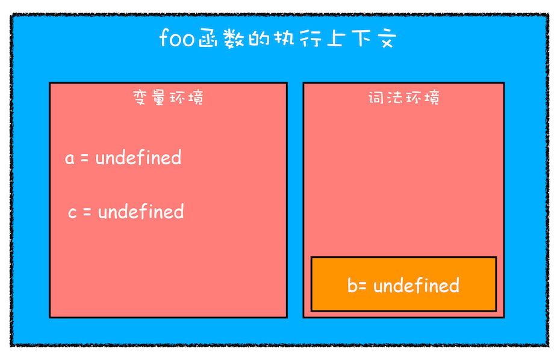

2. 继续执行代码，当执行到代码块里面时，变量环境中 a 的值已经被设置成了 1，词法环境中 b 的值已经被设置成了 2，这时候函数的执行上下文就如下图所示：
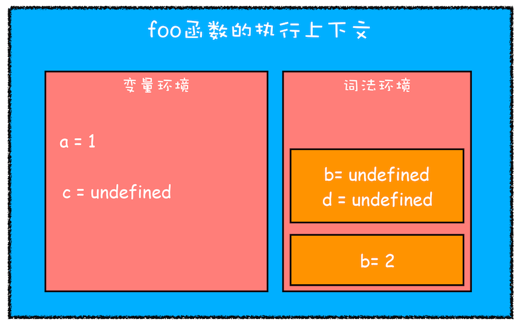

从图中可以看出，当进入函数的作用域块时，作用域块中通过 let 声明的变量，会被存放在词法环境的一个单独的区域中，这个区域中的变量并不影响作用域块外面的变量，比如在作用域外面声明了变量 b，在该作用域块内部也声明了变量 b，当执行到作用域内部时，它们都是独立的存在。

其实，在词法环境内部，维护了一个小型栈结构，栈底是函数最外层的变量，进入一个作用域块后，就会把该作用域块内部的变量压到栈顶；当作用域执行完成之后，该作用域的信息就会从栈顶弹出，这就是词法环境的结构。需要注意下，我这里所讲的变量是指通过 let 或者 const 声明的变量。

再接下来，当执行到作用域块中的console.log(a)这行代码时，就需要在词法环境和变量环境中查找变量 a 的值了，具体查找方式是：沿着词法环境的栈顶向下查询，如果在词法环境中的某个块中查找到了，就直接返回给 JavaScript 引擎，如果没有查找到，那么继续在变量环境中查找。

这样一个变量查找过程就完成了，你可以参考下图：
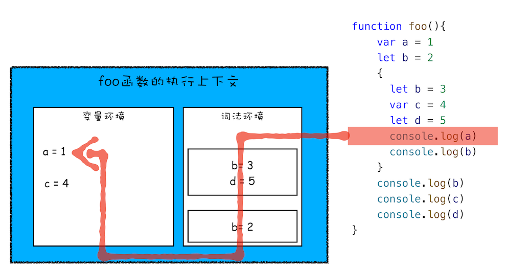

3. 当作用域块执行结束之后，其内部定义的变量就会从词法环境的栈顶弹出，最终执行上下文如下图所示：
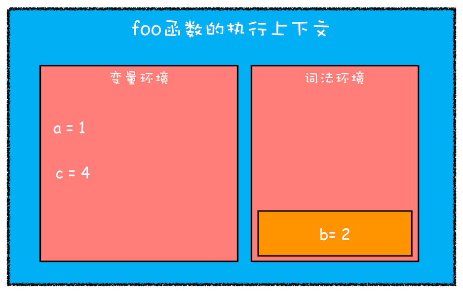

注意：
```js
// 【最终打印结果】：VM6277:3 Uncaught ReferenceError: Cannot access 'myname' before initialization
// 【分析原因】：在块作用域内，let声明的变量被提升，但变量只是创建被提升，初始化并没有被提升，在初始化之前使用变量，就会形成一个暂时性死区。
// 【拓展】
// var的创建和初始化被提升，赋值不会被提升。
// let的创建被提升，初始化和赋值不会被提升。
// function的创建、初始化和赋值均会被提升。
let myname= '极客时间'
{
  console.log(myname) 
  let myname= '极客邦'
}
```
#### 作用域链
```js
function bar() {
    var myName = "极客世界"
    let test1 = 100
    if (1) {
        let myName = "Chrome浏览器"
        console.log(test)
    }
}
function foo() {
    var myName = "极客邦"
    let test = 2
    {
        let test = 3
        bar()
    }
}
var myName = "极客时间"
let myAge = 10
let test = 1
foo()
```
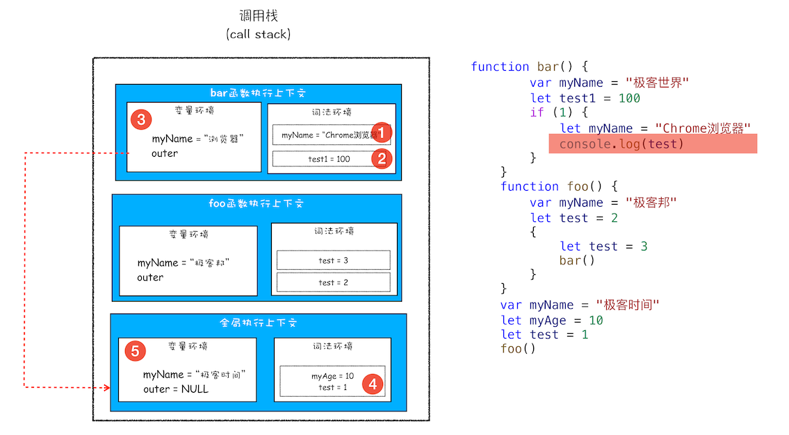

### 再谈闭包
```js
function foo() {
    var myName = "极客时间"
    let test1 = 1
    const test2 = 2
    var innerBar = {
        getName:function(){
            console.log(test1)
            return myName
        },
        setName:function(newName){
            myName = newName
        }
    }
    return innerBar
}
var bar = foo()
bar.setName("极客邦")
bar.getName()
console.log(bar.getName())
```
首先我们看看当执行到 foo 函数内部的return innerBar这行代码时调用栈的情况，看下图：
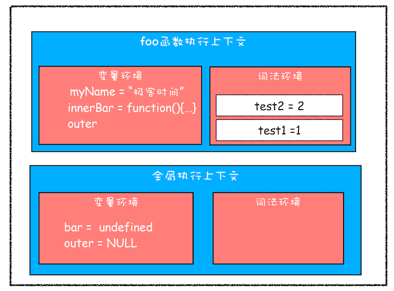

从上面的代码可以看出，innerBar 是一个对象，包含了 getName 和 setName 的两个方法（通常我们把对象内部的函数称为方法）。你可以看到，这两个方法都是在 foo 函数内部定义的，并且这两个方法内部都使用了 myName 和 test1 两个变量。

根据词法作用域的规则，内部函数 getName 和 setName 总是可以访问它们的外部函数 foo 中的变量，所以当 innerBar 对象返回给全局变量 bar 时，虽然 foo 函数已经执行结束，但是 getName 和 setName 函数依然可以使用 foo 函数中的变量 myName 和 test1。所以当 foo 函数执行完成之后，其整个调用栈的状态如下图所示：

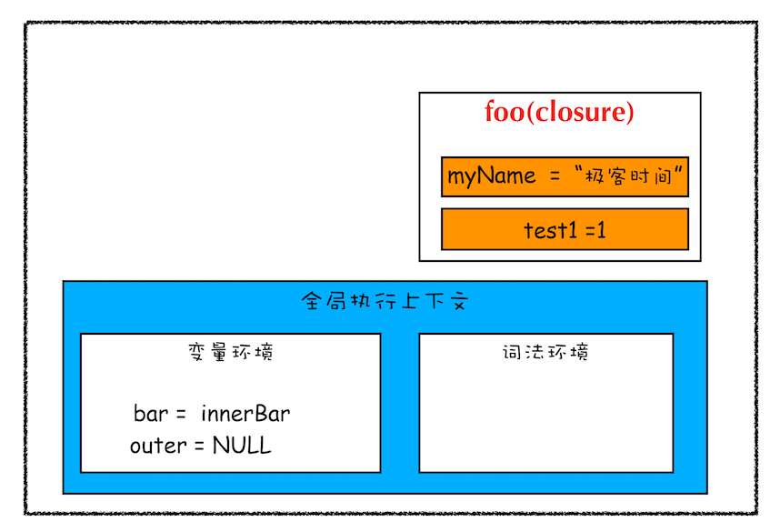

从上图可以看出，foo 函数执行完成之后，其执行上下文从栈顶弹出了，但是由于返回的 setName 和 getName 方法中使用了 foo 函数内部的变量 myName 和 test1，所以这两个变量依然保存在内存中。这像极了 setName 和 getName 方法背的一个专属背包，无论在哪里调用了 setName 和 getName 方法，它们都会背着这个 foo 函数的专属背包。

之所以是专属背包，是因为除了 setName 和 getName 函数之外，其他任何地方都是无法访问该背包的，我们就可以把这个背包称为 foo 函数的闭包。

好了，现在我们终于可以给闭包一个正式的定义了。**在 JavaScript 中，根据词法作用域的规则，内部函数总是可以访问其外部函数中声明的变量，当通过调用一个外部函数返回一个内部函数后，即使该外部函数已经执行结束了，但是内部函数引用外部函数的变量依然保存在内存中，我们就把这些变量的集合称为闭包。比如外部函数是 foo，那么这些变量的集合就称为 foo 函数的闭包。**

那这些闭包是如何使用的呢？

当执行到 bar.setName 方法中的myName = "极客邦"这句代码时，JavaScript 引擎会沿着“当前执行上下文–>foo 函数闭包–> 全局执行上下文”的顺序来查找 myName 变量，你可以参考下面的调用栈状态图：

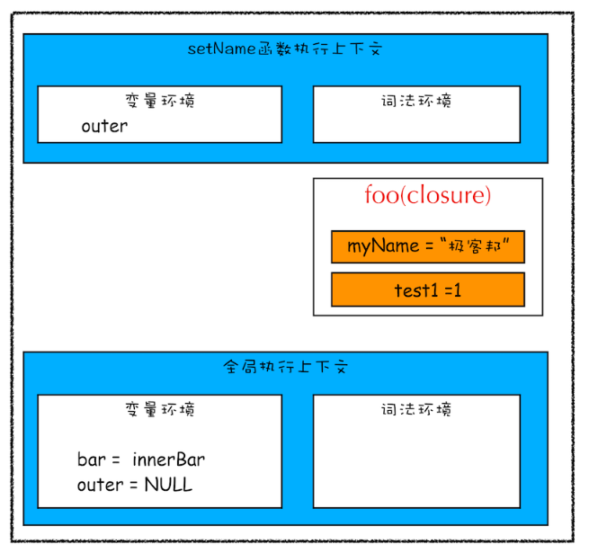

### 闭包是怎么回收的
通常，如果引用闭包的函数是一个全局变量，那么闭包会一直存在直到页面关闭；但如果这个闭包以后不再使用的话，就会造成内存泄漏。

如果引用闭包的函数是个局部变量，等函数销毁后，在下次 JavaScript 引擎执行垃圾回收时，判断闭包这块内容如果已经不再被使用了，那么 JavaScript 引擎的垃圾回收器就会回收这块内存。

所以在使用闭包的时候，你要尽量注意一个原则：**如果该闭包会一直使用，那么它可以作为全局变量而存在；但如果使用频率不高，而且占用内存又比较大的话，那就尽量让它成为一个局部变量。**

### Realm
在最新的标准（9.0）中，JavaScript 引入了一个新概念 Realm，它的中文意思是“国度”“领域”“范围”。

Realm 中包含一组完整的内置对象，而且是复制关系。

对不同 Realm 中的对象操作，会有一些需要格外注意的问题，比如 instanceOf 几乎是失效的。
```js
// 浏览器环境中获取来自两个 Realm 的对象，
// 它们跟本土的 Object 做 instanceOf 时会产生差异。
var iframe = document.createElement('iframe')
document.documentElement.appendChild(iframe)
iframe.src="javascript:var b = {};"

var b1 = iframe.contentWindow.b;
var b2 = {};
console.log(typeof b1, typeof b2); //object object
console.log(b1 instanceof Object, b2 instanceof Object); //false true
```

## 函数
我们大致了解了执行上下文是什么，也知道了任何语句的执行都会依赖特定的上下文。

一旦上下文被切换，整个语句的效果可能都会发生改变。那么，切换上下文的时机就显得非常重要了。

1. 普通函数声明
2. 函数表达式
3. 箭头函数
4. 在 class 中定义的函数
5. 生成器函数 function * 定义的函数
6. 用 class 定义的类，实际上也是函数
7. 异步函数
8. 生成器函数加上 async 关键字

对普通变量而言，这些函数并没有本质区别，都是遵循了“继承定义时环境”的规则，它们的一个行为差异在于 this 关键字。

### this 关键字
**this 是执行上下文中很重要的一个组成部分。同一个函数调用方式不同，得到的 this 值也不同，**我们看一个例子：
```js
function showThis(){
    console.log(this);
}
var o = {
    showThis: showThis
}
showThis(); // global
o.showThis(); // o
```
**调用函数时使用的引用，决定了函数执行时刻的 this 值。**

```js
const showThis = () => {
    console.log(this);
}
var o = {
    showThis: showThis
}
showThis(); // global
o.showThis(); // global
```
我们看到，改为箭头函数后，不论用什么引用来调用它，都不影响它的 this 值。

```js
class C {
    showThis() {
        console.log(this);
    }
}
var o = new C();
var showThis = o.showThis;

showThis(); // undefined
o.showThis(); // o
```

按照我们上面的方法，不难验证出：生成器函数、异步生成器函数和异步普通函数跟普通函数行为是一致的，异步箭头函数与箭头函数行为是一致的。

### this 关键字的机制
函数能够引用定义时的变量，如上文分析，函数也能记住定义时的 this，因此，函数内部必定有一个机制来保存这些信息。

在 JavaScript 标准中，为函数规定了用来保存定义时上下文的私有属性[[Environment]]。

当一个函数执行时，会创建一条新的执行环境记录，记录的外层词法环境（outer lexical environment）会被设置成函数的[[Environment]]。

这个动作就是切换上下文了，我们假设有这样的代码：
```js
var a = 1;
foo();
// 在别处定义了foo：
var b = 2;
function foo(){
    console.log(b); // 2
    console.log(a); // error
}
```
这里的 foo 能够访问 b（定义时词法环境），却不能访问 a（执行时的词法环境），这就是执行上下文的切换机制了。

JavaScript 用一个栈来管理执行上下文，这个栈中的每一项又包含一个链表。如下图所示：


当函数调用时，会入栈一个新的执行上下文，函数调用结束时，执行上下文被出栈。

而 this 则是一个更为复杂的机制，JavaScript 标准定义了 [[thisMode]] 私有属性。

[[thisMode]] 私有属性有三个取值:
- lexical：表示从上下文中找 this，这对应了箭头函数。
- global：表示当 this 为 undefined 时，取全局对象，对应了普通函数。
- strict：当严格模式时使用，this 严格按照调用时传入的值，可能为 null 或者 undefined

非常有意思的是，方法的行为跟普通函数有差异，恰恰是因为 class 设计成了默认按 strict 模式执行。
```js
// class 设计的真实效果；
"use strict"
function showThis(){
    console.log(this);
}
var o = {
    showThis: showThis
}
showThis(); // undefined
o.showThis(); // o
```

函数创建新的执行上下文中的词法环境记录时，会根据[[thisMode]]来标记新纪录的[[ThisBindingStatus]]私有属性。

代码执行遇到 this 时，会逐层检查当前词法环境记录中的[[ThisBindingStatus]]，当找到有 this 的环境记录时获取 this 的值。

这样的规则的实际效果是，嵌套的箭头函数中的代码都指向外层 this，例如：
```js
var o = {}
o.foo = function foo(){
    console.log(this);
    return () => {
        console.log(this);
        return () => console.log(this);
    }
}

o.foo()()(); // o, o, o
```

### 操作 this 的内置函数
Function.prototype.call 和 Function.prototype.apply 可以指定函数调用时传入的 this 值，示例如下：
```js
function foo(a, b, c){
    console.log(this);
    console.log(a, b, c);
}
foo.call({}, 1, 2, 3);
foo.apply({}, [1, 2, 3]);
```

此外，还有 Function.prototype.bind 它可以生成一个绑定过的函数，这个函数的 this 值固定了参数：
```js
function foo(a, b, c){
    console.log(this);
    console.log(a, b, c);
}
foo.bind({}, 1, 2, 3)();
```

有趣的是，call、bind 和 apply 用于不接受 this 的函数类型如箭头、class 都不会报错。

这时候，它们无法实现改变 this 的能力，但是可以实现传参。

### new 与 this
其实我们会发现，为了兼容老代码，新增的特性除了class都不支持new 生成对象。


## 预编译
### js执行三部曲
1. 语法分析
2. 预编译
3. 解释执行

### 预编译阶段
- 函数声明整体提升，函数不管写到哪里，都会被提到逻辑的最前面。
- 变量声明提升，把 var a 提升到最前面
- 未经声明的变量，归window所有；如a=1，相当于window.a = 1；
- 预编译四部曲（全局script脚本也是一个函数，但是少了第三步）；
1. 创建 AO 对象 Activation Object(执行期上下文，作用是理解的作用域，函数产生的执行空间库)
2. 找形参和变量声明，将变量和形参名作为 AO 属性名，值为 undefined
```js
// 相当于 
AO = {
 a : undefined,
 b : undefined
}
```
3. 将实参值和形参统一（把实参值传到形参里）
4. 在函数体里面找函数声明，值赋予函数体（先看自己的 AO，再看全局的 GO）

## 深入之从原型到原型链
1. 每个函数都有一个 prototype 属性，就是我们经常在各种例子中看到的那个 prototype ，比如：
```js
function Person() {

}
// 虽然写在注释里，但是你要注意：
// prototype是函数才会有的属性
Person.prototype.name = 'Kevin';
var person1 = new Person();
var person2 = new Person();
console.log(person1.name) // Kevin
console.log(person2.name) // Kevin
```
2. __proto__，这是每一个JavaScript对象(除了 null )都具有的一个属性，叫__proto__，这个属性会指向该对象的原型。
```js
function Person() {

}
var person = new Person();
console.log(person.__proto__ === Person.prototype); // true
```
- 于是，我们就有了下面的关系图


既然实例对象和构造函数都可以指向原型，那么原型是否有属性指向构造函数或者实例呢？
3. constructor
指向实例倒是没有，因为一个构造函数可以生成多个实例，但是原型指向构造函数倒是有的，这就要讲到第三个属性：constructor，每个原型都有一个 constructor 属性指向关联的构造函数。

为了验证这一点，我们可以尝试：
```js
function Person() {

}
console.log(Person === Person.prototype.constructor); // true
```

所以，再次更新关系图：


综上所述：
```js
function Person() {

}
var person = new Person();
console.log(person.__proto__ == Person.prototype) // true
console.log(Person.prototype.constructor == Person) // true
// 顺便学习一个ES5的方法,可以获得对象的原型
console.log(Object.getPrototypeOf(person) === Person.prototype) // true
```

4. 实例与原型
- 当读取实例的属性时，如果找不到，就会查找与对象关联的原型中的属性，如果还查不到，就去找原型的原型，一直找到最顶层为止

举个例子：
```js
function Person() {

}

Person.prototype.name = 'Kevin';

var person = new Person();

person.name = 'Daisy';
console.log(person.name) // Daisy

delete person.name;
console.log(person.name) // Kevin
```

5. 原型的原型
在前面，我们已经讲了原型也是一个对象，既然是对象，我们就可以用最原始的方式创建它，那就是：
```js
var obj = new Object();
obj.name = 'Kevin'
console.log(obj.name) // Kevin
```
其实原型对象就是通过 Object 构造函数生成的，结合之前所讲，实例的 __proto__ 指向构造函数的 prototype ，所以我们再更新下关系图：


6. 原型链
那 Object.prototype 的原型呢？

null，我们可以打印：
```js
console.log(Object.prototype.__proto__ === null) // true
```

然而 null 究竟代表了什么呢？null 表示“没有对象”，即该处不应该有值。

所以 Object.prototype.__proto__ 的值为 null 跟 Object.prototype 没有原型，其实表达了一个意思。

所以查找属性的时候查到 Object.prototype 就可以停止查找了。

最后一张关系图也可以更新为：


7. 注意点
- constructor
```js
function Person() {

}
var person = new Person();
// person.constructor 其实会找原型，刚好原型上有
// person.constructor === Person.prototype.constructor
console.log(person.constructor === Person); // true
```
- __proto__
其次是 __proto__ ，绝大部分浏览器都支持这个非标准的方法访问原型，然而它并不存在于 Person.prototype 中，实际上，它是来自于 Object.prototype ，与其说是一个属性，不如说是一个 getter/setter，当使用 obj.__proto__ 时，可以理解成返回了 Object.getPrototypeOf(obj)。

- 鸡生蛋，蛋生鸡问题
Function作为一个内置对象，是运行前就已经存在的东西，所以根本就不会根据自己生成自己，所以就没有什么鸡生蛋蛋生鸡，就是鸡生蛋。

至于为什么Function.__proto__ === Function.prototype，我认为有两种可能：一是为了保持与其他函数一致，二是就是表明一种关系而已。

简单的说，我认为：就是先有的Function，然后实现上把原型指向了Function.prototype，但是我们不能倒过来推测因为Function.__proto__ === Function.prototype，所以Function调用了自己生成了自己。

## 作用域
作用域是指程序源代码中定义变量的区域。

作用域规定了如何查找变量，也就是确定当前执行代码对变量的访问权限。

JavaScript 采用词法作用域(lexical scoping)，也就是静态作用域。

### 静态作用域
因为 JavaScript 采用的是词法作用域，函数的作用域在函数定义的时候就决定了。

而与词法作用域相对的是动态作用域，函数的作用域是在函数调用的时候才决定的。

让我们认真看个例子就能明白之间的区别：
```js
var value = 1;

function foo() {
    console.log(value);
}

function bar() {
    var value = 2;
    foo();
}

bar();

// 结果是 ???
```
假设JavaScript采用静态作用域，让我们分析下执行过程：

执行 foo 函数，先从 foo 函数内部查找是否有局部变量 value，如果没有，就根据书写的位置，查找上面一层的代码，也就是 value 等于 1，所以结果会打印 1。

假设JavaScript采用动态作用域，让我们分析下执行过程：

执行 foo 函数，依然是从 foo 函数内部查找是否有局部变量 value。如果没有，就从调用函数的作用域，也就是 bar 函数内部查找 value 变量，所以结果会打印 2。

前面我们已经说了，JavaScript采用的是静态作用域，所以这个例子的结果是 1。

### 动态作用域

也许你会好奇什么语言是动态作用域？

bash 就是动态作用域，不信的话，把下面的脚本存成例如 scope.bash，然后进入相应的目录，用命令行执行 bash ./scope.bash，看看打印的值是多少。

```js
value=1
function foo () {
    echo $value;
}
function bar () {
    local value=2;
    foo;
}
bar
```

思考题，这两段代码的执行效果；执行上下文在调用栈的情况不一样；
```js
var scope = "global scope";
function checkscope(){
    var scope = "local scope";
    function f(){
        return scope;
    }
    return f();
}
checkscope();

var scope = "global scope";
function checkscope(){
    var scope = "local scope";
    function f(){
        return scope;
    }
    return f;
}
checkscope()();
```

## call 和 apply 的模拟实现
### call
- call() 方法在使用一个指定的 this 值和若干个指定的参数值的前提下调用某个函数或方法。
```js
// call 改变了 this 的指向，指向到 foo
// bar 函数执行了
var foo = {
    value: 1
};

function bar() {
    console.log(this.value);
}

bar.call(foo); // 1
```
所以我们模拟的步骤可以分为：

1. 将函数设为对象的属性
2. 执行该函数
3. 删除该函数

```js
Function.prototype.call2 = function (context) {
    // 1. 如果传入的是null，则指向window
    var context = context || window;
    context.fn = this;

    var args = [];
    for(var i = 1, len = arguments.length; i < len; i++) {
        args.push('arguments[' + i + ']');
    }
    // 函数执行是有返回值的
    var result = eval('context.fn(' + args +')');

    delete context.fn
    return result;
}
```

### apply
- 实现原理和call基本一致
```js
Function.prototype.apply = function (context, arr) {
    var context = Object(context) || window;
    context.fn = this;

    var result;
    if (!arr) {
        result = context.fn();
    }
    else {
        var args = [];
        for (var i = 0, len = arr.length; i < len; i++) {
            args.push('arr[' + i + ']');
        }
        result = eval('context.fn(' + args + ')')
    }

    delete context.fn
    return result;
}
```

## bind
- bind() 方法会创建一个新函数。当这个新函数被调用时，bind() 的第一个参数将作为它运行时的 this，之后的一序列参数将会在传递的实参前传入作为它的参数。
1. 返回一个函数
2. 可以传入参数
3. 返回的函数可以使用new
```js
Function.prototype.bind2 = function (context) {
    // 只允许函数调用的方式使用
    if (typeof this !== "function") {
      throw new Error("Function.prototype.bind - what is trying to be bound is not callable");
    }
    // 当前的函数this
    var self = this;
    // bind 时候传入的参数
    var args = Array.prototype.slice.call(arguments, 1);

    var fNOP = function () {};
    // bind 返回一个函数
    var fBound = function () {
        // 这个函数可以继续传值，但是要结合 bind 时候传入的参数
        var bindArgs = Array.prototype.slice.call(arguments);
        // this执行问题，
        return self.apply(this instanceof fNOP ? this : context, args.concat(bindArgs));
    }

    fNOP.prototype = this.prototype;
    fBound.prototype = new fNOP();
    return fBound;
}
```

## new 
1. 会产生一个 obj = new Object() 对象
2. obj.xxx = xxx
3. 如果直接返回一个对象，就取这个对象；否则返回obj
```js
// 第二版的代码
function objectFactory() {
    var obj = new Object(),
    Constructor = [].shift.call(arguments);
    // 注意原型安排上
    obj.__proto__ = Constructor.prototype;
    var ret = Constructor.apply(obj, arguments);
    // 如果new Constructor 返回的是个对象，直接用这个对象
    return typeof ret === 'object' ? ret : obj;
};
```
## 深拷贝
```js
function deepClone(obj, hash = new WeakMap()) {
  // 如果是null或者undefined我就不进行拷贝操作
  if (obj === null) return obj; 
  if (obj instanceof Date) return new Date(obj);
  if (obj instanceof RegExp) return new RegExp(obj);
  // 可能是对象或者普通的值  如果是函数的话是不需要深拷贝
  if (typeof obj !== "object") return obj;
  // 是对象的话就要进行深拷贝
  if (hash.get(obj)) return hash.get(obj);
  let cloneObj = new obj.constructor();
  // 找到的是所属类原型上的constructor, g'g而原型上的 constructor指向的是当前类本身
  hash.set(obj, cloneObj);
  for (let key in obj) {
    if (obj.hasOwnProperty(key)) {
      // 实现一个递归拷贝
      cloneObj[key] = deepClone(obj[key], hash);
    }
  }
  return cloneObj;
}
let obj = { name: 1, address: { x: 100 } };
obj.o = obj; // 对象存在循环引用的情况
let d = deepClone(obj);
obj.address.x = 200;
console.log(d);
```

## 创建对象的方式和优缺点
1. 工厂模式
- 缺点：对象无法识别，因为所有的实例都指向一个原型``Object.prototype``
```js
function createPerson(name) {
    var o = new Object();
    o.name = name;
    o.getName = function () {
        console.log(this.name);
    };

    return o;
}

var person1 = createPerson('kevin');
```
2. 构造函数模式
- 优点：实例可以识别为一个特定的类型

- 缺点：每次创建实例时，每个方法都要被创建一次
```js
function Person(name) {
    this.name = name;
    // 每个方法都要被创建一次
    this.getName = function () {
        console.log(this.name);
    };
}

var person1 = new Person('kevin');
```
3. 原型模式
- 优点：方法不会重新创建

- 缺点：1. 所有的属性和方法都共享 2. 不能初始化参数
```js
function Person(name) {

}

Person.prototype.name = 'keivn';
Person.prototype.getName = function () {
    console.log(this.name);
};

var person1 = new Person();
```

## 继承
1. 原型链继承
```js
function Parent () {
    this.name = 'kevin';
}
Parent.prototype.getName = function () {
    console.log(this.name);
}

function Child () {

}

Child.prototype = new Parent();

var child1 = new Child();
console.log(child1.getName()) // kevin
```

引用类型的属性被所有实例共享，举个例子：
```js
function Parent () {
    this.names = ['kevin', 'daisy'];
}

function Child () {

}

Child.prototype = new Parent();

var child1 = new Child();

child1.names.push('yayu');

console.log(child1.names); // ["kevin", "daisy", "yayu"]

var child2 = new Child();

console.log(child2.names); // ["kevin", "daisy", "yayu"]
```

2. 借用构造函数(经典继承)
```js
function Parent () {
    this.names = ['kevin', 'daisy'];
}

function Child () {
    Parent.call(this);
}

var child1 = new Child();

child1.names.push('yayu');

console.log(child1.names); // ["kevin", "daisy", "yayu"]

var child2 = new Child();

console.log(child2.names); // ["kevin", "daisy"]
```

优点：
- 避免了引用类型的属性被所有实例共享
- 可以在 Child 中向 Parent 传参

缺点：
- 方法都在构造函数中定义，每次创建实例都会创建一遍方法。

3. 组合继承（原型链继承和经典继承双剑合璧）
```js
function Parent (name) {
    this.name = name;
    this.colors = ['red', 'blue', 'green'];
}

Parent.prototype.getName = function () {
    console.log(this.name)
}

function Child (name, age) {

    Parent.call(this, name);
    
    this.age = age;

}

Child.prototype = new Parent();
Child.prototype.constructor = Child;

var child1 = new Child('kevin', '18');

child1.colors.push('black');

console.log(child1.name); // kevin
console.log(child1.age); // 18
console.log(child1.colors); // ["red", "blue", "green", "black"]

var child2 = new Child('daisy', '20');

console.log(child2.name); // daisy
console.log(child2.age); // 20
console.log(child2.colors); // ["red", "blue", "green"]
```

4. 组合继承的优化(推荐使用)
- 就是 ES5 Object.create 的模拟实现，将传入的对象作为创建的对象的原型。
```js
function createObj(o) {
    function F(){}
    F.prototype = o;
    return new F();
}
```
这是最推荐的一种方式，接近完美的继承，它的名字也叫做寄生组合继承。
```js
  function Parent5 () {
    this.name = 'parent5';
    this.play = [1, 2, 3];
  }
  function Child5() {
    Parent5.call(this);
    this.type = 'child5';
  }
  Child5.prototype = Object.create(Parent5.prototype);
  Child5.prototype.constructor = Child5;
```

### 继承存在的问题
- 因为继承，所有在某个对象上，被集成了很多无用的属性；
- 组合模式就很好的避免掉了这样的问题；golang完全采用的是面向组合的设计方式。

## JS 专题系列
1. 防抖
- 防抖的原理就是：你尽管触发事件，但是我一定在事件触发 n 秒后才执行，如果你在一个事件触发的 n 秒内又触发了这个事件，那我就以新的事件的时间为准，n 秒后才执行，总之，就是要等你触发完事件 n 秒内不再触发事件，我才执行；
```js
// 第三版
function debounce(func, wait) {
    var timeout;
    return function () {
        var context = this;
        var args = arguments;

        clearTimeout(timeout)
        timeout = setTimeout(function(){
            func.apply(context, args)
        }, wait);
    }
}
```

2. 节流
```js
const throttle = function(fn, interval) {
  let last = 0;
  return function (...args) {
    let context = this;
    let now = +new Date();
    // 还没到时间
    if(now - last < interval) return;
    last = now;
    fn.apply(this, args)
  }
}

// 一个相对好的实现，双剑合璧；
// fn是我们需要包装的事件回调, delay是时间间隔的阈值
function throttle(fn, delay) {
  // last为上一次触发回调的时间, timer是定时器
  let last = 0, timer = null
  // 将throttle处理结果当作函数返回
  return function () { 
    // 保留调用时的this上下文
    let context = this
    // 保留调用时传入的参数
    let args = arguments
    // 记录本次触发回调的时间
    let now = +new Date()
    // 判断上次触发的时间和本次触发的时间差是否小于时间间隔的阈值
    if (now - last < delay) {
      // 如果时间间隔小于我们设定的时间间隔阈值，则为本次触发操作设立一个新的定时器
       clearTimeout(timer)
       timer = setTimeout(function () {
          last = now
          fn.apply(context, args)
        }, delay)
    } else {
        // 如果时间间隔超出了我们设定的时间间隔阈值，那就不等了，无论如何要反馈给用户一次响应
        last = now
        fn.apply(context, args)
    }
  }
}
```

## V8引擎垃圾回收机制
V8只能使用系统的一部分内存，具体来说，在64位系统下，V8最多只能分配1.4G, 在 32 位系统中，最多只能分配0.7G。

所有的对象类型的数据在JS中都是通过堆进行空间分配的。当我们构造一个对象进行赋值操作的时候，其实相应的内存已经分配到了堆上。你可以不断的这样创建对象，让 V8 为它分配空间，直到堆的大小达到上限。

那么问题来了，V8 为什么要给它设置内存上限？明明我的机器大几十G的内存，只能让我用这么一点？

究其根本，是由两个因素所共同决定的，一个是JS单线程的执行机制，另一个是JS垃圾回收机制的限制。

首先JS是单线程运行的，这意味着一旦进入到垃圾回收，那么其它的各种运行逻辑都要暂停; 另一方面垃圾回收其实是非常耗时间的操作，以 1.5GB 的垃圾回收堆内存为例，V8 做一次小的垃圾回收需要50ms 以上，做一次非增量式的垃圾回收甚至要 1s 以上。

可见其耗时之久，而且在这么长的时间内，我们的JS代码执行会一直没有响应，造成应用卡顿，导致应用性能和响应能力直线下降。因此，V8 做了一个简单粗暴的选择，那就是限制堆内存，也算是一种权衡的手段，因为大部分情况是不会遇到操作几个G内存这样的场景的。

不过，如果你想调整这个内存的限制也不是不行。配置命令如下:
```js
// 这是调整老生代这部分的内存，单位是MB。
node --max-old-space-size=2048 xxx.js
```
或者
```js
// 这是调整新生代这部分的内存，单位是 KB。
node --max-new-space-size=2048 xxx.js
```

### 新生代内存的回收
V8 把堆内存分成了两部分进行处理——新生代内存和老生代内存。顾名思义，新生代就是临时分配的内存，存活时间短， 老生代是常驻内存，存活的时间长。``V8 的堆内存，也就是两个内存之和``。

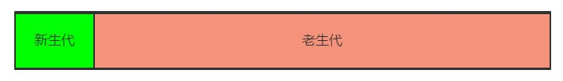

根据这两种不同种类的堆内存，V8 采用了不同的回收策略，来根据不同的场景做针对性的优化。

首先是新生代的内存，刚刚已经介绍了调整新生代内存的方法，那它的内存默认限制是多少？在 64 位和 32 位系统下分别为 32MB 和 16MB。够小吧，不过也很好理解，新生代中的变量存活时间短，来了马上就走，不容易产生太大的内存负担，因此可以将它设的足够小。

那好了，新生代的垃圾回收是怎么做的呢？

首先将新生代内存空间一分为二:

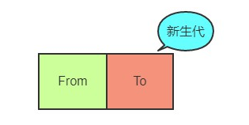

其中From部分表示正在使用的内存，To 是目前闲置的内存。

当进行垃圾回收时，V8 将From部分的对象检查一遍，如果是存活对象那么复制到To内存中(在To内存中按照顺序从头放置的)，如果是非存活对象直接回收即可。

当所有的From中的存活对象按照顺序进入到To内存之后，From 和 To 两者的角色对调，From现在被闲置，To为正在使用，如此循环。

那你很可能会问了，直接将非存活对象回收了不就万事大吉了嘛，为什么还要后面的一系列操作？

注意，我刚刚特别说明了，在To内存中按照顺序从头放置的，这是为了应对这样的场景(存活的对象很散):

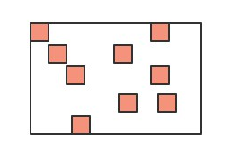

深色的小方块代表存活对象，白色部分表示待分配的内存，由于堆内存是连续分配的，这样零零散散的空间可能会导致稍微大一点的对象没有办法进行空间分配，这种零散的空间也叫做内存碎片。刚刚介绍的新生代垃圾回收算法也叫Scavenge算法。

Scavenge 算法主要就是解决内存碎片的问题，在进行一顿复制之后，To空间变成了这个样子:

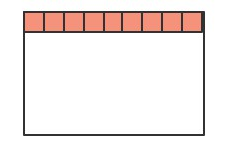

是不是整齐了许多？这样就大大方便了后续连续空间的分配。

不过Scavenge 算法的劣势也非常明显，就是内存只能使用新生代内存的一半，但是它只存放生命周期短的对象，这种对象一般很少，因此时间性能非常优秀。

### 老生代内存回收
刚刚介绍了新生代的回收方式，那么新生代中的变量如果经过多次回收后依然存在，那么就会被放入到老生代内存中，这种现象就叫晋升。

发生晋升其实不只是这一种原因，我们来梳理一下会有那些情况触发晋升:
- 已经经历过一次 Scavenge 回收。
- To（闲置）空间的内存占用超过25%。

现在进入到老生代的垃圾回收机制当中，老生代中累积的变量空间一般都是很大的，当然不能用Scavenge算法啦，浪费一半空间不说，对庞大的内存空间进行复制岂不是劳民伤财？

那么对于老生代而言，究竟是采取怎样的策略进行垃圾回收的呢？

第一步，进行标记-清除（引用计数已废弃）。这个过程在《JavaScript高级程序设计(第三版)》中有过详细的介绍，主要分成两个阶段，即标记阶段和清除阶段。首先会遍历堆中的所有对象，对它们做上标记，然后对于代码环境中使用的变量以及被强引用的变量取消标记，剩下的就是要删除的变量了，在随后的清除阶段对其进行空间的回收。

当然这又会引发内存碎片的问题，存活对象的空间不连续对后续的空间分配造成障碍。老生代又是如何处理这个问题的呢？

第二步，整理内存碎片。V8 的解决方式非常简单粗暴，在清除阶段结束后，把存活的对象全部往一端靠拢。

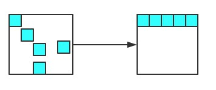

由于是移动对象，它的执行速度不可能很快，事实上也是整个过程中最耗时间的部分。

### 增量标记
由于JS的单线程机制，V8 在进行垃圾回收的时候，不可避免地会阻塞业务逻辑的执行，倘若老生代的垃圾回收任务很重，那么耗时会非常可怕，严重影响应用的性能。那这个时候为了避免这样问题，V8 采取了增量标记的方案，即将一口气完成的标记任务分为很多小的部分完成，每做完一个小的部分就"歇"一下，就js应用逻辑执行一会儿，然后再执行下面的部分，如果循环，直到标记阶段完成才进入内存碎片的整理上面来。其实这个过程跟React Fiber的思路有点像，这里就不展开了。

经过增量标记之后，垃圾回收过程对JS应用的阻塞时间减少到原来了1 / 6, 可以看到，这是一个非常成功的改进。

JS垃圾回收的原理就介绍到这里了，其实理解起来是非常简单的，重要的是理解它为什么要这么做，而不仅仅是如何做的，希望这篇总结能够对你有所启发。

## V8引擎执行一段JS代码
站在 V8 的角度，理解其中的执行机制，也能够帮助我们理解很多的上层应用，包括Babel、Eslint、前端框架的底层机制。那么，一段 JavaScript 代码放在 V8 当中究竟是如何执行的呢？

首先需要明白的是，机器是读不懂 JS 代码，机器只能理解特定的机器码，那如果要让 JS 的逻辑在机器上运行起来，就必须将 JS 的代码翻译成机器码，然后让机器识别。JS属于解释型语言，对于解释型的语言说，解释器会对源代码做如下分析:
- 通过词法分析和语法分析生成 AST(抽象语法树)
- 生成字节码

然后解释器根据字节码来执行程序。但 JS 整个执行的过程其实会比这个更加复杂，接下来就来一一地拆解。

1. 生成 AST
生成 AST 分为两步——词法分析和语法分析。

词法分析即分词，它的工作就是将一行行的代码分解成一个个token。 比如下面一行代码:
```js
let name = 'sanyuan'
```
其中会把句子分解成四个部分:

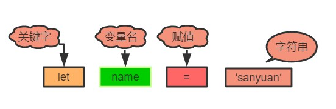

即解析成了四个token，这就是词法分析的作用。

接下来语法分析阶段，将生成的这些 token 数据，根据一定的语法规则转化为AST。举个例子:
```js
let name = 'sanyuan'
console.log(name)
```
最后生成的 AST 是这样的:

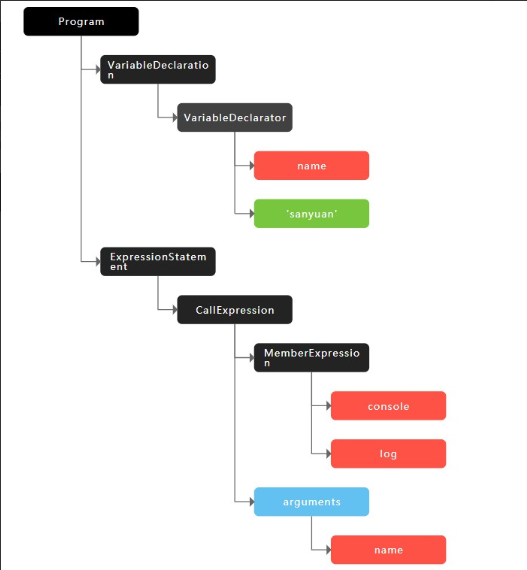

当生成了 AST 之后，编译器/解释器后续的工作都要依靠 AST 而不是源代码。

顺便补充一句，babel 的工作原理就是将 ES5 的代码解析生成 ES5 的 AST，然后将 ES5 的 AST 转换为 ES6 的AST，最后才将 ES6 的 AST 转化为具体的 ES6 代码。由于本文着重阐述原理，关于 babel 编译的细节就不展开了，推荐大家去读一读荒山的[babel](https://juejin.im/post/5d94bfbf5188256db95589be)文章, 帮你打开新世界的大门；

回到 V8 本身，生成 AST 后，接下来会生成执行上下文，关于执行上下文，可以参考前面介绍过的执行上下文；

2. 生成字节码

开头就已经提到过了，生成 AST 之后，直接通过 V8 的解释器(也叫Ignition)来生成字节码。但是字节码并不能让机器直接运行，那你可能就会说了，不能执行还转成字节码干嘛，直接把 AST 转换成机器码不就得了，让机器直接执行。确实，在 V8 的早期是这么做的，但后来因为机器码的体积太大，引发了严重的内存占用问题。

给一张对比图让大家直观地感受以下三者代码量的差异:

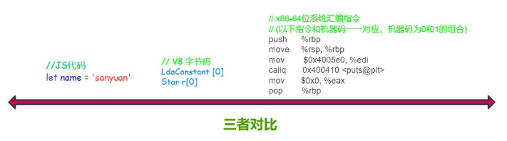

很容易得出，字节码是比机器码轻量得多的代码。那 V8 为什么要使用字节码，字节码到底是个什么东西？

>子节码是介于AST 和 机器码之间的一种代码，但是与特定类型的机器码无关，字节码需要通过解释器将其转换为机器码然后执行。

字节码仍然需要转换为机器码，但和原来不同的是，**现在不用一次性将全部的字节码都转换成机器码，而是通过解释器来逐行执行字节码，省去了生成二进制文件的操作，这样就大大降低了内存的压力**。

3. 执行代码

接下来，就进入到字节码解释执行的阶段啦！

在执行字节码的过程中，如果发现某一部分代码重复出现，那么 V8 将它记做热点代码(HotSpot)，然后将这么代码编译成机器码保存起来，这个用来编译的工具就是V8的编译器(也叫做TurboFan) , 因此在这样的机制下，代码执行的时间越久，那么执行效率会越来越高，因为有越来越多的字节码被标记为热点代码，遇到它们时直接执行相应的机器码，不用再次将转换为机器码。

其实当你听到有人说 JS 就是一门解释器语言的时候，其实这个说法是有问题的。因为字节码不仅配合了解释器，而且还和编译器打交道，所以 JS 并不是完全的解释型语言。而编译器和解释器的 根本区别在于前者会编译生成二进制文件但后者不会。

并且，这种字节码跟编译器和解释器结合的技术，我们称之为即时编译, 也就是我们经常听到的JIT。

这就是 V8 中执行一段JS代码的整个过程，梳理一下:

1. 首先通过词法分析和语法分析生成 AST
2. 将 AST 转换为字节码(早期直接转机器码，有严重的内存占用问题)
3. 由解释器逐行执行字节码，遇到热点代码启动编译器进行编译，生成对应的机器码, 以优化执行效率；


