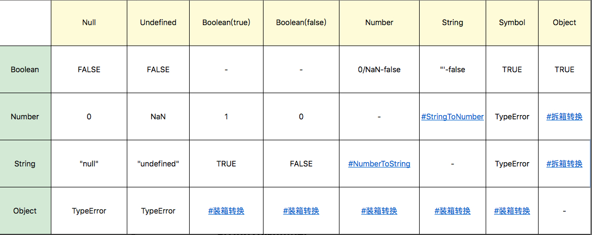
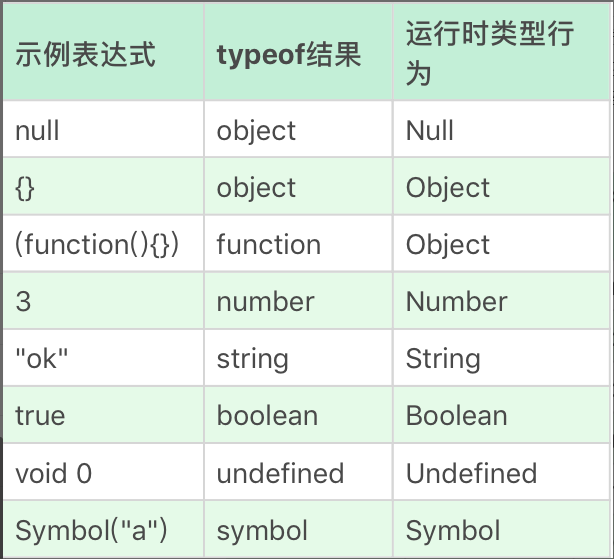
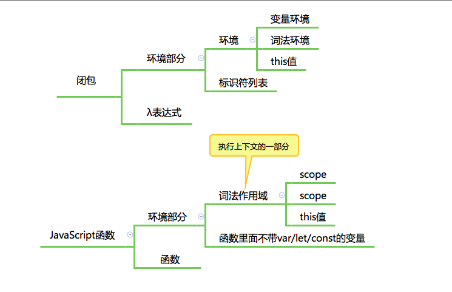
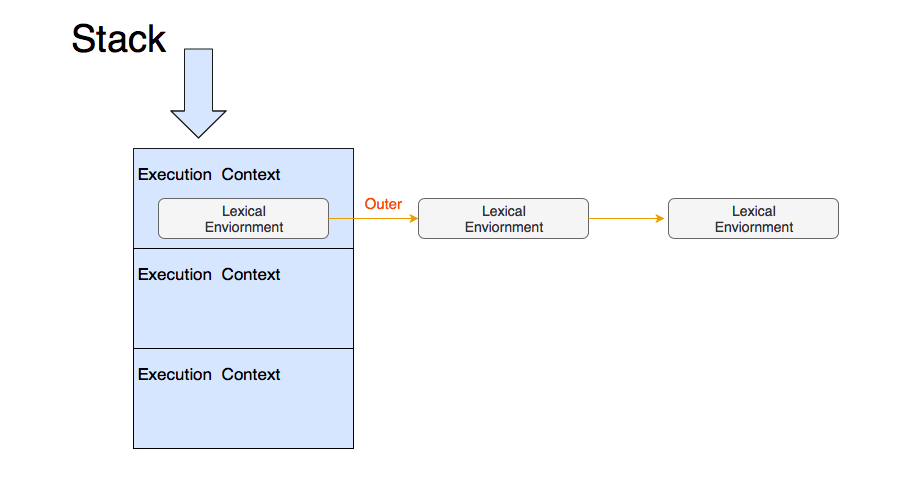
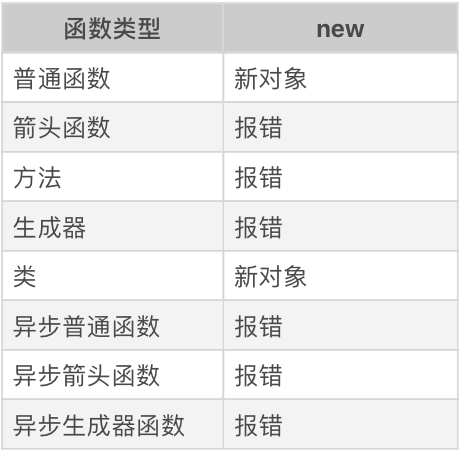

## 基本类型
1. Undefined；
2. Null；
3. Boolean；
4. String；String 有最大长度是 2^53 - 1，受编码格式影响；
5. Number；NAN，Infinity，-Infinity，三个例外；
```js
// 正确的比较方法应该用最小精度 Number.EPSILON
console.log( Math.abs(0.1 + 0.2 - 0.3) <= Number.EPSILON);
```
6. Symbol；在 ES6 规范中，整个对象系统被用 Symbol 重塑。
```js
var o = new Object
o[Symbol.iterator] = function() {
    var v = 0
    return {
        next: function() {
            return { value: v++, done: v > 10 }
        }
    }        
};
// 满足Symbol.iterator接口都可以用 for of
for(var v of o) 
    console.log(v); // 0 1 2 3 ... 9
```
7. Object;
- Number、String 和 Boolean，三个构造器是两用的，当跟 new 搭配时，它们产生对象，当直接调用时，它们表示强制类型转换。

- Symbol 函数比较特殊，直接用 new 调用它会抛出错误，但它仍然是 Symbol 对象的构造器。

## 类型转换

1. StringToNumber
- 30；十进制
- 0b111；二进制
- 0o13；八进制  
- 0xFF；十六进制
- NumberToString 比较符合直觉，日常开发较少，了解即可

2. 装箱转换
```js
var symbolObject = (function(){ return this; }).call(Symbol("a"));
console.log(typeof symbolObject); //object
console.log(symbolObject instanceof Symbol); //true
console.log(symbolObject.constructor == Symbol); //true
```
3. 拆箱转换
在 JavaScript 标准中，规定了 ToPrimitive 函数，它是对象类型到基本类型的转换（即，拆箱转换）。

拆箱转换会尝试调用 valueOf 和 toString 来获得拆箱后的基本类型。如果 valueOf 和 toString 都不存在，或者没有返回基本类型，则会产生类型错误 TypeError。
```js
var o = {
    valueOf : () => {console.log("valueOf"); return {}},
    toString : () => {console.log("toString"); return {}}
}
o * 2 //ecmascript 规范的默认顺序
// valueOf
// toString
// TypeError
String(o) 
// toString 
// valueOf 
// TypeError
```
在 ES6 之后，还允许对象通过显式指定 @@toPrimitive Symbol 来覆盖原有的行为。
```js
var o = {
    valueOf : () => {console.log("valueOf"); return {}},
    toString : () => {console.log("toString"); return {}}
}
o[Symbol.toPrimitive] = () => {console.log("toPrimitive"); return "hello"}
console.log(o + "")
// toPrimitive
// hello
```
4. typeof 
请注意 object——Null 和 function——Object 是特例，我们理解类型的时候需要特别注意这个区别。



## 对象
1. 对象具有唯一标识性：即使完全相同的两个对象，也并非同一个对象。
```js
var o1 = { a: 1 };
var o2 = { a: 1 };
console.log(o1 == o2); // false
```
2. 对象有状态：对象具有状态，同一对象可能处于不同状态之下。
3. 对象具有行为：即对象的状态，可能因为它的行为产生变迁。

总结一句话来看，在 JavaScript 中，对象的状态和行为其实都被抽象为了属性。

在实现了对象基本特征的基础上, 我认为，JavaScript 中对象独有的特色是：对象具有高度的动态性，这是因为 JavaScript 赋予了使用者在运行时为对象添改状态和行为的能力。
```js
var o = { a: 1 };
o.b = 2;
console.log(o.a, o.b); //1 2
```
为了提高抽象能力，JavaScript 的属性被设计成比别的语言更加复杂的形式，它提供了数据属性和访问器属性（getter/setter）两类。

### JavaScript 对象的两类属性
对 JavaScript 来说，属性并非只是简单的名称和值，JavaScript 用一组特征（attribute）来描述属性（property）。

1. 先来说第一类属性，数据属性。它比较接近于其它语言的属性概念。数据属性具有四个特征。
- value：就是属性的值。
- writable：决定属性能否被赋值。
- enumerable：决定 for in 能否枚举该属性。
- configurable：决定该属性能否被删除或者改变特征值。

2. 第二类属性是访问器（getter/setter）属性，它也有四个特征。
- getter：函数或 undefined，在取属性值时被调用。
- setter：函数或 undefined，在设置属性值时被调用。
- enumerable：决定 for in 能否枚举该属性。
- configurable：决定该属性能否被删除或者改变特征值。

我们通常用于定义属性的代码会产生数据属性，其中的 writable、enumerable、configurable 都默认为 true。我们可以使用内置函数 getOwnPropertyDescripter 来查看，如以下代码所示:
```js
var o = { a: 1 };
o.b = 2;
//a和b皆为数据属性
// {value: 1, writable: true, enumerable: true, configurable: true}
Object.getOwnPropertyDescriptor(o,"a") 
// {value: 2, writable: true, enumerable: true, configurable: true}
Object.getOwnPropertyDescriptor(o,"b") 
```

我们可以使用 Object.defineProperty 来修改
```js
var o = { a: 1 };
Object.defineProperty(o, "b", {
    value: 2, 
    writable: false, 
    enumerable: false, 
    configurable: true
});
//a 和 b都是数据属性，但特征值变化了
// {value: 1, writable: true, enumerable: true, configurable: true}
Object.getOwnPropertyDescriptor(o,"a"); 
// {value: 2, writable: false, enumerable: false, configurable: true}
Object.getOwnPropertyDescriptor(o,"b"); 
o.b = 3; //试图写值，但 writable === false
console.log(o.b); // 2
```

在创建对象时，也可以使用 get 和 set 关键字来创建访问器属性，代码如下所示： 
```js
var o = { get a() { return 1 } }; 
console.log(o.a); // 1
```
我们以上面的对象 o 为例，你可以想象一下“a”是 key。{writable:true,value:1,configurable:true,enumerable:true} 是 value。

## JavaScript 的原型
最为成功的流派是使用“类”的方式来描述对象，这诞生了诸如 C++、Java 等流行的编程语言。这个流派叫做基于类的编程语言。

还有一种就是基于原型的编程语言，它们利用原型来描述对象。我们的 JavaScript 就是其中代表。

如果我们抛开 JavaScript 用于模拟 Java 类的复杂语法设施（如 new、Function Object、函数的 prototype 属性等），原型系统可以说相当简单，我可以用两条概括：
1. 如果所有对象都有私有字段[[prototype]]，就是对象的原型；
2. 读一个属性，如果对象本身没有，则会继续访问对象的原型，直到原型为空或者找到为止。

这个模型在 ES 的各个历史版本中并没有很大改变，但从 ES6 以来，JavaScript 提供了一系列内置函数，以便更为直接地访问操纵原型。三个方法分别为：

1. Object.create 根据指定的原型创建新对象，原型可以是 null；
2. Object.getPrototypeOf 获得一个对象的原型；
3. Object.setPrototypeOf 设置一个对象的原型。

利用这三个方法，我们可以完全抛开类的思维，利用原型来实现抽象和复用。我用下面的代码展示了用原型来抽象猫和虎的例子。
```js
var cat = {
    say(){
        console.log("meow~");
    },
    jump(){
        console.log("jump");
    }
}
var tiger = Object.create(cat,  {
    say:{
        writable:true,
        configurable:true,
        enumerable:true,
        value:function(){
            console.log("roar!");
        }
    }
})
var anotherCat = Object.create(cat);
anotherCat.say();
var anotherTiger = Object.create(tiger);
anotherTiger.say();
```
考虑到 new 和 prototype 属性等基础设施今天仍然有效，而且被很多代码使用，学习这些知识也有助于我们理解运行时的原型工作原理，下面我们试着回到过去，追溯一下早年的 JavaScript 中的原型和类。

### 早期版本中的类与原型
在早期版本的 JavaScript 中，“类”的定义是一个私有属性 [[class]]，语言标准为内置类型诸如 Number、String、Date 等指定了[[class]]属性，以表示它们的类。

语言使用者唯一可以访问[[class]]属性的方式是 Object.prototype.toString。
```js
var o = new Object;
var n = new Number;
var s = new String;
var b = new Boolean;
var d = new Date;
var arg = function(){ return arguments }();
var r = new RegExp;
var f = new Function;
var arr = new Array;
var e = new Error;
console.log([o, n, s, b, d, arg, r, f, arr, e]
.map(v => Object.prototype.toString.call(v))); 
```

在 ES5 开始，[[class]] 私有属性被 Symbol.toStringTag 代替，Object.prototype.toString 的意义从命名上不再跟 class 相关。我们甚至可以自定义 Object.prototype.toString 的行为，以下代码展示了使用 Symbol.toStringTag 来自定义 Object.prototype.toString 的行为：
```js
var o = { [Symbol.toStringTag]: "MyObject" }
console.log(o + "");
```

## new 操作符
new 运算接受一个构造器和一组调用参数，实际上做了几件事：
1. 以构造器的 prototype 属性（注意与私有字段[[prototype]]的区分）为原型，创建新对象；
2. 将 this 和调用参数传给构造器，执行；
3. 如果构造器返回的是对象，则返回，否则返回第一步创建的对象。

## ES6 中的类
好在 ES6 中加入了新特性 class，new 跟 function 搭配的怪异行为终于可以退休了（虽然运行时没有改变），在任何场景，我都推荐使用 ES6 的语法来定义类，而令 function 回归原本的函数语义。下面我们就来看一下 ES6 中的类。

ES6 中引入了 class 关键字，并且在标准中删除了所有[[class]]相关的私有属性描述，类的概念正式从属性升级成语言的基础设施，从此，基于类的编程方式成为了 JavaScript 的官方编程范式。
```js
class Animal { 
  constructor(name) {
    this.name = name;
  }
  speak() {
    console.log(this.name + ' makes a noise.');
  }
}
class Dog extends Animal {
  constructor(name) {
    super(name); // call the super class constructor and pass in the name parameter
  }
  speak() {
    console.log(this.name + ' barks.');
  }
}
let d = new Dog('Mitzie');
d.speak(); // Mitzie barks.
```
一些激进的观点认为，class 关键字和箭头运算符可以完全替代旧的 function 关键字，它更明确地区分了定义函数和定义类两种意图，我认为这是有一定道理的。

## JavaScript 中的对象分类
1. 宿主对象（host Objects）：由 JavaScript 宿主环境提供的对象，它们的行为完全由宿主环境决定。
2. 内置对象（Built-in Objects）：由 JavaScript 语言提供的对象。
- 固有对象（Intrinsic Objects ）：由标准规定，随着 JavaScript 运行时创建而自动创建的对象实例。
- 原生对象（Native Objects）：可以由用户通过 Array、RegExp 等内置构造器或者特殊语法创建的对象。
- 普通对象（Ordinary Objects）：由{}语法、Object 构造器或者 class 关键字定义类创建的对象，它能够被原型继承。

## js代码执行
在 ES3 和更早的版本中，JavaScript 本身还没有异步执行代码的能力，这也就意味着，宿主环境传递给 JavaScript 引擎一段代码，引擎就把代码直接顺次执行了，这个任务也就是宿主发起的任务。

但是，在 ES5 之后，JavaScript 引入了 Promise，这样，不需要浏览器的安排，JavaScript 引擎本身也可以发起任务了。

由于我们这里主要讲 JavaScript 语言，那么采纳 JSC 引擎的术语，我们把**宿主发起的任务称为宏观任务，把 JavaScript 引擎发起的任务称为微观任务。**

### 宏观和微观任务
JavaScript 引擎等待宿主环境分配宏观任务，在操作系统中，通常等待的行为都是一个事件循环，所以在 Node 术语中，也会把这个部分称为事件循环。

这里每次的执行过程，其实都是一个宏观任务。我们可以大概理解：宏观任务的队列就相当于事件循环。

在宏观任务中，JavaScript 的 Promise 还会产生异步代码，JavaScript 必须保证这些异步代码在一个宏观任务中完成，因此，每个宏观任务中又包含了一个微观任务队列。

有了宏观任务和微观任务机制，我们就可以实现 JavaScript 引擎级和宿主级的任务了，例如：Promise 永远在队列尾部添加微观任务。setTimeout 等宿主 API，则会添加宏观任务。

### Promise
Promise 是 JavaScript 语言提供的一种标准化的异步管理方式，它的总体思想是，需要进行 io、等待或者其它异步操作的函数，不返回真实结果，而返回一个“承诺”，函数的调用方可以在合适的时机，选择等待这个承诺兑现（通过 Promise 的 then 方法的回调）。
```js
function sleep(duration) {
    return new Promise(function(resolve, reject) {
        setTimeout(resolve, duration);
    })
}
sleep(1000).then( ()=> console.log("finished"));
```

Promise 的 then 回调是一个异步的执行过程，下面我们就来研究一下 Promise 函数中的执行顺序，我们来看一段代码示例：
```js
// a b c
var r = new Promise(function(resolve, reject){
    console.log("a");
    // resolve 以后会在当前的宏任务添加微任务；
    resolve()
});
r.then(() => console.log("c"));
console.log("b")
```

我们发现，不论代码顺序如何，d 必定发生在 c 之后，因为 Promise 产生的是 JavaScript 引擎内部的微任务，而 setTimeout 是浏览器 API，它产生宏任务。
```js
var r = new Promise(function(resolve, reject){
    console.log("a");
    resolve()
});
setTimeout(()=>console.log("d"), 0)
r.then(() => console.log("c"));
console.log("b")
```

为了理解微任务始终先于宏任务，我们设计一个实验：执行一个耗时 1 秒的 Promise。
```js
// c1 c2 d
setTimeout(()=>console.log("d"), 0)
var r = new Promise(function(resolve, reject){
    resolve()
});
r.then(() => { 
    var begin = Date.now();
    while(Date.now() - begin < 1000);
    console.log("c1") 
    new Promise(function(resolve, reject){
        resolve()
    }).then(() => console.log("c2"))
});
```
这里我们强制了 1 秒的执行耗时，这样，我们可以确保任务 c2 是在 d 之后被添加到任务队列。我们可以看到，即使耗时一秒的 c1 执行完毕，再 enque 的 c2，仍然先于 d 执行了，**这很好地解释了微任务优先的原理。**

Promise 是 JavaScript 中的一个定义，但是实际编写代码时，我们可以发现，它似乎并不比回调的方式书写更简单，但是从 ES6 开始，我们有了 async/await，这个语法改进跟 Promise 配合，能够有效地改善代码结构。

### 新特性：async/await
async/await 是 ES2016 新加入的特性，它提供了用 for、if 等代码结构来编写异步的方式。它的运行时基础是 Promise，面对这种比较新的特性，我们先来看一下基本用法。

**async 函数必定返回 Promise，我们把所有返回 Promise 的函数都可以认为是异步函数。**

async 函数是一种特殊语法，特征是在 function 关键字之前加上 async 关键字，这样，就定义了一个 async 函数，我们可以在其中使用 await 来等待一个 Promise。
```js
// 它产生Promise，当然是微观任务了
function sleep(duration) {
    return new Promise(function(resolve, reject) {
        setTimeout(resolve, duration);
    })
}
async function foo(){
    console.log("a")
    // 生产一个微任务，先执行掉同步立马回来执行微任务。
    await sleep(2000)
    console.log("b")
}
```

async 函数强大之处在于，它是可以嵌套的。我们在定义了一批原子操作的情况下，可以利用 async 函数组合出新的 async 函数。
```js
function sleep(duration) {
    return new Promise(function(resolve, reject) {
        setTimeout(resolve, duration);
    })
}
async function foo(name){
    await sleep(2000)
    console.log(name)
}
async function foo2(){
    await foo("a");
    console.log('----')
    await foo("b");
}
```
这里 foo2 用 await 调用了两次异步函数 foo，可以看到，如果我们把 sleep 这样的异步操作放入某一个框架或者库中，使用者几乎不需要了解 Promise 的概念即可进行异步编程了。

此外，generator/iterator 也常常被跟异步一起来讲，我们必须说明 generator/iterator 并非异步代码，只是在缺少 async/await 的时候，一些框架（最著名的要数 co）使用这样的特性来模拟 async/await。

但是 generator 并非被设计成实现异步，所以有了 async/await 之后，generator/iterator 来模拟异步的方法应该被废弃。

## 闭包


这里我们容易产生一个常见的概念误区，有些人会把 JavaScript 执行上下文，或者作用域（Scope，ES3 中规定的执行上下文的一部分）这个概念当作闭包。

实际上 JavaScript 中跟闭包对应的概念就是“函数”，可能是这个概念太过于普通，跟闭包看起来又没什么联系，所以大家才不自觉地把这个概念对应到了看起来更特别的“作用域”吧（其实我早年也是这么理解闭包，直到后来被朋友纠正，查了资料才改正过来）。

### 执行上下文
相比普通函数，JavaScript 函数的主要复杂性来自于它携带的“环境部分”。当然，发展到今天的 JavaScript，它所定义的环境部分，已经比当初经典的定义复杂了很多。

JavaScript 中与闭包“环境部分”相对应的术语是“词法环境”，但是 JavaScript 函数比λ函数要复杂得多，我们还要处理 this、变量声明、with 等等一系列的复杂语法，λ函数中可没有这些东西，所以，在 JavaScript 的设计中，词法环境只是 JavaScript 执行上下文的一部分。

JavaScript 标准把一段代码（包括函数），执行所需的所有信息定义为：“执行上下文”。

1. 执行上下文在 ES3 中
- scope：作用域，也常常被叫做作用域链。
- variable object：变量对象，用于存储变量的对象。
- this value：this 值。

2. 在 ES5 中
- lexical environment：词法环境，当获取变量时使用。
- variable environment：变量环境，当声明变量时使用。
- this value：this 值。

3. 在 ES2018 中
- lexical environment：词法环境，当获取变量或者 this 值时使用。
- variable environment：变量环境，当声明变量时使用。
- code evaluation state：用于恢复代码执行位置。
- Function：执行的任务是函数时使用，表示正在被执行的函数。
- ScriptOrModule：执行的任务是脚本或者模块时使用，表示正在被执行的代码。
- Realm：使用的基础库和内置对象实例。
- Generator：仅生成器上下文有这个属性，表示当前生成器。

以最新的为准，以代码的方式理解：
```js
var b = {}
let c = 1
this.a = 2;
// var 把 b 声明到哪里；
// b 表示哪个变量；
// b 的原型是哪个对象；
// let 把 c 声明到哪里；
// this 指向哪个对象。
```
### var 声明与赋值
```js
var b = 1
```
通常我们认为它声明了 b，并且为它赋值为 1，var 声明作用域函数执行的作用域。也就是说，var 会穿透 for 、if 等语句。

在只有 var，没有 let 的旧 JavaScript 时代，诞生了一个技巧，叫做：立即执行的函数表达式（IIFE），通过创建一个函数，并且立即执行，来构造一个新的域，从而控制 var 的范围。
```js
(function(){
    var a;
    //code
}());

(function(){
    var a;
    //code
})();
```
var b = {} 这样一句对两个域产生了作用，从语言的角度是个非常糟糕的设计，这也是一些人坚定地反对在任何场景下使用 with 的原因之一。

### let 
let 是 ES6 开始引入的新的变量声明模式，比起 var 的诸多弊病，let 做了非常明确的梳理和规定。

为了实现 let，JavaScript 在运行时引入了块级作用域。也就是说，在 let 出现之前，JavaScript 的 if for 等语句皆不产生作用域。

我简单统计了下，以下语句会产生 let 使用的作用域：for；if；switch；try/catch/finally。

### Realm
在最新的标准（9.0）中，JavaScript 引入了一个新概念 Realm，它的中文意思是“国度”“领域”“范围”。

Realm 中包含一组完整的内置对象，而且是复制关系。

对不同 Realm 中的对象操作，会有一些需要格外注意的问题，比如 instanceOf 几乎是失效的。
```js
// 浏览器环境中获取来自两个 Realm 的对象，
// 它们跟本土的 Object 做 instanceOf 时会产生差异。
var iframe = document.createElement('iframe')
document.documentElement.appendChild(iframe)
iframe.src="javascript:var b = {};"

var b1 = iframe.contentWindow.b;
var b2 = {};
console.log(typeof b1, typeof b2); //object object
console.log(b1 instanceof Object, b2 instanceof Object); //false true
```

## 函数
我们大致了解了执行上下文是什么，也知道了任何语句的执行都会依赖特定的上下文。

一旦上下文被切换，整个语句的效果可能都会发生改变。那么，切换上下文的时机就显得非常重要了。

1. 普通函数声明
2. 函数表达式
3. 箭头函数
4. 在 class 中定义的函数
5. 生成器函数 function * 定义的函数
6. 用 class 定义的类，实际上也是函数
7. 异步函数
8. 生成器函数加上 async 关键字

对普通变量而言，这些函数并没有本质区别，都是遵循了“继承定义时环境”的规则，它们的一个行为差异在于 this 关键字。

### this 关键字
**this 是执行上下文中很重要的一个组成部分。同一个函数调用方式不同，得到的 this 值也不同，**我们看一个例子：
```js
function showThis(){
    console.log(this);
}
var o = {
    showThis: showThis
}
showThis(); // global
o.showThis(); // o
```
**调用函数时使用的引用，决定了函数执行时刻的 this 值。**

```js
const showThis = () => {
    console.log(this);
}
var o = {
    showThis: showThis
}
showThis(); // global
o.showThis(); // global
```
我们看到，改为箭头函数后，不论用什么引用来调用它，都不影响它的 this 值。

```js
class C {
    showThis() {
        console.log(this);
    }
}
var o = new C();
var showThis = o.showThis;

showThis(); // undefined
o.showThis(); // o
```

按照我们上面的方法，不难验证出：生成器函数、异步生成器函数和异步普通函数跟普通函数行为是一致的，异步箭头函数与箭头函数行为是一致的。

### this 关键字的机制
函数能够引用定义时的变量，如上文分析，函数也能记住定义时的 this，因此，函数内部必定有一个机制来保存这些信息。

在 JavaScript 标准中，为函数规定了用来保存定义时上下文的私有属性[[Environment]]。

当一个函数执行时，会创建一条新的执行环境记录，记录的外层词法环境（outer lexical environment）会被设置成函数的[[Environment]]。

这个动作就是切换上下文了，我们假设有这样的代码：
```js
var a = 1;
foo();
// 在别处定义了foo：
var b = 2;
function foo(){
    console.log(b); // 2
    console.log(a); // error
}
```
这里的 foo 能够访问 b（定义时词法环境），却不能访问 a（执行时的词法环境），这就是执行上下文的切换机制了。

JavaScript 用一个栈来管理执行上下文，这个栈中的每一项又包含一个链表。如下图所示：



当函数调用时，会入栈一个新的执行上下文，函数调用结束时，执行上下文被出栈。

而 this 则是一个更为复杂的机制，JavaScript 标准定义了 [[thisMode]] 私有属性。

[[thisMode]] 私有属性有三个取值:
- lexical：表示从上下文中找 this，这对应了箭头函数。
- global：表示当 this 为 undefined 时，取全局对象，对应了普通函数。
- strict：当严格模式时使用，this 严格按照调用时传入的值，可能为 null 或者 undefined

非常有意思的是，方法的行为跟普通函数有差异，恰恰是因为 class 设计成了默认按 strict 模式执行。
```js
// class 设计的真实效果；
"use strict"
function showThis(){
    console.log(this);
}
var o = {
    showThis: showThis
}
showThis(); // undefined
o.showThis(); // o
```

函数创建新的执行上下文中的词法环境记录时，会根据[[thisMode]]来标记新纪录的[[ThisBindingStatus]]私有属性。

代码执行遇到 this 时，会逐层检查当前词法环境记录中的[[ThisBindingStatus]]，当找到有 this 的环境记录时获取 this 的值。

这样的规则的实际效果是，嵌套的箭头函数中的代码都指向外层 this，例如：
```js
var o = {}
o.foo = function foo(){
    console.log(this);
    return () => {
        console.log(this);
        return () => console.log(this);
    }
}

o.foo()()(); // o, o, o
```

### 操作 this 的内置函数
Function.prototype.call 和 Function.prototype.apply 可以指定函数调用时传入的 this 值，示例如下：
```js
function foo(a, b, c){
    console.log(this);
    console.log(a, b, c);
}
foo.call({}, 1, 2, 3);
foo.apply({}, [1, 2, 3]);
```

此外，还有 Function.prototype.bind 它可以生成一个绑定过的函数，这个函数的 this 值固定了参数：
```js
function foo(a, b, c){
    console.log(this);
    console.log(a, b, c);
}
foo.bind({}, 1, 2, 3)();
```

有趣的是，call、bind 和 apply 用于不接受 this 的函数类型如箭头、class 都不会报错。

这时候，它们无法实现改变 this 的能力，但是可以实现传参。

### new 与 this
其实我们会发现，为了兼容老代码，新增的特性除了class都不支持new 生成对象。



