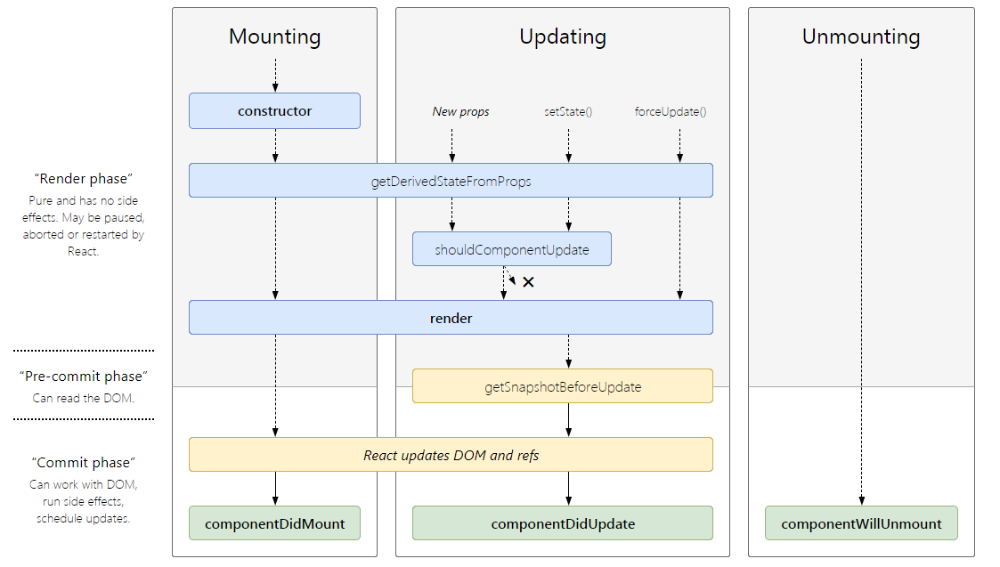
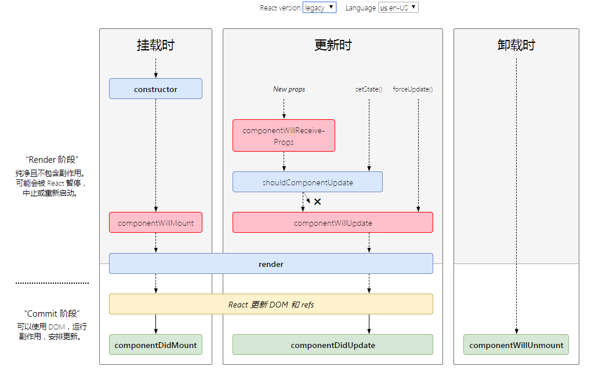
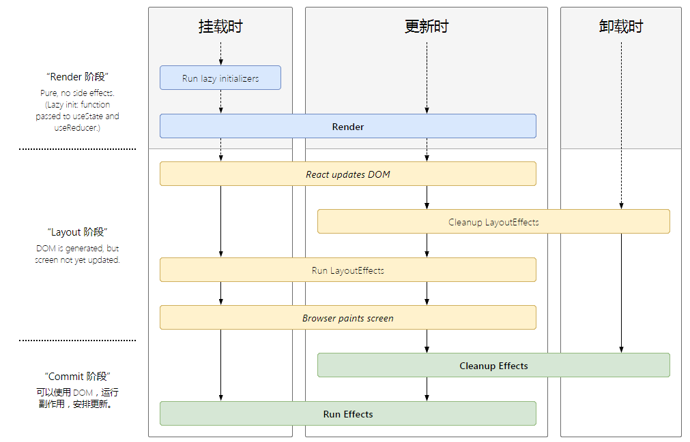
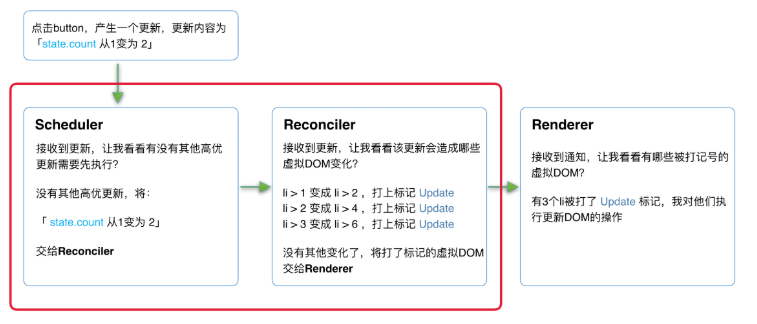

## react
首先react是一个库，不是一个框架；react的哲学是：UI = fn(data)，数据驱动；

## 什么是MVC，MVP，MVVM？
MV* 是指各种 MVC、MVP、MVVM 等 Web 设计模式，通过分离关注点来改进代码的组织方式，设计模式并不是凭空的创造，而是对复杂问题解决的不断提炼，即使没有看过这些设计模式的介绍，也许在日常开发中就已经使用了其中的思想；

## 最简单的例子
用一个最简单的例子来展示各种设计模式

页面有一个 id 为 container 的 span，点击按钮会让其内容加 1
```js
<div>
  <span id="container">0</span>
  <button id="btn" onclick="javascript:add()">+</button>
</div>

<script>
  function add (){
    const container = document.getElementById('container');
    const current = parseInt(container.innerText);
    container.innerText = current + 1;
  }
</script>
```
视图渲染和数据处理的逻辑杂糅在一起，随着业务逻辑变复杂，代码将失控，难以维护；

## MVC
MVC 是 Model View Controller 的缩写
- Model：模型层，数据相关的操作
- View：视图层，用户界面渲染逻辑
- Controller：控制器，数据模型和视图之间通信的桥梁

MVC 模型有很多变种和数据流动方式，最传统的 MVC 模型把视图渲染和数据处理做了隔离，通过控制器接收 View 操作，传递给数据模型，数据 ready 后由数据模型驱动视图渲染；

上面的例子用 MVC 模式来写可以做简单的代码分离

view：
```js
<div>
  <span id="container">0</span>
  <button id="btn">+</button>
</div>
```

model：
```js
function add (node) {
  // 业务逻辑处理
  const currentValue = parseInt(node.innerText);
  const newValue = currentValue + 1;

  // 更新视图
  node.innerText = current + 1;
}
```

controller：
```js
const button = document.getElementById('btn');
// 响应视图指令
button.addEventListener('click', () => {
  const container = document.getElementById('container');

  // 调用模型
    add(container);
}, false);
```

1. 视图层最简单，处理页面的渲染
2. 模型层定义了 +1 操作的实现，并更新视图数据
3. 控制器在用户点击按钮的时候把请求转发给模型处理，在 web 开发中一般页面、接口请求的路由也是控制器负责。

在上面例子中为了尽量让数据处理和 UI 隔离，Controller 获取了 container 节点，做为参数传给了 Model，这样 Controller 需要理解 View，也就是和 View 的实现还是存在耦合，在 MVC 的实践中相当程度的业务逻辑实际会被写在 Controller 中，因为 Controller 被定位为 View 的 Model 沟通的桥梁，这部分耦合可以接受;

但因为 View 的更新由 Model 处理，所以 Model 难免要和 View 的实现耦合，可以使用观察者模式让 View 监听 Mode 的数据变化做出更新，但这样 View 的实现又依赖的 Model；

## MVP
MVP 是 Model View Presenter 的缩写，可以说是 MVC 模式的改良，相对于 MVC 有了各层负责的任务和数据流动方式都有了部分变化；

- Model：和具体业务无关的数据处理
- View：用户界面渲染逻辑
- Presenter：响应视图指令，同时进行相关业务处理，必要时候获调用 Model 获取底层数据，返回指令结果到视图，驱动视图渲染；

MVP 模式相对于 MVC 有几个核心变化：
1. View 和 Model 完全隔离，Model 不再负责业务逻辑和视图变化，只负责底层数据处理
2. Presenter 接管路由和业务逻辑，但要求 View 实现 View Interface，方便和具体 View 解耦，可以不依赖 UI 进行单元测试；
3. View 层只负责发起指令和根据数据渲染 UI，不再有主动监听数据变化等行为，所以也被称之为被动视图；

使用 MVP 模式修改上面例子：

view：
```js
<div>
    <span id="container">0</span>
    <button id="btn">+</button>
</div>
<script>
  // View Interface
  const globalConfig = {
    containerId: 'container',
    buttonId: 'btn',
  };
</script>
```

model：
```js
function add (num) {
  return num + 1;
}
```

presenter：
```js
const button = document.getElementById(globalConfig.containerId);
const container = document.getElementById(globalConfig.buttonId);

// 响应视图指令
button.addEventListener('click', () => {
  const currentValue = parseInt(container.innerText);
  // 调用模型
    const newValue = add(currentValue);
  // 更新视图
  container.innerText = current + 1;
}, false);
```

这样 Model 只处理业务无关的数据处理，会变得非常稳定，同时 Presenter 和 View 通过接口/配置桥接，相对于直接 MVC 耦合降低了很多；

可以看出 MVP 相对于 MVC 数据与视图分离做的更为出色，在大部分时候使用 MVC 其实是在使用 MVP；

## MVVM
MVVM 可以写成 MV-VM，是 Model View - ViewModel 的缩写，可以算是 MVP 模式的变种，View 和 Model 职责和 MVP 相同，但 ViewModel 主要靠 DataBinding 把 View 和 Model 做了自动关联，框架替应用开发者实现数据变化后的视图更新，相当于简化了 Presenter 的部分功能；

前端比较熟悉的 Vue 正是使用 MVVM 模式，使用 Vue 实现示例功能；

view：
```js
<div id="test">
    <!-- 数据和视图绑定 -->
    <span>{{counter}}</span>
    <button v-on:click="counterPlus">+</button>
</div>
```

model：
```js
function add (num) {
  return num + 1;
}
```

viewmodel：
```js
new Vue({
  el: '#test',
  data: {
    counter: 0
  },
  methods: {
    counterPlus: function () {
        // 只需要修改数据，无需手工修改视图
        this.counter = add(this.counter);
    }
  }
})
```

在 View 中做了数据和视图的绑定，在 ViewModel 中只需要更新数据，视图就会自动变化，DataBinding 由框架实现；

## 总结
MVC、MVP、MVVM 三种流行的设计模式主要都是在解决数据和视图逻辑的分离问题，在实际使用中还有很多变种，总体而言：
- MVC 对视图和数据做了第一步的分离，实现简单，但 View、业务逻辑、底层数据模型 分离的不彻底：
- MVP 通过 Presenter 彻底解耦了 View 和 Model，同时剥离了业务逻辑和底层数据逻辑，让 Model 变得稳定，但业务逻辑复杂情况下 Presenter 会相对臃肿；
- MVVM 通过 DataBinding 实现了视图和数据的绑定，但依赖框架实现，增加了理解成本，在错误使用的情况下调试复杂；

## React lifecycle
> https://lifecycle.reactacademy.ca/

我们先来看一下16.4的生命周期函数：



legacy，也就是老版本的生命周期，其中红色的是要在17大版本删除的：



hooks的生命钩子，可以看出，hooks是为了模糊掉生命周期的：



## React 理念
> 官网：我们认为，React 是用 JavaScript 构建快速响应的大型 Web 应用程序的首选方式。它在 Facebook 和 Instagram 上表现优秀。

那么该如何理解快速响应？可以从两个角度来看：
- 速度快
- 响应自然

React是如何实现这两点的呢？

## 理解“速度快”
我们经常用“前端三大框架”指React、Vue和Angular。相比于使用模版语言的Vue、Angular，使用原生js（JSX仅仅是js的语法糖）开发UI的React在语法层面有更多灵活性。

由于语法的灵活，在编译时无法区分可能变化的部分。所以在运行时，React需要遍历jsx，判断其数据是否更新。

基于以上原因，相比于Vue、Angular，缺少编译时优化手段的React为了速度快需要在运行时做出更多努力。

比如：
- 使用PureComponent或React.memo构建组件
- 使用shouldComponentUpdate生命周期钩子
- 渲染列表时使用key
- 使用useCallback和useMemo缓存函数和变量

由开发者来显式的告诉React哪些组件不需要重复计算、可以复用。

在后面源码的学习中，我们会看到这些优化手段是如何起作用的。比如经过优化后，React会通过bailoutOnAlreadyFinishedWork方法跳过一些本次更新不需要处理的任务。

## 理解“响应自然”
简单来说，就是把用户的操作优先响应，优先级低的可以延迟响应；

当用户输入过快时可能输入变得不是那么流畅。这是由于下拉列表的更新会阻塞线程。我们一般是通过debounce 或 throttle来减少输入内容时触发回调的次数来解决这个问题。

但这只是治标不治本。只要组件的更新操作是同步的，那么当更新开始直到渲染完毕前，组件中总会有一定数量的工作占用线程，浏览器没有空闲时间绘制UI，造成卡顿。

让我们从“响应自然”的角度考虑：当输入字符时，用户是否在意下拉框能在一瞬间就更新？

事实是：并不在意。

如果我们能稍稍延迟下拉框更新的时间，为浏览器留出时间渲染UI，让输入不卡顿。这样的体验是更自然的。

为了实现这个目标，需要将同步的更新变为可中断的异步更新。

在浏览器每一帧的时间中，预留一些时间给JS线程，React利用这部分时间更新组件（可以看到，在源码中，预留的初始时间是5ms）。

当预留的时间不够用时，React将线程控制权交还给浏览器使其有时间渲染UI，React则等待下一帧时间到来继续被中断的工作。

## 总结
通过以上内容，我们可以看到，React为了践行“构建快速响应的大型 Web 应用程序”理念做出的努力。

这其中有些优化手段可以在现有架构上增加，而有些（如：异步可中断更新）只能重构整个架构实现。

相对于Vue这样的框架，React更在意底层抽象的表现力。

## React15 vs React16
React从v15升级到v16后重构了整个架构。本节我们聊聊v15，看看他为什么不能满足速度快，响应自然的理念，以至于被重构。

### React15架构
React15架构可以分为两层：
- Reconciler（协调器）—— 负责找出变化的组件
- Renderer（渲染器）—— 负责将变化的组件渲染到页面上

1. Reconciler（协调器）
我们知道，在React中可以通过this.setState、this.forceUpdate、ReactDOM.render等API触发更新。

每当有更新发生时，Reconciler会做如下工作：
- 调用函数组件、或class组件的render方法，将返回的JSX转化为虚拟DOM
- 将虚拟DOM和上次更新时的虚拟DOM对比
- 通过对比找出本次更新中变化的虚拟DOM
- 通知Renderer将变化的虚拟DOM渲染到页面上

2. Renderer（渲染器）
由于React支持跨平台，所以不同平台有不同的Renderer。我们前端最熟悉的是负责在浏览器环境渲染的Renderer —— ReactDOM。除此之外还有一些别的平台；

主流的浏览器刷新频率为60Hz，即每（1000ms / 60Hz）16.6ms浏览器刷新一次。我们知道，JS可以操作DOM，GUI渲染线程与JS线程是互斥的。所以JS脚本执行和浏览器布局、绘制不能同时执行。

在每16.6ms时间内，需要完成如下工作：
```js
JS脚本执行 -----  样式布局 ----- 样式绘制
```
当JS执行时间过长，超出了16.6ms，这次刷新就没有时间执行样式布局和样式绘制了。

对于用户在输入框输入内容这个行为来说，就体现为按下了键盘按键但是页面上不实时显示输入。

对于React的更新来说，由于递归执行，所以更新一旦开始，中途就无法中断。当层级很深时，递归更新时间超过了16ms，用户交互就会卡顿。

Reconciler和Renderer是交替工作的，整个过程都是同步的，所以在用户看来所有DOM是同时更新的。

这样就会出现页面更新不完全就显示dom；所有react重构了；

## React16架构
React16架构可以分为三层：
- Scheduler（调度器）—— 调度任务的优先级，高优任务优先进入Reconciler
- Reconciler（协调器）—— 负责找出变化的组件
- Renderer（渲染器）—— 负责将变化的组件渲染到页面上

可以看到，相较于React15，React16中新增了Scheduler（调度器），让我们来了解下他。

1. Scheduler（调度器）

既然我们以浏览器是否有剩余时间作为任务中断的标准，那么我们需要一种机制，当浏览器有剩余时间时通知我们。

其实部分浏览器已经实现了这个API，这就是requestIdleCallback。但是由于以下因素，React放弃使用：
- 浏览器兼容性
- 触发频率不稳定，受很多因素影响。比如当我们的浏览器切换tab后，之前tab注册的requestIdleCallback触发的频率会变得很低；

基于以上原因，React实现了功能更完备的requestIdleCallbackpolyfill，这就是Scheduler。除了在空闲时触发回调的功能外，Scheduler还提供了多种调度优先级供任务设置。

2. Reconciler（协调器）
我们知道，在React15中Reconciler是递归处理虚拟DOM的。

我们可以看见，更新工作从递归变成了可以中断的循环过程。每次循环都会调用shouldYield判断当前是否有剩余时间。
```js
/** @noinline */
function workLoopConcurrent() {
  // Perform work until Scheduler asks us to yield
  while (workInProgress !== null && !shouldYield()) {
    workInProgress = performUnitOfWork(workInProgress);
  }
}
```

那么React16是如何解决中断更新时DOM渲染不完全的问题呢？

在React16中，Reconciler与Renderer不再是交替工作。当Scheduler将任务交给Reconciler后，Reconciler会为变化的虚拟DOM打上代表增/删/更新的标记，类似这样：
```js
export const Placement = /*             */ 0b0000000000010;
export const Update = /*                */ 0b0000000000100;
export const PlacementAndUpdate = /*    */ 0b0000000000110;
export const Deletion = /*              */ 0b0000000001000;
```

**整个Scheduler与Reconciler的工作都在内存中进行。只有当所有组件都完成Reconciler的工作，才会统一交给Renderer。**

那具体react是如何再继续之前被打断的任务呢？
```js
prepareFreshStack(root, lanes)
```

prepareFreshStack 会将 WIP 重置；可以这么理解，就是input输入渲染一个长list，当list 没有渲染完，input又输入了，得优先做输入的任务；

当然如果是时间片不够，应该会复用WIP树；

3. Renderer（渲染器）
Renderer根据Reconciler为虚拟DOM打的标记，同步执行对应的DOM操作。

在React16架构中整个更新流程为：



其中红框中的步骤随时可能由于以下原因被中断：
- 有其他更高优任务需要先更新
- 当前帧没有剩余时间

由于红框中的工作都在内存中进行，不会更新页面上的DOM，所以即使反复中断，React15中的问题 (用户看见更新不完全的DOM) 也不会出现。

## 总结
通过本节我们知道了React16采用新的Reconciler。

Reconciler内部采用了Fiber的架构。

Fiber是什么？他和Reconciler或者说和React之间是什么关系？

## Fiber 架构
Fiber并不是计算机术语中的新名词，他的中文翻译叫做纤程，与进程（Process）、线程（Thread）、协程（Coroutine）同为程序执行过程。

在很多文章中将纤程理解为协程的一种实现。在JS中，协程的实现便是Generator。

所以，我们可以将纤程(Fiber)、协程(Generator)理解为代数效应思想在JS中的体现。

React Fiber可以理解为：
- React内部实现的一套状态更新机制。支持任务不同优先级，可中断与恢复，并且恢复后可以复用之前的中间状态。

其中每个任务更新单元为React Element对应的Fiber节点。

## Fiber的起源
我们提到的虚拟DOM在React中有个正式的称呼——Fiber。在之后的学习中，我们会逐渐用Fiber来取代React16虚拟DOM这一称呼。

接下来让我们了解下Fiber因何而来？他的作用是什么？

在React15及以前，Reconciler采用递归的方式创建虚拟DOM，递归过程是不能中断的。如果组件树的层级很深，递归会占用线程很多时间，造成卡顿。

为了解决这个问题，React16将递归的无法中断的更新重构为异步的可中断更新，由于曾经用于递归的虚拟DOM数据结构已经无法满足需要。于是，全新的Fiber架构应运而生。

## Fiber的含义
Fiber包含三层含义：
1. 作为架构来说，之前React15的Reconciler采用递归的方式执行，数据保存在递归调用栈中，所以被称为stack Reconciler。React16的Reconciler基于Fiber节点实现，被称为Fiber Reconciler。

2. 作为静态的数据结构来说，每个Fiber节点对应一个组件，保存了该组件的类型（函数组件/类组件/原生组件...）、对应的DOM节点等信息。

3. 作为动态的工作单元来说，每个Fiber节点保存了本次更新中该组件改变的状态、要执行的工作（需要被删除/被插入页面中/被更新...）。

> 参考 https://react.iamkasong.com

## jsx
JSX作为描述组件内容的数据结构，为JS赋予了更多视觉表现力。在React中我们大量使用他。在深入源码之前，有些疑问我们需要先解决：

- JSX和Fiber节点是同一个东西么？
- React Component、React Element是同一个东西么，他们和JSX有什么关系？

JSX在编译时会被Babel编译为React.createElement方法。

这也是为什么在每个使用JSX的JS文件中，你必须显式的声明
```js
import React from 'react';
```

否则在运行时该模块内就会报未定义变量 React的错误。

JSX并不是只能被编译为React.createElement方法，你可以通过@babel/plugin-transform-react-jsx插件显式告诉Babel编译时需要将JSX编译为什么函数的调用（默认为React.createElement）。

比如在preact这个类React库中，JSX会被编译为一个名为h的函数调用。
```js
// 编译前
<p>xiaoming</p>
// 编译后
h("p", null, "xiaoming");
```

从上面的内容我们可以发现，JSX是一种描述当前组件内容的数据结构，他不包含组件schedule、reconcile、render所需的相关信息。

比如如下信息就不包括在JSX中：
- 组件在更新中的优先级
- 组件的state
- 组件被打上的用于Renderer的标记

这些内容都包含在Fiber节点中。

所以，在组件mount时，Reconciler根据JSX描述的组件内容生成组件对应的Fiber节点。

在update时，Reconciler将JSX与Fiber节点保存的数据对比，生成组件对应的Fiber节点，并根据对比结果为Fiber节点打上标记。

## 整体更新流程
```js
创建fiberRootNode、rootFiber、updateQueue（`legacyCreateRootFromDOMContainer`）

    |
    |
    v

创建Update对象（`updateContainer`）

    |
    |
    v

从fiber到root（`markUpdateLaneFromFiberToRoot`）

    |
    |
    v

调度更新（`ensureRootIsScheduled`）

    |
    |
    v

render阶段（`performSyncWorkOnRoot` 或 `performConcurrentWorkOnRoot`）

    |
    |
    v

commit阶段（`commitRoot`）
```

## Hooks
> https://zhuanlan.zhihu.com/p/92211533
> https://overreacted.io/zh-hans/a-complete-guide-to-useeffect/

- componentDidMount：当deps为空时，re-render时不再执行callback
```js
// mount结束，已经更新到DOM
const onMount = function useDidMount(effect) => {
    useEffect(effect, []);
};
```

- componentDidUpdate
```js
// layout结束，render DOM之前（会block rendering）
const onUpdate = function useUpdate(effect) => {
  useLayoutEffect(effect, []);
};
```

- componentWillUnMount
```js
const unMount = function useWillUnMount(effect, deps = []) => {
  useEffect(() => effect, deps);
};
```

- shouldComponentUpdate（或React.PureComponent）
```js
// 使用React.memo包裹组件
const MyComponent = React.memo(() => {
  return <Child prop={prop} />
}, [prop]);

// or
function A({ a, b }) {
  const B = useMemo(() => <B1 a={a} />, [a]);
  const C = useMemo(() => <C1 b={b} />, [b]);
  return (
    <>
      {B}
      {C}
    </>
  );
}
```

## 每一次都会有自己的事件处理函数和值
```js
function App() {
  const [count, setCount] = useState(0);

  function handleAlertClick() {
    // Click me 三次再 Show alert，然后继续 Click me
    // 每次渲染都会有自己的值和点击函数
    // 事实上每一次渲染都有它自己的…所有
    setTimeout(() => {
      alert('You clicked on: ' + count);
    }, 3000);
  }

  return (
    <div>
      <p>You clicked {count} times</p>
      <button onClick={() => setCount(count + 1)}>
        Click me
      </button>
      <button onClick={handleAlertClick}>
        Show alert
      </button>
    </div>
  );
}
```

## 其实hooks的实现是依赖闭包的
- 每一个组件内的函数（包括事件处理函数，effects，定时器或者API调用等等）会捕获某次渲染中定义的props和state。
```js
function Counter() {
  const [count, setCount] = useState(0);
  // 点击多次以后，都会有自己的count值
  useEffect(() => {
    setTimeout(() => {
      console.log(`You clicked ${count} times`);
    }, 3000);
  });

  return (
    <div>
      <p>You clicked {count} times</p>
      <button onClick={() => setCount(count + 1)}>
        Click me
      </button>
    </div>
  );
}
```

## hooks 使用的注意点
1. hook只能使用在函数组件
2. 一个函数组件可以有很多hook，这样非常有利于横切关注点。

### useState
useState 运行过程：
1. 运行函数组件时，调用useState（第一次运行）
2. 检查一个状态表格
- 状态表格无内容
- 使用默认值在表格创建一个状态
- 将状态加入数组（多个时候就加多个）
3. 重新渲染界面又调用一次
- 状态表格有内容（不需要重新创建了）
- 忽略默认值，直接得到状态
4. 表格附着在函数组件上的，所以不会共享状态（各有各的状态表格）

注意细节：
```js
  const [n, setN] = useState(0)
```
1. useState 最好写在函数起始位置，方便维护
2. useState 不能出现在判断条件if里面，这样对维护表格不利（react根本不让这么写）
3. useState返回的第二项，引用不变，节省内存
4. 如果使用函数```setN(0)```改变数据，若数据和之前的数据完全相等（使用Object.is），不会导致重新渲染。
5. 使用函数改变数据，传入的值不会和原来的合并，而是直接替换。（setState是混合的，可以局部修改）
6. 也不能直接修改数据，和之前类组件一样。
7. 如果要强制刷新组件
- 强制刷新组件，类组件用forceUpdate()
- useState直接set一个空对象就行了, 因为它是覆盖```const [n, forceUpdate] = useState(0)```
8. 和类组件一样，组件中改变状态可能是异步的（在dom事件中），多个状态会合并提高效率，此时，不能信任之前的状态，应该使用回调函数的方式。

**如果某些状态之间没有必然的联系，应该切分为不同的状态，而不要合并成一个状态**
**因为代码耦合度越低，越好维护**

### Effect Hook：用于函数组件中处理副作用
类组件的时候，涉及服务端渲染，除了DidMount, DidUpdate, willUnMount以外其它都会渲染两次，尽管react反复强调只能在三个生命周期使用，但是很多开发者不遵守，直接出Effect Hook了。
```js
  useEffect(() => {
    // do something
    // 比如增加一个计时器
    return () => {
      //  清楚操作
    }
  }, []);
```

注意的细节：
1. useEffect 运行的时间点是页面真实dom渲染完成后。因此它是异步执行的，并且不会阻塞浏览器
2. 相当于类组件的生命钩子 DidMount 和 DidUpdate，挂载完和更新完；
3. 但是又有区别的，类组件的两个生命钩子更改了真实的dom，但是用户没有看到UI界面，是[同步的]
4. useEffect 中的副作用函数，是更改了真实的dom，并且用户已经看到了UI更新，[异步的]。不会阻塞界面；
5. 每个函数组件中可以多次使用，但是也不能放在判断或循环等代码块中，和useState一样，后面的hook基本一致（一般不要用这么奇葩的写法）
6. useEffect 是有返回值的，返回的是一个清理函数，函数的运行时间点是每次运行副作用的函数之前；首次渲染组件不会运行。组件销毁时，一定会运行。
7. 重新渲染组件的时候，不想重新运行副作用函数，可以使用第二个参数，这个参数是数组，然后副作用函数就依赖这个数组，只有依赖的数据和上一次不一样时，才会运行执行第一个副作用函数参数。
8. 所以当传递了依赖数据之后，如果数据没有变化
- 副作用函数仅在第一次渲染后运行
- 清理函数仅在卸载组件后运行
9. 所以，就可以利用 useEffect 来实现之前类组件的挂载运行一次，卸载时运行一次。（特别是监听移除dom事件）
10. 如果依赖项使用的是空数组，清理函数就没有作用了，但是卸载还是会运行一次
11. 副作用函数中，如果使用了函数组件上下文的变量，由于闭包的影响，会导致副作用函数中变量不会实时变化。js的知识点。
12. 如果副作用函数在每次注册时，会覆盖之前的副作用函数，因此，尽量保持副作用函数稳定，否则控制起来会比较复杂。（把副作用函数抽出去写，动态改变）
13. effects会在每次渲染后运行，并且概念上它是组件输出的一部分，可以“看到”属于某次特定渲染的props和state。也就是说 effects 会有自己的state 和 props
```js
  // 点击一次按钮执行一次 setCount
  useEffect(() => {
    setTimeout(() => {
      console.log(`You clicked ${count} times`);
    }, 3000);
  });
  // 当然如果你想要用最新的值，用 ref
  const [count, setCount] = useState(0);
  const latestCount = useRef(count);
  // 每次都能拿到最新的 count ，这其实是可变数据的锅
  // 如果是使用原来的 count，就是简单的函数闭包，不可变数据
  useEffect(() => {
    // Set the mutable latest value
    latestCount.current = count;
    setTimeout(() => {
      // Read the mutable latest value
      console.log(`You clicked ${latestCount.current} times`);
    }, 3000);
  });
```

14. 多次复用 useEffect 的正确姿势，应该注意依赖项的使用，充分发挥 不可变数据 和 单一数据流魅力
```js
function Parent() {
  const [query, setQuery] = useState('react');

  // ✅ Preserves identity until query changes
  const fetchData = useCallback(() => {
    const url = 'https://hn.algolia.com/api/v1/search?query=' + query;
    // ... Fetch data and return it ...
  }, [query]);  // ✅ Callback deps are OK

  return <Child fetchData={fetchData} />
}

function Child({ fetchData }) {
  let [data, setData] = useState(null);

  useEffect(() => {
    fetchData().then(setData);
  }, [fetchData]); // ✅ Effect deps are OK

  // ...
}
```

### 自定义hook
将一些常用的、跨组件的hook功能，抽离出去形成一个函数，该函数就是自定义hook

- 例如1：很多组件都需要在第一次加载完成之后，获取所有XXX的数据。
- 放在以前类组件，只能在挂载完成DidMount请求数据，或者redux。
- 以前的一些做法：
1. render props 数据一样，界面不一样，其实就是传递一个render函数下去运行。
2. withComponent 高阶组件就是把相同的逻辑抽出来。

- 自定义hook细节：
1. 函数名必须以use开头
2. 调用自定义hook函数时，应该放到顶层
3. 自定义hook其实就是把hook抽成一个函数出去，多个hook就可以抽多个，横切关注点，用组合compose编程。
- render props 数据一样，界面不一样，其实就是传递一个render函数下去运行。
- withComponet 高阶组件就是把相同的逻辑抽出来。

### reducer hook
- 该函数接受两个参数，一个是state，和action，和redux那一套一样。调用store.dispatch分发action返回变化后的数据。
- redux：action -> store.dispatch(action.type) -> reducer -> newState -> store
- reducer hook 未来可能会结合redux使用，目前也有一些很成熟的库使用了；
```js
// 通用的reducer hook, 其实就是一个store
export default function useReducer(reducer, initState, initFunc) {
    // initFunc是一个对第二个参数进行计算的一个回调函数
    const [state, setState] = useState(initFunc ? initFunc(initState) : initState)
    // 相当与store.dispatch
    function dispatch(action){
        const newState = reducer(state, action)
        setState(newState)
    }
    return [state, dispatch]
}
```

### Context hook
- 获取上下文数据，之前的React.createContext()消费者也要套一层。
- 用这个hook就可以直接返回ctx的值，直接看用例把；
```js
const ctx = React.createContext()

// function Test(){
//    return <ctx.Consumer>
//        {value => <div>Context: {value}</div>}
//    </ctx.Consumer>
// }

function Test(){
   const value = useContext(ctx)
   return <div>Context: {value}</div>
}

export default function Context() {
    return (
        <ctx.Provider value='abc'>
            <Test />
        </ctx.Provider>
    )
}
```

### callback hook
- 用于得到一个固定引用值的函数，通常用它来优化性能
- 该函数有两个参数：
1. 函数，useCallback会固定该函数的引用，只要依赖项没发生变化则会保持之前函数的地址
2. 依赖项，也是个数组;
- 该函数返回值：引用相对固定的函数地址
```js
class CallBack extends React.PureComponent {
    render() {
        console.log('CallBack render')
        return (
            <div>
                <button onClick={ this.props.onClick }>点击</button>
            </div>
        )
    }
}

export default function Parent(){
    const [n, setN] = useState(0)
    const [txt, setTxt] = useState(123)
    console.log('Parent render', txt)
    {/* useCallback把参数函数地址固化，CallBack类组件的PureComponent浅比较有效 */}
    const handleClick = useCallback(() => {
        setTxt(txt + 1)
    }, [txt]) //依赖项变了才会返回新地址的函数

    return (
        <div>
            {/* onClick函数地址变了，导致CallBack类组件的PureComponent浅比较无效 */}
            <CallBack text={txt} onClick={ handleClick }/>
            <input value={n} type='number' onChange={
                e => {
                    setN(e.target.value)
                } 
            }/>
        </div>
    )
}
```

### Memo hook
- 用于保持一些比较稳定的数据，通常用于性能优化，用法和callback一样，只是callback只能固话一个引用返回。Memo功能强大些，可以固化更多东西。
- 可以让一些稳定的，高开销的渲染数据避免掉没有必要的渲染。
- 比如说list数据不想受点击事件避免不了的重新渲染，就可以用Memo;
- 为什么会出Memo callback这样的API，因为函数组件是普通函数，它总是被重新渲染，不像类组件那样有些生命钩子只渲染一次。
```js
function Item({value}){
        return (
            <div>
                {value}
            </div>
        )
    }

export default function Parent(){
    const [n, setN] = useState(0)
    const [range,] = useState({min:0, max:1000})

    // 随便 setN 改一下值，就会导致全部重新渲染，太可怕了，以前类组件的优化也无能为力
    // 这时候可以用useMemo，直接固化list，太爽了
    // 由于list没有变化，导致react元素本身引用没有变化，一定不会发生重新渲染。
    const list = useMemo(() => {
        const list = []
        for(let i = range.min; i <= range.max; i++){
            list.push(<Item key={i} value={i}/>)
        }
        return list
    }, [range.min, range.max])

    return (
        <div>
             {list}
             <div>
                <input value={n} type='number' onChange={
                    e => {
                        setN(e.target.value)
                    } 
                }/>
             </div>
        </div>
    )
}
```

### imperativeHandle and Ref Hook
- useImperativeHandle 这个 hook，主要是用来使用ref转发的
```js
function Test(props, ref){
   useImperativeHandle(ref, () => {
      // 返回的这个对象属性会挂载到这个ref上； 
      return {
        method(){
            console.log('method must be caller')
        }
      }
    // 如果不给依赖项，则每次运行函数组件都会调用该函数
    // 如果使用了依赖项，则第一次调用后，则进行缓存，依赖项变化才重新运行
   }, [])
   return <div>test111</div>
}

const WithTest = React.forwardRef(Test)

export default function ImperativeHandle() {
    const [, forceUpdate] = useState({})
    const ref = useRef()

    return (
        <div>
            <WithTest ref={ref}/>

            <button onClick={
                () => {
                    ref.current.method()
                }
            }>click WithTest the method</button>

            <button onClick={
                () => {
                    forceUpdate({})
                }
            }>刷新</button>
        </div>
    )
}
```

### LayoutEffect Hook
- useEffect 是在浏览器渲染之后运行的，如果用它操作真实的dom，渲染页面有时候会闪烁，卡屏；
- 真实渲染之前做一些改动，用 useLayoutEffect: 完成dom更新后，还没有呈现给用户。
- 用法和useEffect一样。
- 但是应该尽量的使用useEffect，因为它不会阻塞页面渲染，如果出现了问题，再考虑使用 useLayoutEffect

