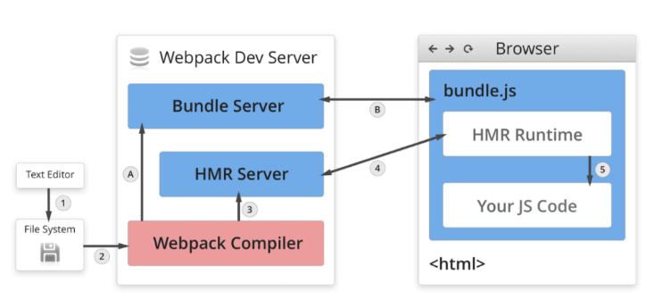
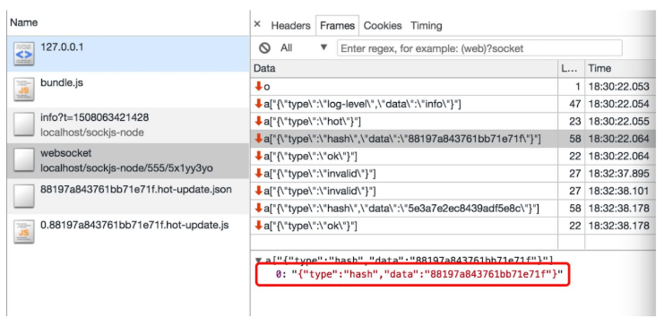
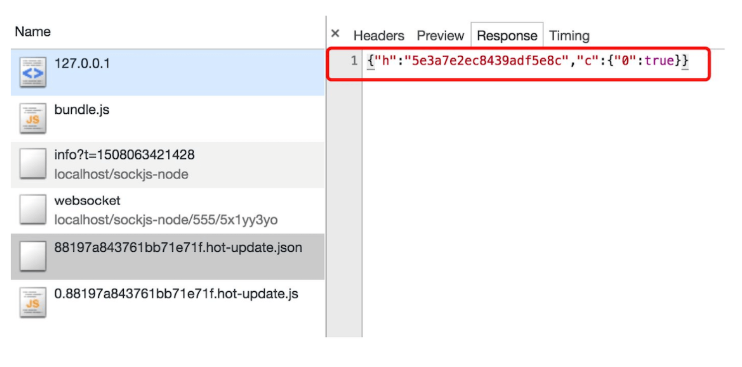
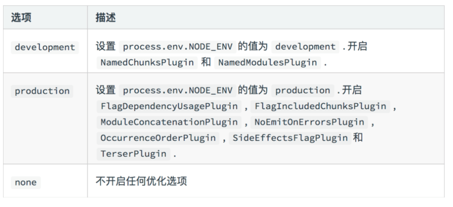

## 前端构建之路
1. ant + YUI Tool 
2. grunt
3. fis3/gulp
4. webapck/rollup/parcal

## css的问题

### 类名冲突的问题

当你写一个css类的时候，你是写全局的类呢，还是写多个层级选择后的类呢？

你会发现，怎么都不好

- 过深的层级不利于编写、阅读、压缩、复用
- 过浅的层级容易导致类名冲突

一旦样式多起来，这个问题就会变得越发严重，其实归根结底，就是类名冲突不好解决的问题

### 重复样式

这种问题就更普遍了，一些重复的样式值总是不断的出现在css代码中，维护起来极其困难

比如，一个网站的颜色一般就那么几种：
- primary
- info
- warn
- error
- success

如果有更多的颜色，都是从这些色调中自然变化得来，可以想象，这些颜色会到处充斥到诸如背景、文字、边框中，一旦要做颜色调整，是一个非常大的工程

### css文件细分问题

在大型项目中，css也需要更细的拆分，这样有利于css代码的维护。

比如，有一个做轮播图的模块，它不仅需要依赖js功能，还需要依赖css样式，既然依赖的js功能仅关心轮播图，那css样式也应该仅关心轮播图，由此类推，不同的功能依赖不同的css样式、公共样式可以单独抽离，这样就形成了不同于过去的css文件结构：文件更多、拆分的更细;

而同时，在真实的运行环境下，我们却希望文件越少越好，这种情况和JS遇到的情况是一致的

因此，对于css，也需要工程化管理

从另一个角度来说，css的工程化会遇到更多的挑战，因为css不像JS，它的语法本身经过这么多年并没有发生多少的变化（css3也仅仅是多了一些属性而已），对于css语法本身的改变也是一个工程化的课题

### 如何解决

这么多年来，官方一直没有提出方案来解决上述问题

一些第三方机构针对不同的问题，提出了自己的解决方案

### 解决类名冲突

一些第三方机构提出了一些方案来解决该问题，常见的解决方案如下：

**命名约定**

即提供一种命名的标准，来解决冲突，常见的标准有：

- BEM
- OOCSS
- AMCSS
- SMACSS
- 其他

**css in js**

这种方案非常大胆，它觉得，css语言本身几乎无可救药了，干脆直接用js对象来表示样式，然后把样式直接应用到元素的style中

这样一来，css变成了一个一个的对象，就可以完全利用到js语言的优势，你可以：

- 通过一个函数返回一个样式对象
- 把公共的样式提取到公共模块中返回
- 应用js的各种特性操作对象，比如：混合、提取、拆分
- 更多的花样

> 这种方案在手机端的React Native中大行其道

**css module**

非常有趣和好用的css模块化方案，编写简单，绝对不重名

具体后面详细介绍

### 解决重复样式的问题

**css in js**

这种方案虽然可以利用js语言解决重复样式值的问题，但由于太过激进，很多习惯写css的开发者编写起来并不是很适应

**预编译器**

有些第三方搞出一套css语言的进化版来解决这个问题，它支持变量、函数等高级语法，然后经过编译器将其编译成为正常的css

这种方案特别像构建工具，不过它仅针对css

常见的预编译器支持的语言有：
- less
- sass

### 解决css文件细分问题

这一部分，就要依靠构建工具，例如webpack来解决了

利用一些loader或plugin来打包、合并、压缩css文件

## 抽离css文件

目前，css代码被css-loader转换后，交给的是style-loader进行处理。

style-loader使用的方式是用一段js代码，将样式加入到style元素中。

而实际的开发中，我们往往希望依赖的样式最终形成一个css文件

此时，就需要用到一个库：`mini-css-extract-plugin`

该库提供了1个plugin和1个loader

- plugin：负责生成css文件
- loader：负责记录要生成的css文件的内容，同时导出开启css-module后的样式对象

使用方式：

```js
const MiniCssExtractPlugin = require("mini-css-extract-plugin")
module.exports = {
    module: {
        rules: [
            {
                test: /\.css$/, use: [MiniCssExtractPlugin.loader, "css-loader?modules"]
            }
        ]
    },
    plugins: [
        new MiniCssExtractPlugin() //负责生成css文件
    ]
}
```

**配置生成的文件名**

同`output.filename`的含义一样，即根据chunk生成的样式文件名

配置生成的文件名，例如`[name].[contenthash:5].css`

默认情况下，每个chunk对应一个css文件

## js编译
```js
function A() {
    return new Promise(resolve => {
        setTimeout(() => {
            resolve(3);
        }, 1000);
    })
}
async function B() {
    const b = await A();
    const c = await A();
    return b + c;
}
B().then(data => console.log(data));
```
编译后：
```js
"use strict";
function asyncGeneratorStep(gen, resolve, reject, _next, arg) {
    try {
        var info = gen.next(arg);
        var value = info.value;
    } catch (error) {
        reject(error);
        return;
    }

    if (info.done) {
        resolve(value);
    } else {
        Promise.resolve(value).then(data => {
            _next(data);
        });
    }
}


function A() {
    return new Promise(function (resolve) {
        setTimeout(function () {
            resolve(3);
        }, 1000);
    });
}

function B() {
    var fn = function* () {
        const b = yield A();
        const c = yield A();
        return b + c;
    };
    return new Promise(function (resolve, reject) {
        var gen = fn();
        function _next(value) {
            asyncGeneratorStep(gen, resolve, reject, _next, value);
        }
        _next(undefined);
    });
}

B().then(function (data) {
    return console.log(data);
});
```

### 构建性能
记住，构建性能只在开发阶段，主要是决解开发阶段的开发速度。

## webpack 基础配置

### devtool 配置
1. source map 应在开发环境中使用，作为一种调试手段``devtool: 'cheap-module-eval-source-map'``
2. source map 不应该在生产环境中使用，source map的文件一般较大，不仅会导致额外的网络传输，还容易暴露原始代码。即便要在生产环境中使用source map，用于调试真实的代码运行问题，也要做出一些处理规避网络传输和代码暴露的问题。但是线上出错了，我们也想快速定位：``devtool: 'cheap-module-source-map'``

### entry 和 output

entry 打包的入口，output输出文件出口
```js
// 对象，一般单页面只需要一个入口，多页面就需要多个入口；
entry: {
	main: './src/index.js',
	sub: './src/index2.js',
},
```

output必须是一个对象，output 的配置必须是一个对象，它指示 webpack 如何去输出、以及在哪里输出你的「bundle、asset 和其他你所打包或使用 webpack 载入的任何内容」。
```js
// 占位符可以灵活打包单页或者多页
// 其实 filename 还有其他的占位符
// hash,chunkhash,name,id,query
output: {
  filename: '[name].js',
  path: path.resolve('./dist'),
}
```

### 配置 Loader
webpack 开箱即用只支持 JS 和 JSON 两种文件类型，需要通过 Loaders 去支持其它文 件类型并且把它们转化成有效的模块;

Loaders 本身是一个函数，接受源文件作为参数，返回转换的结果。

例如处理图片：
```js
// 处理png的图片本身webpack并不认识，需要用file-loader这样的资源转换器；
module.exports = {
  mode: 'development',
  entry: './src/index.js',
  module: {
    rules: [{
      test: /\.png$/,
      use: {
        loader: 'file-loader',
      }
    }]
  },
  output: {
    filename: 'bundle.js',
    path: path.resolve(__dirname, 'bundle')
  }
}
```

我们来分析一下 webpack 打包的流程，最开始我们通过运行 npm run bundle，开始打包，因为本身 webpack 是知道怎么打包 js 的，所以它就一直打包打包，但当他遇到了 图片文件的时候，他就不知道怎们进行打包了，它就到配置文件的 module 选项中去找相应的规则。在配置文件中我们规定了当 webpack 遇到 图片文件的时候，就使用 file-loader 来帮我们进行打包文件。

loader 是什么？

其实 loader 就是一个方案规则，他知道对于某一个特定的文件，webpack 该怎么去进行打包，因为本身，webpak 自己是不知道怎么去打包的，所以需要去使用 loader 来打包文件。

我们再举一个例子，可能有些朋友写过 vue，在 vue 中，文件是以 .vue 文件结尾的文件，webpack 是不认识 .vue 文件的，所以需要安装一个 打包 vue-loader 来帮助 webpack 打包 vue 文件。

那具体如何配置loader?

```js
module: {
  rules: [
    {
      // 命中 js 文件
      test: /\.js$/,
      // 使用 babel-loader 来解析 js 文件
      use: ['babel-loader'],
      // 只命中 src 目录下的 js 文件，加快 webpack 的加载速度
      include: path.resolve(__dirname, 'src')
    },
    {
      // 命中 less 文件
      test: /\.less$/,
      // 从右到左依次使用 less-loader、css-loader、style-loader
      use: ['style-loader', 'css-loader', 'less-loader'],
      // 排除 node_modules 下面的 less 文件
      exclude: path.resolve(__dirname, 'node_modules')
    },
  ]
}
```

### 常用的loader

1. file-loader

有的时候，我们还有一个需求，就是想把图片打包到具体的一个文件夹中，我们可以进行如下配置
```js
rules: [{
  test: /\.png$/,
  use: {
    loader: 'file-loader',
    options: {
      name: '[name]_[hash].[ext]',
      outputPath: 'images/',
    }
  }
}]
```

url-loader可以实现同样的功能，但是，默认会把图片转成Base64，需要配置options参数limit


### 打包样式文件

通常我们写样式都通过于处理器写，但是webpack并不认识样式文件，所以：
```js
{
	test: /\.less$/,
	use: [
    'style-loader',
    'css-loader',
    'less-loader',
    'postcss-loader',
  ]
}
```
在这里我们来分析一下整个过程，当 webpack 开始加载 index.less 文件的时候，它会遵循 从右到左，从下到上的原则，依次走 postcss-loader，less-loader，css-loader，style-loader，当使用 post-loader 的时候，他会去找相应的 posts.config.js 配置文件(或者配置loader的时候指定一下)，并执行 autoprefixer 这个插件，然后在依次往上执行，知道加载解析完成。

有的时候，我们会在 js 里面加上less 文件的时候，webpack 会依次去走一下 4 个loader，但是有的时候 less 文件里面 引入其他的 less 文件，这个时候就有可能不去走 下面的 less-loader 与 postcss-loader 了，所以我们就需要在 css-loader 里面传入一个参数 importLoaders 为 2：

```js
{
  test: /\.less$/,
  use: [
    'style-loader',
    {
      loader: 'css-loader',
      options: {
        importLoaders: 2
      }
    },
    'less-loader',
    'postcss-loader',
  ]
}
```

上面这个参数的意思就是，通过在 less 里面引入的文件 还需要去走下面的两个 loader,这就保证了，不管你是 js 引入的还是less 引入的，都会从下到上依次去走四个 loader；

css 模块化，有的时候，样式会冲突，或者一改全改；我们就需要开启css 模块化；在css-loader下的options参数增加一个 modules: true；

这样带来的好处就是，我们写的各个模块里的样式文件都只对自己的模块生效，非常独立，不会对其他模块产生影响。

### 移动端

有时候我们写移动端，或者需要响应式，以前的方法是用媒体查询写多套代码，这样累死人；

我们可以用px2rem-loader 搭配手淘的 lib-flexible实现；

然后再index.html引入lib-flexible，配置一下 px2rem-loader 参数即可

### row-loader 和 html-webpack-plugin
有时候我们需要内联一些资源到html文件去，比如一个meta.html内嵌index.html

然后在模版文件 index.html 使用 raw-loader，这里需要注意的是我们需要安装 0.5.* 版本的 row-loader，此外我们是通过 html-webpack-plugin 来生成 html 的，我们可以使用 ejs 的语法：
```js
<!DOCTYPE html>
<html lang="en">
<head>
  <meta charset="UTF-8">
  <title>模块化问题例子</title>
  ${require('raw-loader!./meta.html')}
  <script>${require('raw-loader!babel-loader!../node_modules/amfe-flexible')}</script>
</head>
<body>
  <div id='root'></div>
</body>
</html>
```

打包图标一般用file-loader处理就行了；直接在index.less中引入加载进去；
```js
// 最后不要忘记了配loader
{
  test: /\.(eot|ttf|svg|woff|woff2)$/,
  use: {
    loader: 'file-loader',
  }
},
```

其他的还有很多 [loader](https://webpack.js.org/loaders/) 是 Webpack 官方推荐的， 大家可以在需要用到的时候去查询相应的文档，笔者在这里就不细讲了。

## 配置 plugin

上一节我们讲了 loader，我们知道了在 webpack 中，loader 可以完成对不同类型文件的打包，这一节我们讲一下 plugins，让我们的打包变得更加便捷。

什么是plugin？

webpack 中的 plugin 大多都提供额外的能力，增强 webpack 。其用于 bundle 文件的优化，资源管理与环境变量的注入等

它能使 webapck 运行到某一个时间段，做相应的事情，其实很类似 react 中的生命周期函数。它作用于整个构建过程，你其实还可以理解成任何 loader 无法做的事情都可以通过 plugins 来实现。

配置只需要把插件实例添加到 [plugins](https://webpack.js.org/plugins/) 字段的数组中。不过由于需要提供不同的功能，不同的插件本身的配置比较多样化。

我们来讲几个常用的 plugins

1. html-webpack-plugin

这个插件会帮助我们在 webpack 打包结束后，自动生成一个 html 文件，并把打包产生文件引入到这个 html 文件中去。

用法很简单，直接往webpack配置的插件里面加就行了。
```js
plugins: [
  new htmlWebpackPlugin(),
]
```

2. clean-webpack-plugin

这个插件能帮我们在打包之前先删除掉打包出来的文件夹；

```js
// 引入 clean-webpack-plugin
const { CleanWebpackPlugin } = require('clean-webpack-plugin');

plugins: [
  new htmlWebpackPlugin({
    template: 'src/index.html', // 模板文件
  }),
  new cleanWebpackPlugin(),
]
```

3. 其它常用的插件
- mini-css-extract-plugin：Webpack4.0 中将 css 从 bundle 文件中提取成一个独立的 css 文件；在 3.0 版本使用 extract-text-webpack-plugin。
- terser-webpack-plugin：压缩 js 的插件，支持压缩 es6 代码，webpack4.0 默认使用的一个压缩插件，在 3.0 版本使用 uglifyjs-webpack-plugin 来压缩 js 代码。
- copy-webpack-plugin：将文件或者文件夹拷贝到构建的输出目录
- zip-webpack-plugin：将打包出的资源生成一个 zip 包
- optimize-css-assets-webpack-plugin：压缩 css 代码的插件
- webpack.DefinePlugin：创建一个在 编译 时可以配置的全局常量，比如设置 process.env.NODE_ENV，可以在 js 业务代码中使用。
- webpack.DllPlugin：抽取第三方 js，使用 dll 打包，之后 Webpack 性能优化将到。

##  webpack-dev-server
因为 webpack 是基于 node 环境的，我们先在根目录下创建一个 server.js。

我们使用 express 框架来起一个服务器。同时使用 webpack-dev-middleware 来监听文件变化，当文件变化的时候，自动刷新一下服务器。

- 首先安装依赖
```js
npm install express webpack-dev-middleware -D
```
- 编写 server.js 文件
```js
const express = require('express');
const webpack = require('webpack');

// 监听文件变化
const webpackDevMiddleware = require('webpack-dev-middleware');

// 导入配置文件
const config = require('./webpack.config.js');

// 返回 webpack 的编译器
// complier 的意思就是 通过 webpack 和 其配置文件，可以随时对文件进行编译
const complier = webpack(config);

// 创建服务器的实例
const app = express();

// 中间件可以接受两个参数，编译器 和 其他的配置参数
app.use(webpackDevMiddleware(complier, {}));

// 启动一个 express 服务
app.listen(3000, () => {
	console.log('server is running');
});
```
- 接着我们修改一下 package.json 文件的 scripts：
```js
"scripts": {
  "start": "webpack-dev-server",
  "server": "node server.js"
},
```
- 最后我们运行 npm run server，就和webpack-dev-server没啥区别了；

## HMR 热更新

什么是HMR热更新？

模块热替换（Hot Module Replacement 或 HMR）是 webpack 提供的最有用的功能之一, 它允许在运行时更新各种模块，而无需进行完全刷新。

一般如果我们使用了 webpack-dev-server，当我们修改了项目中的文件的时候，一般会重新刷新一下页面，这会导致我们刚刚在页面中操作的东西都被还原。

使用热更新：
```js
const webpack = require('webpack');
module.exports = {
  devServer: {
    contentBase: './dist',
    open: true,
    port: 8080,
    hot: true,
    hotOnly: true
  },
  plugins: [
    new webpack.HotModuleReplacementPlugin()
  ],
}
```

热更新原理：



先来理解一下这些概念：
- File System，代表我们的文件系统，里面有我们的所有代码文件
- Webpack Compile，Webpack 的编译器，将 JS 编译成 Bundle
- HMR Server，将热更新的文件输出给 HMR Rumtime
- Bundle server，提供文件在浏览器器的访问；
- HMR Rumtime，客户端 HMR 的中枢，用来更新文件的变化，与 HMR server 通过 websocket 保持长链接，由此传输热更新的文件
- bundle.js，代表构建出来的文件

大致流程：

分为两个流程，一个是文件系统的文件通过 webpack 的编译器进行编译，接着被放到 Bundle Server 服务器上，也就是 1 -> 2 -> A -> B 的流程；

第二个流程是，当文件系统发生改变的时候，Webpack 会重新编译，将更新后的代码发送给了 HMR Server，接着便通知给了 HMR Runtime，一般来说热更新的文件或者说是 module 是以 json 的形式传输给 浏览器的 HMR Runtime 的，最终 HMR Runtime 就会更新我们前端的代码。

注意以下几点：
- webpack-dev-server 是将打包的代码放到内存之中，不是在 output 指定的目录之下，这样能使 webpack 速度更快。
- webpack-dev-server 底层是基于 webpack-dev-middleware 这个库的，他能调用 webpack 相关的 Api 对代码变化进行监控，并且告诉 webpack，将代码打包到内存中。
- Websocket 不会将更新好的代码直接发给服务器端，而是发一个更新模块的哈希值，真正处理这个 hash 的还是 webpack。



- 浏览器端 HMR.runtime 会根据最新的 hash 值，向服务器端拿到所有要更新的模块的 hash 值，接着再通过一个 jsonp 请求来获取这些 hash 对应的最新模块代码。



- 浏览器端拿到最新的更新代码后，如我们在配置文件中配置的一样，是根据 HotModuleReplacementPlugin 对新旧模块进行对比，决定是否更新模块，在决定更新模块后，检查模块之间的依赖关系，更新模块的同时更新模块间的依赖引用。

- 当模块的热替换过程中，如果替换模块失败，就会会推倒 live reload 操作，也就是进行浏览器刷新来获取最新打包代码。

## 打包ES6代码
由于浏览器的兼容性问题，不能使较新的ES6写；所有需要进行一定的转换；

我们就需要用到一种工具，能帮我们把 es6 语法的代码转化为 能让浏览器识别的 es5 代码，这个时候我们就要用到 babel 了。

首先安装依赖，@babel/core 是 babel 的核心模块，babel-loader 是使 webpack 能用 babel，@babel/preset-env 是 babel 真正帮我们转化 es6 代码的预设插件；
```js
npm install babel-loader @babel/core @babel/preset-env -D
```

然后在webpack要进行babel配置；
```js
module: {
  rules: [{
    test: /\.js$/,
    exclude: /node_modules/,
    loader: 'babel-loader',
  },
 ]
}
```

我们可以在项目根目录下 创建 .babelrc 文件来更好的管理 babel 的配置
```js
{
  "presets": ["@babel/preset-env"]
}
```

但是，有些低版本的浏览器支持性很差，要做低版本浏览器的兼容；

> @babel/polyfill，从Babel 7.4.0开始，不推荐使用此软件包

我们可以通过设置.babelrc来做兼容：
```js
{
  "presets": [
    [
      "@babel/preset-env",
      {
        "targets": {
          "chrome": "67",
          "browsers": ["last 2 versions","safari 7"]
        },
        "useBuiltIns": "usage"
      }
    ]
  ]
}
```

bebal，就像postCss和webpack，它本身只提供分析功能，具体的转换需要使用插件；
可以独立使用，不过我们常常是和webpack联用；
```js
// 和webpack webpack-cli 雷同；
npm install @babel/core @babel/cli -D
```
单独使用也比较简单，直接用cli工具，和webpack是一样的；

### bebel 预设
> bebal 预设和postcss预设是一样的，是多个插件的集合体；用于解决一系列常见的兼容性问题；
```js
{
  "presets": [
    // 预设，从后往前进行转换
  ],
  "plugins":[
    // 插件
  ]
}
```
我们先来讲预设：

1. "@babel/preset-env"，可以使用最新的ES语法，不容考虑兼容性；
- 兼容的浏览器，可以根据 .browserslistrc 来确定范围，告诉babel解析的浏览器范围；

```js
// 常用的方式；
{
  "presets": [
    [
      "@babel/preset-env",
      {
        "targets": {
          "chrome": "67",
          "browsers": ["last 2 versions","safari 7"]
        },
        // 默认是false，不处理新API；使用了之后;
        // 如果旧浏览器没有新API，就会自动引入新的API库，core-js
        "useBuiltIns": "usage",
        "corejs":3 //除了这个，regenerator-runtime（搞定新语法，变成API，如for of）
      }
    ]
  ]
}
```

打包react：
```js
{
	"presets": [
    [
      "@babel/preset-env",
      {
        "useBuiltIns": "usage"
      }
    ],
    "@babel/preset-react"
  ]
}
```

### bebel 插件
> @babel/polyfill，从Babel 7.4.0开始，不推荐使；被core-js和generator-runtime取代

除了预设可以转换代码，插件也可以转换代码；他们的顺序是：
- 插件在 presets 预设前运行
- 插件顺序从前往后
- 预设顺序相反，颠倒了；

预设只能转换已经形成正式标准的语法；对于一些早期阶段，还没有确定下来的标准不做转换；

### webpack Mode
Mode 用来指定当前的构建环境是：production、development 还是 none；

webpack 不同的mode会开启一些不同的功能：



### 文件指纹
主要讲下三种：
1. Hash：和整个项目的构建相关，只要项⽬文件有修改，整个项目构建的 hash 值就会更改
2. Chunkhash：和 webpack 打包的 chunk 有关，不同的 entry 会成不同的 chunkhash 值
3. Contenthash：根据⽂件内容来定义 hash ，件内容不变，则 contenthash 不变

其中，js尽量用chunkhash，css用contenthash；图片资源直接用hash???

## webpack 高级概念

### Tree Shaking
tree-shaking 简称摇树。它的作用是 能够在模块的层面上做到打包后的代码只包含被引用并被执行的模块，而不被引用或不被执行的模块被删除掉，以起到减包的效果。

webpack的生产环境默认启动了，默认配置：
```js
// webpack 配置上
optimization: {
  usedExports: true,
}
// package.json 上；
{
  "name": "webpack",
  "version": "1.0.0",
  "description": "",
  "sideEffects": false, // 对所有的文件都启用 tree_shaking
}
```

tree-shaking 的局限性：

- 只能是静态声明和引用的 ES6 模块，不能是动态引入和声明的。
  - CommonJS 模块是支持动态结构，它通过 require() 引入模块，所以是不能被 tree-shaking 进行处理的。

- 只能处理模块级别，不能处理函数级别的冗余；
  - 因为 webpack 的 tree-shaking 是基于模块间的依赖关系，所以并不能对模块内部自身的无用代码进行删除

- 只能处理 JS 相关冗余代码，不能处理 CSS 冗余代码。
  - 目前 webpack 只对 JS 文件的依赖进行了处理，CSS 的冗余并没有给出很好的工具。可以借助 PureCss 来完成这个目的。

### 代码分割
我们可以多入口打包分割工具库；或者利用webpack；
```js
optimization: {
  splitChunks: {
    chunks: 'all', // 公用的类库拆分，默认全部
  }
},
```

或者异步引入，分割代码(import)，我们新建一个 async.js 文件，用于异步导入 lodash：
```js
export default function getComponent() {
  return import('lodash').then(({ default: _ }) => {
    var element = document.createElement('div');
    element.innerHTML = _.join(['Hello', 'Darrell'], '-');
    return element;
  })
}
```
接着我们在 index.js 中引入使用：
```js
import getComponent from './async.js'

getComponent().then(element => {
  document.body.appendChild(element);
});
```

在早些 webpack 版本中是不支持 import('lodash').then() 这种方法的，打包过程中会报错，我们需要借助 babel 的一个插件 babel-plugin-dynamic-import-webpack 帮我们解决这个问题。


### html-webpack-externals-plugin

再将 splitChunksPlugin 之前，我们先来讲一下 html-webpack-externals-plugin，此插件可以将一些公用包提取出来使用 cdn 引入，不打入 bundle 中：

```js
const HtmlWebpackExternalsPlugin = require('html-webpack-externals-plugin');

const commonConfig = {
	plugins: [
		new HtmlWebpackExternalsPlugin({
			externals: [
				{
					module: 'react', // 模块名称
					entry: 'https://11.url.cn/now/lib/16.2.0/react.min.js', // 引入的cdn
					global: 'React', // 创建一个全局对象 React
				},
				{
					module: 'react-dom',
					entry: 'https://11.url.cn/now/lib/16.2.0/react-dom.min.js',
					global: 'ReactDOM',
				},
			]
		}),
	],
}
```

不过此插件需要和 html-webpack-plugin 一起使用，因为需要将 CDN 的地址引入到 html 中去。

### optimization 下的 splitChunks

在 Webpack 4 之前，我们使用 extract-text-webpack-plugin 插件来提取项目中引入的样式文件，打包到一个单独的文件中。从 Webpack 4 开始，这个插件就过时了，需要使用 MiniCssExtractPlugin。

此插件能提取 js 中引入的 css 打包到单独文件中，然后通过标签 <link> 添加到头部；

要配合一个loader使用：
```js
const MiniCssExtractPlugin = require("mini-css-extract-plugin");

module.exports = {
  module: {
		rules: [
      {
        test: /\.less$/,
        use: [
          MiniCssExtractPlugin.loader,
          {
            loader: 'css-loader',
            options: {
              importLoaders: 2,
            }
          },
          'less-loader',
          'postcss-loader',
        ]
      }
    ]
  },
  plugins: [
		new MiniCssExtractPlugin({
			filename: '[name].css', // 直接引用【index.html（入口文件） 引入的名字】
			chunkFilename: '[name].chunk.css' // 间接引用【其他地方引入使用的名字】
    }),
	],
}
```

此插件为每个包含 css 的 js(打包之后的js文件) 文件创建一个单独的 css 文件，并支持 css 和 source-map 的按需加载。

MiniCssExtractPlugin 底层也依赖 splitChunksPlugin，所以我们可以在 splitChunksPlugin 的缓存组中进行相应的配置，将css打包到一个文件中：
```js
optimization: {
  splitChunks: {
    cacheGroups: {
      styles: {
      	name: 'styles', // 名字命名为 styles
        test: /\.(c|le)ss$/, // 对所有的 less 或者 css 文件
        chunks: 'all', // 代码分割类型
        // 忽略其他的参数，比如 minsize、minchunks 等，只要是样式文件就去做代码的拆分
        enforce: true, 
      },
    }
  }
},
```
多页打包css我们可以这样配置：
```js
cacheGroups: {
  fooStyles: {
    name: 'main',
    test: (m, c, entry = 'main') =>
      m.constructor.name === 'CssModule' && recursiveIssuer(m) === entry,
    chunks: 'all',
    enforce: true,
  },
  barStyles: {
    name: 'entry2',
    test: (m, c, entry = 'entry2') =>
      m.constructor.name === 'CssModule' && recursiveIssuer(m) === entry,
    chunks: 'all',
    enforce: true,
  },
},
```

压缩css：
```js
const OptimizeCSSAssetsPlugin = require("optimize-css-assets-webpack-plugin");

const prodConfig = {
	optimization: {
		minimizer: [new OptimizeCSSAssetsPlugin({})]
	},
}
```

## 关于ESLint 规范
- babel-eslint：项目中需要使用到 es6 的语言规范，因此需要安装 babel-eslint 这个 parser
- eslint-config-airbnb：配置一些 eslint rules 的规范
- eslint-plugin-import：在使用 import 的时候，一些 rules 规范
- eslint-plugin-react：一些 react 的 eslint 的 rules 规范
- eslint-plugin-jsx-a11y：一些 jsx 的 rules 规范

```js
module.exports = {
  "env": {
    "browser": true,
    "es6": true
  },
  "parser": "babel-eslint", //使用es6的语言规范；
  // "extends": "eslint:recommended", 使用这个，可以定制化项目规范；
  "extends": "airbnb", // 使用 eslint
  "globals": {
    "Atomics": "readonly",
    "SharedArrayBuffer": "readonly"
  },
  "parserOptions": {
    "ecmaVersion": 2018,
    "sourceType": "module"
  },
  // 假设我们不想遵循airbnb，可以在这里提取出来；
  "rules": {
    "react/prefer-stateless-function": 0,
    "react/jsx-filename-extension": 0,
    "import/no-unresolved": 0,
  }
};
```
然后配置一个husky配合CI/CD做代码检测：
```js
"husky": {
  "hooks": {
    "pre-commit": "npm run test:nowatch && npm run lint"
  }
},
```
当然也可以配置devServer 进行联用，保证代码质量（这会对打包速度有一定的影响）；

如果代码中有一些浅显的问题，eslint-loader 会自动帮你修复掉，但是官方也说他可能会修改你的源码。


## webpack 性能优化
1. 升级node 和 npm 版本；
- 所以在项目上尽可能使用比较新的 Webpack、Node、Npm、Yarn 版本，是我们提升打包速度的第一步。

2. 多进程打包
- happypack；

3. DllPlugin 
- 动态链接库，一般第三方库不会变化，我们只需要打包一次即可；

4. 充分利用缓存提升二次构建速度
- babel-loader 开启缓存
- terser-webpack-plugin 开启缓存
- 使用 cache-loader 或者 hard-source-webpack-plugin

5. 在尽可能少的模块上应用 Loader
```js
module: {
  rules: [
    { 
      test: /\.js|jsx$/, 
      exclude: /node_modules/,
      include: path.resolve(__dirname, '../src'), 
      use: ['babel-loader']
    },
  ]
},
```

6. Plugin 尽可能精简并确保可靠；
- 开发环境上不必要的插件，及时去掉

7. resolve 参数合理配置(重点)
- extensions 配置扩展名应该尽量的少；文件的查找，这样就会减慢打包速度。

## webpack 面试题
> https://mp.weixin.qq.com/s/GczUo2Wyr4Kt4-MlxsTxLQ
1. webpack 优点
- 专注模块化打包
- plugins 能做很多事情
- 社区活跃

- 上手难度高
- plugins 繁多，需要不断的学习才能灵活运用；
- 对于初学者调试定位问题不优化
- 构建速度慢

2. 在什么情况下选择 webpack？在什么情况下选择 rollup？
- webpack 适合大型的复杂前端站点
- rollup 适合库

3. 常用的loader
- babel-loader 可以转义js, ts等，就是个解释器；
- postcss-loader 功能很强大，可以配合 autoprefixer 插件自动补齐 CSS3 前缀
- less-loader 处理less
- sass-loader 处理sass
- css-loader  处理css
- style-loader 把处理好的css插到html标签的link上
- url-loader  与 file-loader 类似，区别是用户可以设置一个阈值，大于阈值会交给 file-loader 处理，小于时返回文件的 base64 形式编码（处理图片和字体）
- file-loader 把文件输出到一个文件夹中，在代码中通过相对 URL 去引用输出的文件（处理图片和字体）
- raw-loader 加载文件原始内容
- ts-loader 将ts转成js，babel预设也可以做；
- cache-loader 缓存，增加构建性能；
- thread-loader 开启多线程打包；
- tslint-loader 通过 TSLint 检查 ts 代码
- eslint-loader 通过 ESLint 检查 js 代码
- image-loader 加载并压缩图片文件

4. webpack 常见的plugin
- ignore-plugin：从 bundle 中排出某些模块
- html-webpack-plugin：简单创建 HTML 文件
- terser-webpack-plugin：js 代码压缩，支持压缩 ES6
- extract-text-webpack-plugin：分离样式文件，从 bundle 中提取 css 到单独的文件
- clean-webpack-plugin：目录清理
- webpack-bundle-analyzer：可视化 Webpack 输出文件的体积 (业务组件、依赖第三方模块)
- compression-webpack-plugin：开启 gzip 压缩
- hard-source-webpack-plugin：开发阶段使用，为模块提供中间缓存步骤，加快二次编译速度
- progress-bar-webpack-plugin：项目启动或者打包进度条插件
- friendly-errors-webpack-plugin：开发友好的错误提示插件

5. webpack 的plugin和loader有什么区别？
从功能角度：
- Loader 用于加载待打包的资源，Plugin 用于扩展 webpack 功能。
- Loader 本质就是一个函数，在该函数中对接收到的内容进行转换，返回转换后的结果，主要用于加载某些资源文件。因为 webpack 只认识 js，这就需要对应的 loader 将资源转化，加载进来。

- Plugin 用于扩展 webpack 的功能（loader 也是扩展功能，但只专注于转化文件这一领域），在 webpack 运行的生命周期中会广播出许多事件，Plugin 可以监听这些事件，在合适的时机通过 webpack 提供的 API 改变输出结果。

从运行时机角度区分：
- Loader 运行在打包文件之前（loader 为在模块加载时的预处理文件）
- Plugin 在整个编译周期都起作用

从使用角度区分：
- Loader 在 rules 中配置，类型为数组。每一项都是一个 Object ， 内部包含了 test（类型文件）、loader、options（参数）等属性。
- Plugin 在 plugins 中单独配置，类型为数组，每一项是一个 Plugin 的实例，参数都通过构造函数传入。

6. webpack 构建流程简单说一下？
Webpack 的运行流程是一个串行的过程，从启动到结束会依次执行以下流程：
- 初始化参数：从配置文件和 Shell 语句中读取与合并参数，得出最终的参数

- 开始编译：用上一步得到的参数初始化 Compiler 对象，加载所有配置的插件，执行对象的 run 方法开始执行编译；

- 确定入口：根据配置中的 entry 找出所有的入口文件

- 编译模块：从入口文件出发，调用所有配置的 Loader 对模块进行翻译，再找出改模块依赖的模块，再递归本步骤直到所有入口依赖的文件都经过了本步骤的处理

- 完成模块的编译：在经过第 4 步使用 Loader 翻译完所有模块后，得到了每个模块被翻译后的最终内容以及它们之间的依赖关系；

- 输出资源：根据入口和模块之间的依赖关系，组装成一个个包含多个模块的 Chunk， 再把每个 Chunk 转换成一个单独的文件加入到输出列表，这步是可以修改输出内容的最后机会；

- 输出完成：在确定好输出内容后，根据配置确定输出的路径和文件名，把文件内容写入到文件系统

在以上过程中，Webpack 会在特定的事件点广播出特定的事件，插件在监听到感兴趣的事件后会执行特定的逻辑，并且插件可以调用 Webpack 提供的 API 改变 Webpack 的运行结果。

简单的说：
- 初始化：启动构建，读取与合并配置参数，加载 Plugin，实例化 Compiler
- 编译：从 Entry 出发，针对每个 Module 串行调用对应的 Loader 去翻译文件的内容，再找到该 Module 依赖的 Module，递归地进行编译处理。
- 输出：将编译后的 Module 组合成 Chunk，将 Chunk 转换成文件，输出到文件系统中

7. webpack 如何解析代码路径
webpack 依赖 enhanced-resolve 来解析代码模块的路径，这个模块像 Node.js 那一套模块路径解析的增强版本，有很多可以自定义的解析配置。

模块解析规则分三种：
- 解析相对路径：
  - 查找相对当前模块的路径下是否有对应文件或文件夹，是文件则直接加载
  - 如果是文件夹则找到对应文件夹下是否有 package.json 文件
  - 有的话就按照文件中的 main 字段的文件名来查找文件
  - 没有 package.json 或 main，则查找 index.js 文件

- 解析绝对路径 直接查找对应路径的文件，不建议使用，因为不同的机器用绝对路径会找不到
- 解析模块名 查找当前文件目录，父级直至根目录下的 node_modules 文件夹，看是否有对应名称的模块

另外：通过设置 resolve.alias 、 resolve.extensions 、 resolve.modules 、 resolve.mainFields 、 resolve.resolveLoader 等选项来优化路径查找速度。

8. 使用webpack开发时，你用过哪些可以提高开发效率的插件？
- webpack-merge：提取公共配置，减少重复配置代码
- HotModuleReplacementPlugin：模块热替换
- thread-loader: 并行打包，加快启动速度
- babel-plugin-transform-remove-console: 自动删除 console.log

9. source map 是什么？生产环境怎么用？
source map 是将编译、打包、压缩后的代码映射回源码的过程。打包压缩后的代码不具备良好的可读性，想要调试源码就需要 source map，出错的时候，浏览器控制台将直接显示原始代码出错的位置。

- map 文件只要不打开开发者工具，浏览器是不会加载的。

线上环境一般有三种处理方案：
- source-map：map 文件包含完整的原始代码，但是打包会很慢。打包后的 js 最后一行是 map 文件地址的注释。通过 nginx 设置将 .map 文件只对白名单开放（公司内网）

- hideen-source-map：与 sourceMap 相同，也生成 map 文件，但是打包后的 js 最后没有 map 文件地址的引用。浏览器不会主动去请求 map 文件，一般用于网站错误分析，需要让错误分析工具按名称匹配到 map 文件。或者借助第三方错误监控平台 Sentry 使用；

- nosources-source-map：只会显示具体行数以及查看源码的错误栈。安全性比 sourcemap 高

注意：避免在生产中使用 inline- 和 eval-，因为它们会增加 bundle 体积大小，并降低整体性能

10. 模块化打包原理知道么？
webpack 根据 webpack.config.js 中的入口文件，在入口文件里识别模块依赖，不管这里的模块依赖是用 CommonJS 写的，还是 ES6 Module 规范写的，webpack 会自动进行分析，并通过转换、编译代码，打包成最终的文件。最终文件中的模块实现是基于 webpack 自己实现的 webpack_require（es5 代码），所以打包后的文件可以跑在浏览器上。

同时以上意味着在 webapck 环境下，你可以只使用 ES6 模块语法书写代码（通常我们都是这么做的），也可以使用 CommonJS 模块语法，甚至可以两者混合使用。因为从 webpack2 开始，内置了对 ES6、CommonJS、AMD 模块化语句的支持，webpack 会对各种模块进行语法分析，并做转换编译。

另外，针对异步模块：webpack 实现模块的异步加载有点像 jsonp 的流程。

遇到异步模块时，使用__webpack_require__.e函数去把异步代码加载进来。该函数会在 html 的 head 中动态增加 script 标签，src 指向指定的异步模块存放的文件。

加载的异步模块文件会执行webpackJsonpCallback函数，把异步模块加载到主文件中。

所以后续可以像同步模块一样,直接使用__webpack_require__("./src/async.js")加载异步模块。

11. 文件监听原理呢？
在发现源码发生变化时，自动重新构建出新的输出文件。

缺点：每次需要手动刷新浏览器

原理：轮询判断文件的最后编辑时间是否变化，初次构建时把文件的修改时间储存起来，下次有修改时会和上次修改时间比对，发现不一致的时候，并不会立刻告诉监听者，而是先缓存起来，等 aggregateTimeout 后，把变化列表一起构建，并生成到 bundle 文件夹。

```js
module.export = {
  // 默认 false，也就是不开启
  watch: true,
  watchOptions: {
    // 默认为空，不监听的文件夹或者文件，支持正则匹配
    ignore: /node_modules/,
    // 监听到变化发生后会等 300ms 再去执行，默认 300ms
    aggregateTimeout: 300,
    // 判断文件是否发生变化是通过不停询问系统指定文件有没有变化实现的，默认每秒询问 1000 次
    poll: 1000,
  },
};
```

12. 说一下webpack热更新原理？
Webpack 的热更新又称为热替换（Hot Module Replacement），缩写为 HMR。这个机制可以做到不用刷新浏览器而将变更的模块替换掉旧的模块。

相对于手动刷新页面，HMR 的优点在于可以保存应用的状态，提高开发效率。

- webpack 构建的项目，分为 server 端和 client 端（也就是浏览器），项目启动时，双方会保持一个 socket 连接，用于通话。

- 当本地资源发生变化时，server 向浏览器发送新资源的 hash 值，浏览器调用 reloadApp 方法，检查是否有变化，有差异是会向 server 发起 Ajax获取更改内容（文件列表、hash），这样浏览器继续借助这些信息向 server 端发起请求，通过 jsonp 的方式获取 chunk 的增量更新。

后续的部分（拿到增量更新之后如何处理？哪些状态该保留？哪些又需要更新？）由 HotModulePlugin 来完成，提供了相关 API 以供开发者针对自身场景进行处理，像 react-hot-loader 和 vue-loader 都是借助这些 API 实现 HMR。

13. 如何对 bundle 体积进行监控和分析？
- VSCode 中有一个插件 Import Cost 可以帮助我们对引入模块的大小进行实时监测

- webpack-bundle-analyzer 生成 bundle 的模块组成图，显示所占体积

- bundlesize 工具包可以进行自动化资源体积监控，集成到 CI 中，就可以在应用过大的时候收到提醒。

14. 文件指纹是什么？怎么用？
文件指纹是打包后输出的文件名的后缀。

- Hash：和整个项目的构建相关，只要项目文件有修改，整个项目构建的 hash 值就会更改

- Chunkhash：和 Webpack 打包的 chunk 有关，不同的 entry 会生成不同的 chunkhash

- Contenthash：根据文件内容来定义 hash，文件内容不变，则 contenthash 不变。

js 的文件指纹设置：设置 output 的 filename，用 chunkhash
```js
module.exports = {
  entry: {
    app: './src/app.js',
    search: './src/search.js',
  },
  output: {
    filename: '[name][chunkhash:8].js',
    path: __dirname + '/dist',
  },
};
```

css 的文件指纹设置：
- 设置 MiniCssExtractPlugin 的 filename，使用 contenthash
- 设置 ExtractTextPlugin 的 filename（过时了）
```js
module.exports = {
  // ...
  plugins: [
    new MiniCssExtractPlugin({
      filename: '[name][contenthash:8].css',
    })
    new ExtractTextPlugin('[name][contenthash].css'),
  ]
}
```

图片的文件指纹设置 设置 file-loader 或 url-loader 的 name， 使用 hash。

15. 在实际工程中，配置文件上百行乃是常事，如何保证各个 loader 按照预想方式工作？
webpack 配置中，通过 module.rules 中的 enforce 字段，将 loader 分为 preLoader 、 postLoader 和 loader 三种，执行顺序为 pre -> loader -> inline -> post

pre 代表在所有正常 loader 之前执行， post 是所有 loader 之后执行。（inline 官方不推荐使用）

16. 代码分割的本质是什么？有什么意义？你是如何拆分的？

代码分割的本质其实是在 源代码直接上线（请求多） 和 打包成唯一脚本 main.bundle.js（传输慢） 这两种极端方案之间的一种更适合实际场景的中间状态。

用可接受的服务器性能压力增加来换取更好的用户体验。

源代码直接上线：虽然过程可控，但是 http 请求多，性能开销大。

打包成唯一脚本：
- 服务器压力小，但是页面空白期长，用户体验不好
- 大体积文件会增加编译时间，影响开发效率
- 多页应用，独立访问单个页面时，需要下载大量不相干的资源

代码分割（splitChunk）的意义：
- 复用的代码抽离到公共模块中，解决代码冗余
- 公共模块再按照使用的页面多少（或其他思虑）进一步拆分，用来减小文件体积，顺便优化首屏加载速度

如何拆分因项目而异，普遍适应的拆分原则：
- 业务代码和第三方库分离打包，实现代码分割
- 业务代码中的公共业务模块提取打包到一个模块
- 首屏相关模块单独打包

17. 如何优化SPA
- root中插入loading 或者 骨架屏 prerender-spa-plugin

- 去掉外链css

- http缓存资源 cache-control > expires > etag > last-modified

- 使用动态 polyfill

- 使用 SplitChunksPlugin 自动拆分业务基础库，避免加载重复模块

- 使用 Tree Shaking 减少业务代码体积

- 懒加载：动态import，loaddable

- 把代码编译到 ES2015+

- 使用 lazyload 和 placeholder 提升加载体验

- SSR


