## 创世纪
1989 年，任职于欧洲核子研究中心（CERN）的 **蒂姆·伯纳斯 - 李（Tim Berners-Lee）** 发表了一篇论文，提出了在互联网上构建超链接文档系统的构想，这篇论文中他确立了三项关键技术。
1. URI：统一资源标识符，作为互联网资源上的唯一身份；
2. HTML: 即超文本标记语言，描述超文本文档；
3. HTTP: 即超文本传输协议，用来传输超文本。

基于这三项关键的技术，人们就可以自由的共享这个世界的信息了，蒂姆把这个系统称为“万维网”（World Wide Web），也就是我们现在所熟知的 Web，这一边HTTP就诞生了；

## HTTP/0.9
20 世纪 90 年代初期的互联网世界非常简陋，计算机处理能力低，存储容量小，网速很慢，还是一片“信息荒漠”。
网络上绝大多数的资源都是纯文本，很多通信协议也都使用纯文本，所以 HTTP 的设计也不可避免地受到了时代的限制。

这一时期的 HTTP 被定义为 0.9 版，结构比较简单，为了便于服务器和客户端处理，它也采用了**纯文本格式**。蒂姆·伯纳斯 - 李最初设想的系统里的文档都是只读的，**所以只允许用“GET”动作从服务器上获取 HTML 文档，并且在响应请求之后立即关闭连接，功能非常有限**。

```!
正是因为简单，所以HTTP协议充满了可扩展性。
```
## HTTP/1.0
1993 年，NCSA（美国国家超级计算应用中心）开发出了 Mosaic，是第一个可以图文混排的浏览器，随后又在 1995 年开发出了服务器软件 Apache，简化了 HTTP 服务器的搭建工作。

同一时期，计算机多媒体技术也有了新的发展：1992 年发明了 JPEG 图像格式，1995 年发明了 MP3 音乐格式。

这些技术的推出推动了HTTP协议的发展，经过一系列的草案（在当时并没有成为一个标准），HTTP/1.0 版本在 1996 年正式发布。
在0.9版本上增加了很多丰富的功能。
- 增加了POST，HEAD等新方法；
- 增加了响应状态码，尽可能的标记网络的状态；
- 引入了协议版本号概念；
- 引入了 HTTP Header（头部）的概念，让 HTTP 处理请求和响应更加灵活；
- 传输的数据不再仅限于文本。

## HTTP/1.1
1995 年，网景的 Netscape Navigator 和微软的 Internet Explorer 开始了著名的“浏览器大战”，都希望在互联网上占据主导地位。
于是在“浏览器大战”结束之后的 1999 年（微软赢了），**HTTP/1.1 发布了 RFC 文档，编号为 2616**，正式确立了延续十余年的传奇。
相比于HTTP/1.0，它是一个正式的标准，也是对HTTP/1.0的小幅度修正。
- 增加了PUT，DELETE等新方法
- 增加了缓存管理和控制
- 明确了连接管理，允许持久连接（默认）；
- 允许响应头分块，利于传输大文件；
- 强制要求Host头，让互联网主机托管成为可能；

不过由于HTTP/1.1过于庞大和复杂，在2014年又做了一次修订，只是将原来的大文档分块，实质性没有做任何的改变；

## HTTP/2.0
经过十余年的发展， HTTP/1.1 标准一直“岿然不动”，显然已经不能满足现在的互联网需求；无奈之下人们只好发明各式各样的“小花招”来缓解这些问题，比如以前常见的切图、JS 合并等网页优化手段。

Chrome 目前的全球的占有率超过了 60%。“挟用户以号令天下”，Google 借此顺势把 SPDY 推上了标准的宝座，互联网标准化组织以 SPDY 为基础开始制定新版本的 HTTP 协议，最终在 2015 年发布了 HTTP/2，RFC 编号 7540。

HTTP/2 的制定充分考虑了现今互联网的现状：宽带、移动、不安全，在高度兼容 HTTP/1.1 的同时在性能改善方面做了很大努力，主要的特点有：
- 二进制协议，不再是纯文本；
- 可发起多个请求，废弃了 1.1 里的管道；
- 使用专用算法压缩头部，减少数据传输量；
- 允许服务器主动向客户端推送数据；
- 增强了安全性，“事实上”要求加密通信。

## HTTP/3.0
谷歌在 2018 年，互联网标准化组织 IETF 提议将“HTTP over QUIC”更名为“HTTP/3”并获得批准，HTTP/3 正式进入了标准化制订阶段，也许两三年后就会正式发布，到时候我们很可能会跳过 HTTP/2 直接进入 HTTP/3。

## 如何理解 HTTP？有什么特点？
1. 超文本传输协议
- 超文本：超越了普通文本，可以传输音频视频之类的更多数据；
- 传输：所谓的“传输”（Transfer）其实很好理解，就是把一堆东西从 A 点搬到 B 点，或者从 B 点搬到 A 点，即“A<===>B”。
- 协议：协议是约定两方以上的，像我们刚毕业时候的三方协议；
2. 特点
- HTTP 协议是一个“双向协议”。也就是说HTTP是轮询机制，一方请求（客户端），一方应答（服务端）。
- 数据虽然是在 A 和 B 之间传输，但并没有限制只有 A 和 B 这两个角色，允许中间有“中转”或者“接力”。
- 传输方式就从“A<===>B”，变成了“A<=>X<=>B”，A 到 B 的传输过程中可以存在任意多个“中间人”，只要中间人也都遵从 HTTP 协议，就可以添加任意的额外功能，例如HTTPS。
- HTTP不是一个孤立的实体（没有实体），需要依赖许多其他的技术来实现，但同时许多技术也都依赖于它。

## HTTP 协议橄榄图
往后的内容就以橄榄图展开来讲。


## HTTP 预备知识
1. 浏览器

浏览器本质上是一个 HTTP 协议中的请求方，使用 HTTP 协议获取网络上的各种资源。当然，为了让我们更好地检索查看网页，它还集成了很多额外的功能。

在 HTTP 协议里，浏览器的角色被称为“User Agent”即“用户代理”，意思是作为访问者的“代理”来发起 HTTP 请求。不过在不引起混淆的情况下，我们通常都简单地称之为“客户端”。

2. Web 服务器

它就是提供 Web 服务的应用程序，通常会运行在硬件含义的服务器上。它利用强大的硬件能力响应海量的客户端 HTTP 请求，处理磁盘上的网页、图片等静态文件，或者把请求转发给后面的 Tomcat、Node.js 等业务应用，返回动态的信息。比如常用的 Nginx 和 Apache

3. CDN

CDN，全称是“Content Delivery Network”，翻译过来就是“内容分发网络”。浏览器和服务器之间的中间人，它应用了 HTTP 协议里的**缓存和代理技术**，代替源站响应客户端的请求。

那CDN有什么好处呢？

简单来说，因为HTTP/1.1的特性，让浏览器访问图片之类的大文件资源很慢，用户体验极其差，所以可以利用CDN加速；除了基本的网络加速外，还提供负载均衡、安全防护、边缘计算、跨运营商网络等功能，能够成倍地“放大”源站服务器的服务能力，很多云服务商都把 CDN 作为产品的一部分；

4. 爬虫/HTML/WebService/WAF
- 爬虫，抓取互联网的信息数据
- HTML 是 HTTP 协议传输的主要内容之一，它描述了超文本页面，用各种“标签”定义文字、图片等资源和排版布局，最终由浏览器“渲染”出可视化页面。
- Web Service，它的名字与 Web Server 很像，但却是一个完全不同的东西。
- WAF网络应用防火墙，应用层面的防火墙；

5. TCP/IP
TCP/IP 协议实际上是一系列网络通信协议的统称，其中最核心的两个协议是 TCP 和 IP，其他的还有 UDP、ICMP、ARP 等等，共同构成了一个复杂但有层次的协议栈。这个协议栈有四层，最上层是“应用层”，最下层是“链接层”，TCP 和 IP 则在中间：TCP 属于“传输层”，IP 属于“网际层”。

- **应用层**：浏览器就通过 URI(也常称为URL，URL是URI的子集) 使用 HTTP 协议来请求超文本信息； 
- **传输层**：TCP 协议是“Transmission Control Protocol”的缩写，意思是“传输控制协议”，它位于 IP 协议之上，基于 IP 协议提供可靠的、字节流形式的通信，是 HTTP 协议得以实现的基础。
- **网际层（网路层）**：主要目的是解决寻址和路由问题，以及如何在两点间传送数据包。使用IP协议，IP 协议使用“IP 地址”的概念来定位互联网上的每一台计算机。
- **链接层**：主要解决局域网（LAN）内的主机和主机之前的通讯；

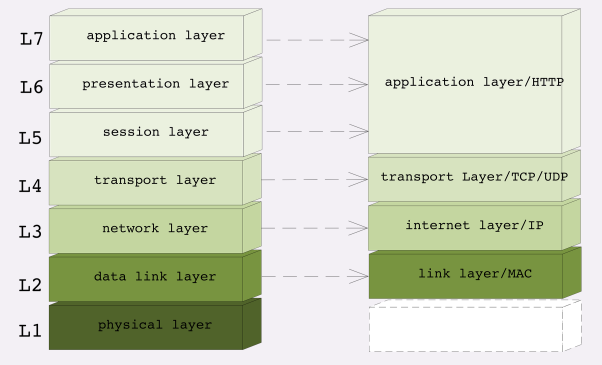

6. DNS
人类记忆ip地址很难，于是“域名系统”（Domain Name System）出现了，用有意义的名字来作为 IP 地址的等价替代。

**域名用“.”分隔成多个单词，级别从左到右逐级升高，最右边的被称为“顶级域名”。**

HTTP 协议中并没有明确要求必须使用 DNS，但实际上为了方便访问互联网上的 Web 服务器，通常都会使用 DNS 来定位或标记主机名，间接地把 DNS 与 HTTP 绑在了一起。

域名解析：
**就像 IP 地址必须转换（ARP）成 MAC 地址才能访问主机一样，域名也必须要转换成 IP 地址，这个过程就是“域名解析”。**

DNS 的核心系统是一个三层的树状、分布式服务，基本对应域名的结构：
- 根域名服务器（Root DNS Server）：管理顶级域名服务器，返回“com”“net”“cn”等顶级域名服务器的 IP 地址；
- 顶级域名服务器（Top-level DNS Server）：管理各自域名下的权威域名服务器，比如 com 顶级域名服务器可以返回 apple.com 域名服务器的 IP 地址；
- 权威域名服务器（Authoritative DNS Server）：管理自己域名下主机的 IP 地址，比如 apple.com 权威域名服务器可以返回 www.apple.com 的 IP 地址。

有了这个系统以后，任何一个域名都可以在这个树形结构里从顶至下进行查询，就好像是把域名从右到左顺序走了一遍，最终就获得了域名对应的 IP 地址。

例如，你要访问“www.apple.com”，就要进行下面的三次查询：

- 访问根域名服务器，它会告诉你“com”顶级域名服务器的地址；
- 访问“com”顶级域名服务器，它再告诉你“apple.com”域名服务器的地址；
- 最后访问“apple.com”域名服务器，就得到了“www.apple.com”的地址。

如果每次都要去查这些DNS服务器，就会非常的慢，所以**在核心 DNS 系统之外，还有两种手段用来减轻域名解析的压力，并且能够更快地获取结果，基本思路就是“缓存”。**

- 许多大公司、网络运行商都会建立自己的 DNS 服务器，作为用户 DNS 查询的代理，代替用户访问核心 DNS 系统。这些“野生”服务器被称为“非权威域名服务器”，可以缓存之前的查询结果，如果已经有了记录，就无需再向根服务器发起查询，直接返回对应的 IP 地址。例如谷歌的 8.8.8.8
- 其次，操作系统里也会对 DNS 解析结果做缓存，第二次在浏览器里再输入相同网址的时候就不会再跑到 DNS 那里去问了，直接在操作系统里就可以拿到 IP 地址。如果操作系统在缓存里找不到 DNS 记录，就会找“C:\WINDOWS\system32\drivers\etc\hosts”这个文件。

总结如下：
- 浏览器缓存 -> 操作系统dns cache -> hosts文件 -> 非权威域名服务器 -> 根域名服务器 -> 顶级域名服务器 -> 二级域名服务器 ->权威域名服务器。
- 非权威域名服务器后面的一般为递归查询，因为内网一般会有防火墙；

7. HTTPS
**在 TCP/IP、DNS 和 URI 的“加持”之下，HTTP 协议终于可以自由地穿梭在互联网世界里，顺利地访问任意的网页了，真的是“好生快活”。**

但是，互联网上不仅有“美女”，还有很多的“野兽”。

假设你打电话找小明要一份广告创意，很不幸，电话被商业间谍给窃听了，他立刻动用种种手段偷窃了你的快递，就在你还在等包裹的时候，他抢先发布了这份广告，给你的公司造成了无形或有形的损失。

那有什么办法解决这个问题呢？

你和小明约定，用火星文进行通讯，只有你和他知道怎么翻译，这就是HTTPS

HTTPS 就相当于这个比喻中的“火星文”，它的全称是“HTTP over SSL/TLS”，也就是运行在 SSL/TLS 协议上的 HTTP。
注意它的名字，这里是 SSL/TLS，而不是 TCP/IP，它是一个负责加密通信的安全协议，建立在 TCP/IP 之上，所以也是个可靠的传输协议，可以被用作 HTTP 的下层。

8. 代理
代理（Proxy）是 HTTP 协议中请求方和应答方中间的一个环节，作为“中转站”，既可以转发客户端的请求，也可以转发服务器的应答。

代理有很多的种类，常见的有：
- 匿名代理：完全“隐匿”了被代理的机器，外界看到的只是代理服务器；
- 透明代理：顾名思义，它在传输过程中是“透明开放”的，外界既知道代理，也知道客户端；
- 正向代理：靠近客户端，代表客户端向服务器发送请求；
- 反向代理：靠近服务器端，代表服务器响应客户端的请求；

我们之前提到过的CDN，就是一个匿名代理的实例，由于代理在传输过程中插入了一个“中间层”，所以可以在这个环节做很多有意思的事情，比如：
- 负载均衡：把访问请求均匀分散到多台机器，实现访问集群化；
- 内容缓存：暂存上下行的数据，减轻后端的压力；
- 安全防护：隐匿 IP, 使用 WAF 等工具抵御网络攻击，保护被代理的机器；
- 数据处理：提供压缩、加密等额外的功能。

## HTTP 协议结构
HTTP 协议也是与 TCP/UDP 类似，同样也需要在实际传输的数据前附加一些头数据，不过与 TCP/UDP 不同的是，它是一个“纯文本”的协议，所以头数据都是 ASCII 码的文本，可以很容易地用肉眼阅读，不用借助程序解析也能够看懂。

HTTP 协议的请求报文和响应报文的结构基本相同，由三大部分组成：

1. 起始行（start line）：描述请求或响应的基本信息；
2. 头部字段集合（header）：使用 key-value 形式更详细地说明报文；
3. 消息正文（entity）：实际传输的数据，它不一定是纯文本，可以是图片、视频等二进制数据。

这其中前两部分起始行和头部字段经常又合称为“请求头”或“响应头”，消息正文又称为“实体”，但与“header”对应，很多时候就直接称为“body”。

HTTP 协议规定报文必须有 header，但可以没有 body，而且在 header 之后必须要有一个“空行”，也就是“CRLF”，十六进制的“0D0A”。

HTTP协议报文就像一个大头儿子，报文里的 header 就是“大头儿子”的“大头”，空行就是他的“脖子”，而后面的 body 部分就是他的身体了。如下图：**请求行 + 请求体 + 空白行 + body(此报文没有body)**

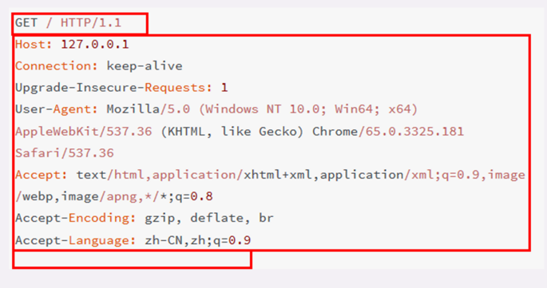

### 请求行
了解 HTTP 报文的基本结构后，我们来看看请求报文里的起始行也就是请求行（request line），它简要地描述了客户端想要如何操作服务器端的资源。

请求行由三部分构成：

1. 请求方法：是一个动词，如 GET/POST，表示对资源的操作；
2. 请求目标：通常是一个 URI，标记了请求方法要操作的资源；
3. 版本号：表示报文使用的 HTTP 协议版本。

这三个部分通常使用空格（space）来分隔，最后要用 CRLF 换行表示结束。

比如一个GET请求行，```GET / HTTP/1.1```

### 状态行
看完了请求行，我们再看响应报文里的起始行，在这里它不叫“响应行”，而是叫“状态行”（status line），意思是服务器响应的状态

同样也是由三部分构成：

1. 版本号：表示报文使用的HTTP协议版本；
2. 状态码：一个三位数，用代码的形式表示处理结果，比如200是成功，500是错误；
3. 原因：作为数字状态码的补充，帮助人理解原因；

比如一个GET响应，```HTTP/1.1 200 OK```

## 头部字段
请求头和响应头的结构是基本一样的，唯一的区别是起始行，所以把请求头和响应头里的字段放在一起介绍。

头部字段是key-value 的形式，key和value之间用一个“:”分割，最后用 CRLF 换行表示字段结束。比如在“Host: 127.0.0.1”这一行里 key 就是“Host”，value 就是“127.0.0.1”。

**HTTP的头部字段非常的灵活，不仅可以使用标准里的 Host、Connection 等已有头，也可以任意添加自定义头，这就给 HTTP 协议带来了无限的扩展可能。**

不过使用头字段需要注意下面几点：
1. 字段名不区分大小写，例如“Host”也可以写成“host”，但首字母大写的可读性更好；
2. 字段名里不允许出现空格，可以使用连字符“-”，但不能使用下划线“_”。例如，“test-name”是合法的字段名，而“test name”“test_name”是不正确的字段名；
3. 字段名后面必须紧接着“:”，不能有空格，而“:”后的字段值前可以有多个空格；
4. 字段的顺序是没有意义的，可以任意排列不影响语义；
5. 字段原则上不能重复，除非这个字段本身的语义允许，例如 Set-Cookie。
```js
// 合法，会正确返回响应报文
GET /09-1 HTTP/1.1
Host:   www.test.com

// 不合法，不符合条件3，返回状态码 400 Bad Request
GET /09-1 HTTP/1.1
Host : www.test.com
```
### 常用的头字段
对 HTTP 报文的解析和处理实际上主要就是对头字段的处理，理解了头字段也就理解了 HTTP 报文。
HTTP 协议规定了非常多的头部字段，实现各种各样的功能，但基本上可以分为四大类：

1. **通用头字段**：在请求头和响应头里都可以出现；
- Date 字段是一个通用字段，但通常出现在响应头里，表示 HTTP 报文创建的时间，客户端可以使用这个时间再搭配其他字段决定缓存策略。
2. **请求头字段**：仅能出现在请求头里，进一步说明请求信息或者额外的附加条件；
- Host 字段，它属于请求字段，只能出现在请求头里，它同时也是唯一一个 **HTTP/1.1 规范里要求必须出现的字段**，也就是说，如果请求头里没有 Host，那这就是一个错误的报文。
- User-Agent 是请求字段，只出现在请求头里。它使用一个字符串来描述发起 HTTP 请求的客户端，服务器可以依据它来返回最合适此浏览器显示的页面。
3. **响应头字段**：仅能出现在响应头里，补充说明响应报文的信息；
- Server 字段是响应字段，只能出现在响应头里。提供服务器信息。
4. **实体头字段**：它实际上属于通用字段，但专门描述 body 的额外信息。
- Content-Length，如果没有这个字段，body就是不定长的，需要使用 chunked 方式分段传输。

## 标准请求方法
很显然，需要有某种“动作的指示”，告诉操作这些资源的方式。所以，就这么出现了“请求方法”。它的实际含义就是客户端发出了一个“动作指令”，要求服务器端对 URI 定位的资源执行这个动作。

目前 HTTP/1.1 规定了八种方法，单词都必须是大写的形式，对常用的加以解释；

1. **GET**：获取资源，可以理解为读取或者下载数据；
2. **HEAD**：获取资源的元信息（轻量版GET）；
3. **POST**：向资源提交数据，相当于写入或上传数据；
4. **PUT**：类似 POST；
5. DELETE：删除资源；
6. CONNECT：建立特殊的连接隧道；
7. **OPTIONS**：列出可对资源实行的方法；
8. TRACE：追踪请求 - 响应的传输路径。

### GET/HEAD
GET是请求**从服务器获取资源**，这个资源既可以是静态的文本、页面、图片、视频，也可以是由 PHP、Java 动态生成的页面或者其他格式的数据。

GET 方法虽然基本动作比较简单，但搭配 URI 和其他头字段就能实现对资源更精细的操作。

例如，在 URI 后使用“#”，就可以在获取页面后直接定位到某个标签所在的位置；使用 If-Modified-Since 字段就变成了“有条件的请求”，仅当资源被修改时才会执行获取动作；使用 Range 字段就是“范围请求”，只获取资源的一部分数据。

HEAD 方法与 GET 方法类似，也是请求从服务器获取资源，服务器的处理机制也是一样的，但服务器不会返回请求的实体数据，只会传回响应头，也就是资源的“元信息”。

### POST/PUT
GET 和 HEAD 方法是从服务器获取数据，而 POST 和 PUT 方法则是相反操作，向 URI 指定的资源提交数据，数据就放在报文的 body 里。

比如，你上论坛灌水，敲了一堆字后点击“发帖”按钮，浏览器就执行了一次 POST 请求，把你的文字放进报文的 body 里，然后拼好 POST 请求头，通过 TCP 协议发给服务器。

PUT 的作用与 POST 类似，也可以向服务器提交数据，但与 POST 存在微妙的不同，通常 POST 表示的是“新建”“create”的含义，而 PUT 则是“修改”“update”的含义。

在实际应用中，PUT 用到的比较少。而且，因为它与 POST 的语义、功能太过近似，有的服务器甚至就直接禁止使用 PUT 方法，只用 POST 方法上传数据。

### OPTIONS
跨域资源共享标准新增了一组 HTTP 首部字段，允许服务器声明哪些源站通过浏览器有权限访问哪些资源。另外，规范要求，对那些可能对服务器数据产生副作用的 HTTP 请求方法（特别是 GET 以外的 HTTP 请求，或者搭配某些 MIME 类型的 POST 请求），浏览器必须首先使用 OPTIONS 方法发起一个预检请求（preflight request），从而获知服务端是否允许该跨域请求。

服务器确认允许之后，才发起实际的 HTTP 请求。在预检请求的返回中，服务器端也可以通知客户端，是否需要携带身份凭证（包括 Cookies 和 HTTP 认证相关数据）。

在前端最常用的 cors 跨域中，浏览器都是用 OPTIONS 方法发预检请求的

### 扩展方法
虽然 HTTP/1.1 里规定了八种请求方法，但它并没有限制我们只能用这八种方法，这也体现了 HTTP 协议良好的扩展性，我们可以任意添加请求动作，只要请求方和响应方都能理解就行。

## 安全与幂等
在 HTTP 协议里，所谓的“安全”是指请求方法不会“破坏”服务器上的资源，即不会对服务器上的资源造成实质的修改。

所谓的“幂等”实际上是一个数学用语，被借用到了 HTTP 协议里，意思是多次执行相同的操作，结果也都是相同的，即多次“幂”后结果“相等”。

很显然，GET 和 HEAD 既是安全的也是幂等的，DELETE 可以多次删除同一个资源，效果都是“资源不存在”，所以也是幂等的。

POST相当于SQL插入语句，PUT相当于更新语句，所以POST是非幂等的，而PUT是幂等的

## URL
URI 不完全等同于网址，它包含有 URL 和 URN 两个部分，在 HTTP 世界里用的网址实际上是 URL——统一资源定位符（Uniform Resource Locator）。但因为 URL 实在是太普及了，所以常常把这两者简单地视为相等。实际上URL是URI的子集。
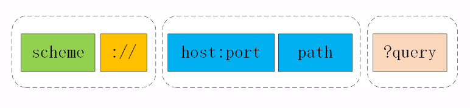
1. scheme：翻译成中文叫“方案名”或者“协议名”，表示资源应该使用哪种协议来访问。
2. 三个特定的字符：在 scheme 之后，必须是三个特定的字符“: //”，它把 scheme 和后面的部分分离开。
3. host:port：在“: //”之后，是被称为“authority”的部分，表示资源所在的主机名，通常的形式是“host:port”，即主机名加端口号，**HTTP默认使用的是80，HTTPS则是443。**
4. path：有了协议名和主机地址、端口号，再加上后面标记资源所在位置的 path，浏览器就可以连接服务器访问资源了。
5. query：它在 path 之后，用一个“?”开始，但不包含“?”，表示对资源附加的额外要求。
- 查询参数 query 有一套自己的格式，是多个“key=value”的字符串，这些 KV 值用字符“&”连接，浏览器和服务器都可以按照这个格式把长串的查询参数解析成可理解的字典或关联数组形式。在 URI 里只能使用 ASCII 码，对于 ASCII 码以外的字符集和特殊字符进行转码；
6. 其实完整URI格式，还存在主机名之前的身份信息“user:passwd@” 和 查询参数后的片段标识符“#fragment”；但片段标识符仅能由浏览器这样的客户端使用，服务器是看不到的。而身份信息会造成安全问题所以这两个是不常用的。

## 状态码该怎么用？
目前 RFC 标准里总共有 41 个状态码，但状态码的定义是开放的，允许自行扩展。
- 1××：提示信息，表示目前是协议处理的中间状态，还需要后续的操作；
- 2××：成功，报文已经收到并被正确处理；
- 3××：重定向，资源位置发生变动，需要客户端重新发送请求；
- 4××：客户端错误，请求报文有误，服务器无法处理；
- 5××：服务器错误，服务器在处理请求时内部发生了错误。

在 HTTP 协议中，正确地理解并应用这些状态码不是客户端或服务器单方的责任，而是双方共同的责任。

客户端作为请求的发起方，获取响应报文后，需要通过状态码知道请求是否被正确处理，是否要再次发送请求，如果出错了原因又是什么。这样才能进行下一步的动作，要么发送新请求，要么改正错误重发请求。

服务器端作为请求的接收方，也应该很好地运用状态码。在处理请求时，选择最恰当的状态码回复客户端，告知客户端处理的结果，指示客户端下一步应该如何行动。特别是在出错的时候，尽量不要简单地返 400、500 这样意思含糊不清的状态码。

因为状态码的含糊不清，通常都会返回一个规定好的结构体辅助判断，如下所示
```js
{
   //状态码，一般规定0为成功，其它的为错误，错误了一般msg会给出精确的提示；
   code:0, 
   msg:'缺少xxx参数' 
}
```
我们再挑一些有价值的状态码学习一下
1. “101 Switching Protocols” 它的意思是客户端使用 Upgrade 头字段，要求在 HTTP 协议的基础上改成其他的协议继续通信，比如 WebSocket。而如果服务器也同意变更协议，就会发送状态码 101，但这之后的数据传输就不会再使用 HTTP 了。

2. “200 OK”是最常见的成功状态码，表示一切正常，服务器如客户端所期望的那样返回了处理结果，如果是非 HEAD 请求，通常在响应头后都会有 body 数据。

3. “204 No Content”是另一个很常见的成功状态码，它的含义与“200 OK”基本相同，但响应头后没有 body 数据。所以对于 Web 服务器来说，正确地区分 200 和 204 是很必要的。

4. “206 Partial Content”是 HTTP 分块下载或断点续传的基础，在客户端发送“范围请求”、要求获取资源的部分数据时出现，它与 200 一样，也是服务器成功处理了请求，但 body 里的数据不是资源的全部，而是其中的一部分。

5. “301 Moved Permanently”俗称“永久重定向”，含义是此次请求的资源已经不存在了，需要改用改用新的 URI 再次访问。

6. 与它类似的是“302 Found”，曾经的描述短语是“Moved Temporarily”，俗称“临时重定向”，意思是请求的资源还在，但需要暂时用另一个 URI 来访问。
- **301 和 302 都会在响应头里使用字段 Location 指明后续要跳转的 URI，最终的效果很相似，浏览器都会重定向到新的 URI。两者的根本区别在于语义，一个是“永久”，一个是“临时”，所以在场景、用法上差距很大。**

7. “304 Not Modified” 是一个比较有意思的状态码，它用于 If-Modified-Since 等条件请求，表示资源未修改，用于缓存控制。它不具有通常的跳转含义，但可以理解成“重定向已到缓存的文件”（即“缓存重定向”）。

8. “400 Bad Request”是一个通用的错误码，表示请求报文有错误，但具体是数据格式错误、缺少请求头还是 URI 超长它没有明确说，只是一个笼统的错误，客户端看到 400 只会是“一头雾水”“不知所措”。所以，在开发 Web 应用时应当尽量避免给客户端返回 400，而是要用其他更有明确含义的状态码。

9. “403 Forbidden”实际上不是客户端的请求出错，而是表示服务器禁止访问资源。原因可能多种多样，例如信息敏感、法律禁止等，如果服务器友好一点，可以在 body 里详细说明拒绝请求的原因，不过现实中通常都是直接给一个“闭门羹”。

10. “404 Not Found”可能是我们最常看见也是最不愿意看到的一个状态码，它的原意是资源在本服务器上未找到，所以无法提供给客户端。但现在已经被“用滥了”，只要服务器“不高兴”就可以给出个 404，而我们也无从得知后面到底是真的未找到，还是有什么别的原因，某种程度上它比 403 还要令人讨厌。

## HTTP特点
1. 灵活可扩展
2. 可靠传输（基于TCP）
3. 应用层协议
- HTTP 凭借着可携带任意头字段和实体数据的报文结构，以及连接控制、缓存代理等方便易用的特性，一出现就“技压群雄”，迅速成为了应用层里的“明星”协议。只要不太苛求性能，HTTP 几乎可以传递一切东西，满足各种需求，称得上是一个“万能”的协议。
4. 请求 - 应答
5. 无状态
- 所谓无状态，就是“没有记忆能力”，不保存本次连接的执行上下文

## HTTP优缺点
1. 简单、灵活、易于扩展（优点）
2. 应用广泛、环境成熟，跨语言、跨平台（优点）
3. 无状态，对于需要记忆状态的场景是缺点（可以利用cookie），不需要记忆状态的是优点（双刃剑）
4. 明文，免费 WiFi 陷阱可以窃听你的一切信息（双刃剑，我觉得是缺点）
5. 不安全，没有身份认证（伪装）和完整性校验（篡改），身份认证”简单来说就是“怎么证明你就是你”。
6. 性能，不算好也不算坏，“请求 - 应答”模式则加剧了 HTTP 的性能问题，这就是著名的“队头阻塞”（Head-of-line blocking），当顺序发送的请求序列中的一个请求因为某种原因被阻塞时，在后面排队的所有请求也一并被阻塞，会导致客户端迟迟收不到数据。

## 数据类型使用的头字段
在 TCP/IP 协议栈里，传输数据基本上都是“header+body”的格式。但 TCP、UDP 因为是传输层的协议，它们不会关心 body 数据是什么，只要把数据发送到对方就算是完成了任务。

而 HTTP 协议则不同，它是应用层的协议，数据到达之后工作只能说是完成了一半，还必须要告诉上层应用这是什么数据才行，否则上层应用就会“不知所措”。

当然HTTP可以靠“猜”。但是效率太低了，所以需要利用一些字段说明发送的数据类型；

HTTP 协议为此定义了两个 Accept 请求头字段和两个 Content 实体头字段，用于客户端和服务器进行“内容协商”。也就是说，客户端用 Accept 头告诉服务器希望接收什么样的数据，而服务器用 Content 头告诉客户端实际发送了什么样的数据。

1. **Accept** 字段标记的是客户端可理解的 MIME type，可以用“,”做分隔符列出多个类型，让服务器有更多的选择余地，例如下面的这个头：
```js
Accept: text/html,application/xml,image/webp,image/png
// 客户端一般也会加上权重（1最大），供服务器计算选择
Accept: text/html,application/xml;q=0.9,*/*;q=0.8
```
2. **Content-Type** 是实体字段，请求和响应里都可以用，作用是指明body数据的类型。在响应报文里，告诉实体数据的真实类型，例如：
```js
// text/html 这种是MIME type类型，更多类型可以查阅文档
Content-Type: text/html //浏览器看不到这个就会渲染页面
Content-Type: image/png //浏览器看到这个就会再页面上显示图片
```
3. **Accept-Encoding/Content-Encoding**，可以省略，前者表示客户端压缩方式，后者表示服务端的返回数据有没有被压缩
- 常用的有 gzip

## 语言类型和编码使用的头字段
1. **Accept-Language/Content-Language**
-  Accept-Language 字段标记了客户端可理解的自然语言，也允许用“,”做分隔符列出多个类型；
-  Content-Language 相应的，服务器应该在响应报文里用这个头字段告诉客户端实体数据使用的实际语言类型：
```js
// 使用中文，英文
Accept-Language: zh-CN, zh, en
// 使用中文
Content-Language: zh-CN
```
2. **Accept-Charset/Content-Type**
- 字符集在 HTTP 里使用的请求头字段是 Accept-Charset，但响应头里却没有对应的 Content-Charset，而是在 Content-Type 字段的数据类型后面用“charset=xxx”来表示，这点需要特别注意。
```js
// 浏览器请求 GBK 或 UTF-8 的字符集
Accept-Charset: gbk, utf-8
// 服务器返回的是 UTF-8 编码
Content-Type: text/html; charset=utf-8
```
不过现在的浏览器都支持多种字符集，通常不会发送 Accept-Charset，而服务器也不会发送 Content-Language，因为使用的语言完全可以由字符集推断出来，所以在请求头里一般只会有 Accept-Language 字段，响应头里只会有 Content-Type 字段。
- 最后总给一下来张图吧

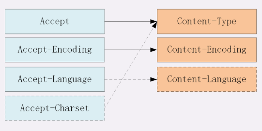

## 化整为零，分块传输
通常浏览器在发送请求时都会带着“Accept-Encoding”头字段，里面是浏览器支持的压缩格式列表，例如 gzip、deflate、br 等，这样服务器就可以从中选择一种压缩算法，放进“Content-Encoding”响应头里，再把原数据压缩后发给浏览器。

不过这个解决方法也有个缺点，gzip 等压缩算法通常只对文本文件有较好的压缩率，而图片、音频视频等多媒体数据本身就已经是高度压缩的，再用 gzip 处理也不会变小（甚至还有可能会增大一点），所以它就失效了。

在数据压缩之外，还能有什么办法来解决大文件的问题呢？

利用“化整为零”的思路在 HTTP 协议里就是“chunked”分块传输编码，在响应报文里用头字段“Transfer-Encoding: chunked”来表示，意思是报文里的 body 部分不是一次性发过来的，而是分成了许多的块（chunk）逐个发送。

“Transfer-Encoding: chunked”和“Content-Length”这两个字段是互斥的，也就是说响应报文里这两个字段不能同时出现，一个响应报文的传输要么是长度已知，要么是长度未知（chunked），这一点你一定要记住。

下面我们来看一下分块传输的编码规则，其实也很简单，同样采用了明文的方式，很类似响应头。

1. 每个分块包含两个部分，长度头和数据块；
2. 长度头是以 CRLF（回车换行，即\r\n）结尾的一行明文，用 16 进制数字表示长度；
3. 数据块紧跟在长度头后，最后也用 CRLF 结尾，但数据不包含 CRLF；
4. 最后用一个长度为 0 的块表示结束，即“0\r\n\r\n”。

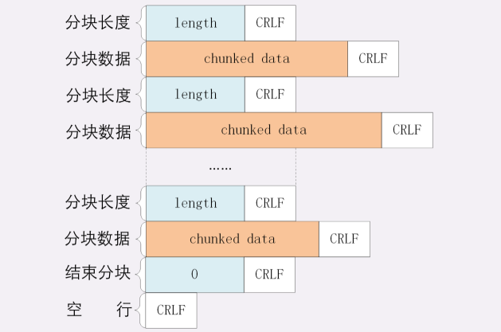

## 范围请求
有了分块传输编码，服务器就可以轻松地收发大文件了，但对于上 G 的超大文件，还有一些问题需要考虑。

比如，你看电视剧前面有广告，想拖进进度条，避开广告，这实际上就是获取大文件的一个片段，而分块传输并没有这个能力。

HTTP 协议为了满足这样的需求，提出了“范围请求”（range requests）的概念，允许客户端在请求头里使用专用字段来表示只获取文件的一部分，相当于是客户端的“化整为零”。

范围请求不是 Web 服务器必备的功能，可以实现也可以不实现，所以服务器必须在响应头里使用字段“Accept-Ranges: bytes”明确告知客户端：“我是支持范围请求的”。如果省略或者值为none，客户端就会认为没有实现范围请求；只能老老实实的收发整个文件；

请求头 Range 是 HTTP 范围请求的专用字段，格式是“bytes=x-y”，其中的 x 和 y 是以字节为单位的数据范围，是偏移量。

当服务器收到 Range 字段后，需要做四件事。
1. 它必须检查范围是否合法，比如文件只有 100 个字节，但请求“200-300”，这就是范围越界了。服务器就会返回状态码 416，意思是“你的范围请求有误，我无法处理，请再检查一下”。

2. 如果范围正确，服务器就可以根据 Range 头计算偏移量，读取文件的片段了，返回状态码“206 Partial Content”，和 200 的意思差不多，但表示 body 只是原数据的一部分。

3. 服务器要添加一个响应头字段 Content-Range，告诉片段的实际偏移量和资源的总大小，格式是“bytes x-y/length”，与 Range 头区别在没有“=”，范围后多了总长度。例如，对于“0-10”的范围请求，值就是“bytes 0-10/100”。

4. 最后剩下的就是发送数据了，直接把片段用 TCP 发给客户端，一个范围请求就算是处理完了。

```js
// 范围请求
GET /16-2 HTTP/1.1
Host: www.test.com
Range: bytes=0-31

// 返回的数据是（去掉了几个无关字段）
HTTP/1.1 206 Partial Content
Content-Length: 32
Accept-Ranges: bytes
Content-Range: bytes 0-31/96
```

刚才说的范围请求一次只获取一个片段，其实它还支持在 Range 头里使用多个“x-y”，一次性获取多个片段数据。

```js
// 发出两个范围请求
GET /16-2 HTTP/1.1
Host: www.chrono.com
Range: bytes=0-9, 20-29

// 响应报文里的“- -00000000001”就是多段的分隔符
HTTP/1.1 206 Partial Content
Content-Type: multipart/byteranges; boundary=00000000001
Content-Length: 189
Connection: keep-alive
Accept-Ranges: bytes

--00000000001
Content-Type: text/plain
Content-Range: bytes 0-9/96

--00000000001
Content-Type: text/plain
Content-Range: bytes 20-29/96

--00000000001--
```
最后，要特别注意，**分段的range和分块的chunk是两个完全无关的概念，不要弄混了。chunk是传输时分成小块逐个发送，range是取大文件中间的一部分。**

## HTTP的连接管理
1. 短链接

HTTP 协议最初（0.9/1.0）是个非常简单的协议，通信过程也采用了简单的“请求 - 应答”方式。

它底层的数据传输基于 TCP/IP，每次发送请求前需要先与服务器建立连接，收到响应报文后会立即关闭连接。

因为客户端与服务器的整个连接过程很短暂，不会与服务器保持长时间的连接状态，所以就被称为“短连接”（short-lived connections）。早期的 HTTP 协议也被称为是“无连接”的协议。

就好比，你吃饭，每次只能盛一勺饭，放到碗里，然后吃了重复这个动作；显然是很浪费时间的；

2. 长连接(HTTP/1.1 默认启用)

针对短连接暴露出的缺点，HTTP 协议就提出了“长连接”的通信方式，也叫“持久连接”（persistent connections）、“连接保活”（keep alive）、“连接复用”（connection reuse）。

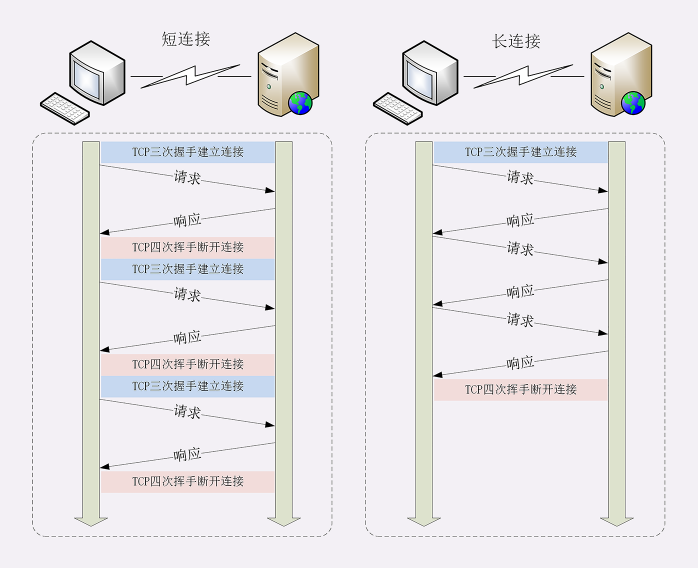

不过不管客户端是否显式要求长连接，如果服务器支持长连接，它总会在响应报文里放一个“Connection: keep-alive”字段，告诉客户端：“我是支持长连接的，接下来就用这个 TCP 一直收发数据吧”。

不过长连接也会有一些小缺点，如果得不到恰当的关闭，会耗尽服务器的资源；

在客户端上，可以在请求头里加上“Connection: close”字段，告诉服务器：“这次通信后就关闭连接”。

而在服务端上，一般不会主动关闭，而是利用一些有效的策略，比如超时时间等等；

### 队头阻塞
“队头阻塞”与短连接和长连接无关，而是由 HTTP 基本的“请求 - 应答”模型所导致的。

因为 HTTP 规定报文必须是“一发一收”，这就形成了一个先进先出的“串行”队列。队列里的请求没有轻重缓急的优先级，只有入队的先后顺序，排在最前面的请求被最优先处理。

如果队首的请求因为处理的太慢耽误了时间，那么队列里后面的所有请求也不得不跟着一起等待，结果就是其他的请求承担了不应有的时间成本。

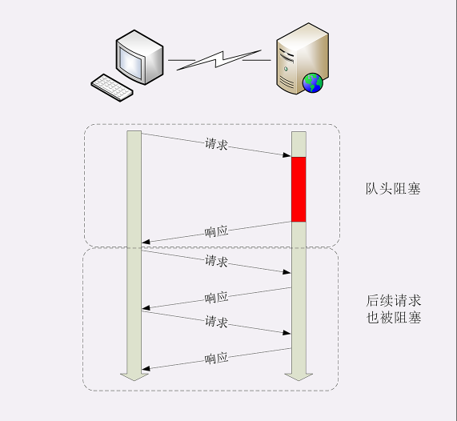

### 性能优化
因为“请求 - 应答”模型不能变，所以“队头阻塞”问题在 HTTP/1.1 里无法解决，只能缓解，有什么办法呢？

**数量解决质量**，这在 HTTP 里就是“并发连接”（concurrent connections），也就是同时对一个域名发起多个长连接，用数量来解决质量的问题。

所以，RFC2616 里明确限制每个客户端最多并发 2 个连接。不过实践证明这个数字实在是太小了，众多浏览器都“无视”标准，把这个上限提高到了 6~8。后来修订的 RFC7230 也就“顺水推舟”，取消了这个“2”的限制。

还有个办法就是**域名分片**，HTTP 协议和浏览器不是限制并发连接数量吗？

好，那我就多开几个域名，比如 shard1.test.com、shard2.test.com，而这些域名都指向同一台服务器 www.test.com，这样实际长连接的数量就又上去了，真是“美滋滋”。不过实在是有点“上有政策，下有对策”的味道。

## 重定向和跳转
跳转动作是由浏览器的使用者主动发起的，可以称为“主动跳转”，但还有一类跳转是由服务器来发起的，浏览器使用者无法控制，相对地就可以称为“被动跳转”，这在 HTTP 协议里有个专门的名词，叫做“重定向”（Redirection）。

被动跳转是响应报文返回重定向状态码（如 301/302），配合“Location”字段。它标记了服务器要求重定向的 URI，也就是要求浏览器跳转到“Location”字段的URI上。

在“Location”里的 URI 既可以使用绝对 URI，也可以使用相对 URI。所谓“绝对 URI”，就是完整形式的 URI，包括 scheme、host:port、path 等。所谓“相对 URI”，就是省略了 scheme 和 host:port，只有 path 和 query 部分，是不完整的，但可以从请求上下文里计算得到。注意，站外不能使用“相对 URI”。

### 重定向状态码
- 301 俗称“永久重定向”（Moved Permanently），意思是原 URI 已经“永久”性地不存在了，今后的所有请求都必须改用新的 URI。
- 302 俗称“临时重定向”（“Moved Temporarily”），意思是原 URI 处于“临时维护”状态，新的 URI 是起“顶包”作用的“临时工”
- 303 See Other：类似 302，但要求重定向后的请求改为 GET 方法，访问一个结果页面，避免 POST/PUT 重复操作；
- 307 Temporary Redirect：类似 302，但重定向后请求里的方法和实体不允许变动，含义比 302 更明确；
- 308 Permanent Redirect：类似 307，不允许重定向后的请求变动，但它是 301“永久重定向”的含义。

## Cookie
HTTP 是“无状态”的，这既是优点也是缺点。优点是服务器没有状态差异，可以很容易地组成集群，而缺点就是无法支持需要记录状态的事务操作。

好在 HTTP 协议是可扩展的，后来发明的 Cookie 技术，给 HTTP 增加了“记忆能力”。

HTTP 的 Cookie 机制原理，就相当于是服务器给每个客户端都贴上一张小纸条，上面写了一些只有服务器才能理解的数据，需要的时候客户端把这些信息发给服务器，服务器看到 Cookie，就能够认出对方是谁了。

### Cookie 的工作过程
那么，Cookie 这张小纸条是怎么传递的呢？

这要用到两个字段：响应头字段 Set-Cookie 和请求头字段 Cookie。直接看图你就明白了，一图胜千言；

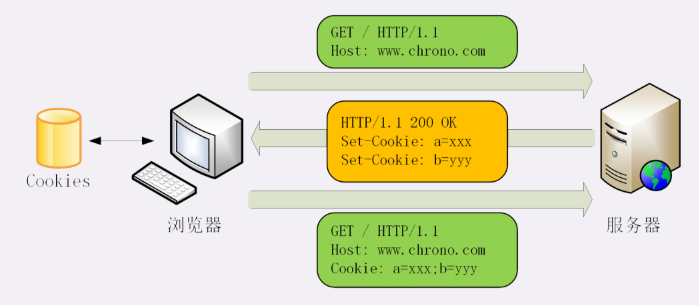

Cookie 是由浏览器负责存储的，而不是操作系统。所以，它是“浏览器绑定”的，只能在本浏览器内生效。

### Cookie 的属性
Cookie有“保鲜期”的，让它只能在一段时间内可用，就像是食品的“保鲜期”，一旦超过这个期限浏览器就认为是 Cookie 失效，在存储里删除，也不会发送给服务器。

Cookie 的有效期可以使用 Expires 和 Max-Age 两个属性来设置。

- Expires 俗称“过期时间”，用的是绝对时间点，可以理解为“截止日期”（deadline）
- Max-Age 用的是相对时间，单位是秒，浏览器用收到报文的时间点再加上 Max-Age，就可以得到失效的绝对时间。

Expires 和 Max-Age 可以同时出现，两者的失效时间可以一致，也可以不一致，但浏览器会优先采用 Max-Age 计算失效期。

比如在这个例子里，Expires 标记的过期时间是“GMT 2019 年 6 月 7 号 8 点 19 分”，而 Max-Age 则只有 10 秒，如果现在是 6 月 6 号零点，那么 Cookie 的实际有效期就是“6 月 6 号零点过 10 秒”。

其次，我们需要设置 Cookie 的作用域，让浏览器仅发送给特定的服务器和 URI，避免被其他网站盗用。

作用域的设置比较简单，“Domain”和“Path”指定了 Cookie 所属的域名和路径，浏览器在发送 Cookie 前会从 URI 中提取出 host 和 path 部分，对比 Cookie 的属性。如果不满足条件，就不会在请求头里发送 Cookie。

不过现实中为了省事，通常 Path 就用一个“/”或者直接省略，表示域名下的任意路径都允许使用 Cookie，让服务器自己去挑。

### Cookie 安全属性
1. HttpOnly

document.cookie 可以读写 Cookie 数据，一般使用属性“HttpOnly”会告诉浏览器，此 Cookie 只能通过浏览器 HTTP 协议传输，禁止其他方式访问，浏览器的 JS 引擎就会禁用 document.cookie 等一切相关的 API，脚本攻击（XSS）也就无从谈起了。

2. SameSite

“SameSite”可以防范“跨站请求伪造”（XSRF）攻击，设置成“SameSite=Strict”可以严格限定 Cookie 不能随着跳转链接跨站发送，而“SameSite=Lax”则略宽松一点，允许 GET/HEAD 等安全方法，但禁止 POST 跨站发送。

3. Secure

“Secure”，表示这个 Cookie 仅能用 HTTPS 协议加密传输，明文的 HTTP 协议会禁止发送。但 Cookie 本身不是加密的，浏览器里还是以明文的形式存在。

### Cookie 的应用

1. Cookie 最基本的一个用途就是身份识别，保存用户的登录信息，实现会话事务。

2. Cookie 的另一个常见用途是广告跟踪。根据你看过的广告，进行分析，然后给你推广告；

虽然现在已经出现了多种 Local Web Storage 技术，能够比 Cookie 存储更多的数据，但 Cookie 仍然是最通用、兼容性最强的客户端数据存储手段。

## HTTP的缓存控制（重点）
缓存（Cache）是计算机领域里的一个重要概念，是优化系统性能的利器。

由于链路漫长，网络时延不可控，浏览器使用 HTTP 获取资源的成本较高。所以，非常有必要把“来之不易”的数据缓存起来，下次再请求的时候尽可能地复用。这样，就可以避免多次请求 - 应答的通信成本，节约网络带宽，也可以加快响应速度。

试想一下，如果有几十 K 甚至几十 M 的数据，不是从网络而是从本地磁盘获取，那将是多么大的一笔节省，免去多少等待的时间。

实际上，HTTP 传输的每一个环节基本上都会有缓存，非常复杂。

基于“请求 - 应答”模式的特点，可以大致分为客户端缓存和服务器端缓存，因为服务器端缓存经常与代理服务“混搭”在一起，所以我先认识客户端——也就是浏览器的缓存。

### 服务器的缓存控制
1. 浏览器发现缓存无数据，于是发送请求，向服务器获取资源；
2. 服务器响应请求，返回资源，同时标记资源的有效期；
3. 浏览器缓存资源，等待下次重用。

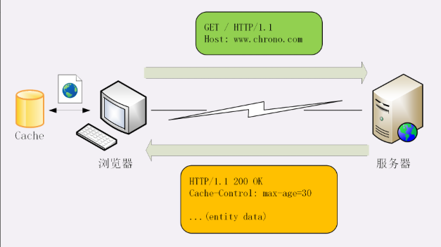

服务器标记资源有效期使用的头字段是“Cache-Control”，里面的值“max-age=30”就是资源的有效时间，相当于告诉浏览器，“这个页面只能缓存 30 秒，之后就算是过期，不能用。”

这里的 max-age 是“生存时间”（又叫“新鲜度”“缓存寿命”，类似 TTL，Time-To-Live），时间的计算起点是响应报文的创建时刻（即 Date 字段，也就是离开服务器的时刻），而不是客户端收到报文的时刻，也就是说包含了在链路传输过程中所有节点所停留的时间。

比如，服务器设定“max-age=5”，但因为网络质量很糟糕，等浏览器收到响应报文已经过去了 4 秒，那么这个资源在客户端就最多能够再存 1 秒钟，之后就会失效。

“max-age”是 HTTP 缓存控制最常用的属性，此外在响应报文里还可以用其他的属性来更精确地指示浏览器应该如何使用缓存：

- no-store：不允许缓存，用于某些变化非常频繁的数据，例如秒杀页面；
- no-cache：它的字面含义容易与 no-store 搞混，实际的意思并不是不允许缓存，而是可以缓存，但在使用之前必须要去服务器验证是否过期，是否有最新的版本；
- must-revalidate：又是一个和 no-cache 相似的词，它的意思是如果缓存不过期就可以继续使用，但过期了如果还想用就必须去服务器验证。

用买西瓜举例说明一下：

- no-store：买来的西瓜（缓存）不允许放进冰箱（浏览器缓存），要么立刻吃，要么立刻扔掉；
- no-cache：可以放进冰箱（浏览器缓存），但吃之前必须问超市（服务器）有没有更新鲜（最新）的，有就吃超市（服务器）里的；
- must-revalidate：可以放进冰箱，保鲜期内可以吃，过期了就要问超市让不让吃。

最后服务器缓存用张图来总结一下吧：

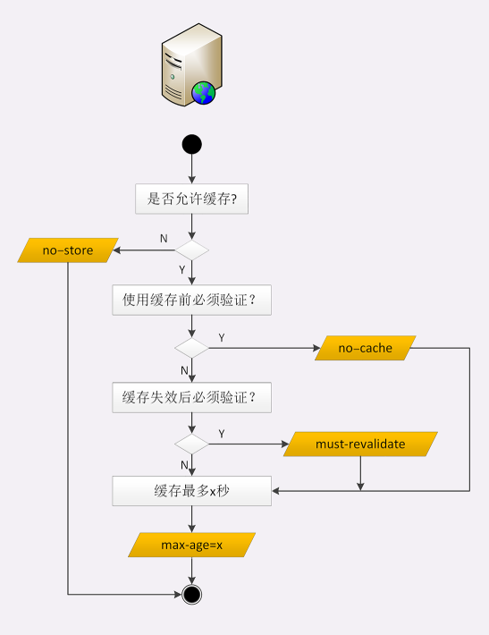

### 客户端的缓存控制
其实不止服务器可以发“Cache-Control”头，浏览器也可以发“Cache-Control”，也就是说请求 - 应答的双方都可以用这个字段进行缓存控制，互相协商缓存的使用策略。

当你点“刷新”按钮的时候，浏览器会在请求头里加一个“Cache-Control: max-age=0”。因为 max-age 是“生存时间”，max-age=0 的意思就是“我要一个最最新鲜的西瓜”，而本地缓存里的数据至少保存了几秒钟，所以浏览器就不会使用缓存，而是向服务器发请求。服务器看到 max-age=0，也就会用一个最新生成的报文回应浏览器。

Ctrl+F5 的“强制刷新”又是什么样的呢？

它其实是发了一个“Cache-Control: no-cache”，含义和“max-age=0”基本一样，就看后台的服务器怎么理解，通常两者的效果是相同的。

还有前进后退，那这几个操作与刷新有什么区别呢？

其实也很简单，**在“前进”“后退”“跳转”这些重定向动作中浏览器不会“夹带私货”，只用最基本的请求头，没有“Cache-Control”，所以就会检查缓存，直接利用之前的资源，不再进行网络通信。而 Ctrl+F5 强制刷新和点击刷新按钮，会和服务器进行通讯发起请求。**

### 条件请求
浏览器用“Cache-Control”做缓存控制只能是刷新数据，不能很好地利用缓存数据，又因为缓存会失效，使用前还必须要去服务器验证是否是最新版。

那么该怎么做呢？

浏览器可以用两个连续的请求组成“验证动作”：先是一个 HEAD，获取资源的修改时间等元信息，然后与缓存数据比较，如果没有改动就使用缓存，节省网络流量，否则就再发一个 GET 请求，获取最新的版本。

但这样的两个请求网络成本太高了，所以 HTTP 协议就定义了一系列“If”开头的“条件请求”字段，专门用来检查验证资源是否过期，**把两个请求才能完成的工作合并在一个请求里做。而且，验证的责任也交给服务器，浏览器只需“坐享其成”。**

条件请求一共有 5 个头字段，我们最常用的是“if-Modified-Since”和“If-None-Match”这两个。**需要第一次的响应报文预先提供“Last-modified”和“ETag”，然后第二次请求时就可以带上缓存里的原值，验证资源是否是最新的。**

如果资源没有变，服务器就回应一个“304 Not Modified”，表示缓存依然有效，浏览器就可以更新一下有效期，然后放心大胆地使用缓存了。

总得来说，强制刷新是因为请求头里的 If-Modified-Since 和 If-None-Match 会被清空所以会返回最新数据。

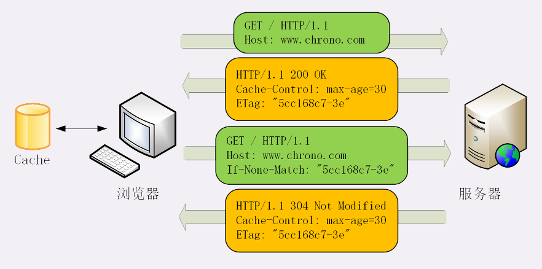

我们拿买西瓜来比喻理解一下吧：

- 你打电话给超市（服务器），“我这个西瓜是 3 天前买的，还有最新的吗？”。超市看了一下库存，说：“没有啊，我这里都是 3 天前的。”于是你就知道了，再让超市送货也没用，还是吃冰箱（浏览器）里的西瓜吧。这就是“if-Modified-Since”和“Last-modified”。

- 但你还是想要最新的，就又打电话：“有不是沙瓤的西瓜吗？”，超市告诉你都是沙瓤的（Match），于是你还是只能吃冰箱里的沙瓤西瓜。这就是“If-None-Match”和“弱 ETag”。

- 第三次打电话，你说“有不是 8 斤的沙瓤西瓜吗？”，这回超市给了你满意的答复：“有个 10 斤的沙瓤西瓜”。于是，你就扔掉了冰箱里的存货，让超市重新送了一个新的大西瓜。这就是“If-None-Match”和“强 ETag”。

## HTTP的代理服务
所谓的“代理服务”就是指服务本身不生产内容，而是处于中间位置转发上下游的请求和响应，具有双重身份：面向下游的用户时，表现为服务器，代表源服务器响应客户端的请求；而面向上游的源服务器时，又表现为客户端，代表客户端发送请求。

你也许听过这样一句至理名言：“计算机科学领域里的任何问题，都可以通过引入一个中间层来解决”（在这句话后面还可以再加上一句“如果一个中间层解决不了问题，那就再加一个中间层”）。TCP/IP 协议栈是这样，而代理也是这样。

实际工作中最常见的反向代理，它在传输链路中更靠近源服务器，为源服务器提供代理服务。

### 代理服务器的缓存
但客户端和代理是不一样的，客户端的缓存只是用户自己使用，而代理的缓存可能会为非常多的客户端提供服务。所以，需要对它的缓存再多一些限制条件。

我们要区分客户端上的缓存和代理上的缓存，可以使用两个新属性“private”和“public”。

“private”表示缓存只能在客户端保存，是用户“私有”的，不能放在代理上与别人共享。而“public”的意思就是缓存完全开放，谁都可以存，谁都可以用。直接来看一张图吧


注意一点，**源服务器在设置完“Cache-Control”后必须要为报文加上“Last-modified”或“ETag”字段。否则，客户端和代理后面就无法使用条件请求来验证缓存是否有效，也就不会有 304 缓存重定向。**


