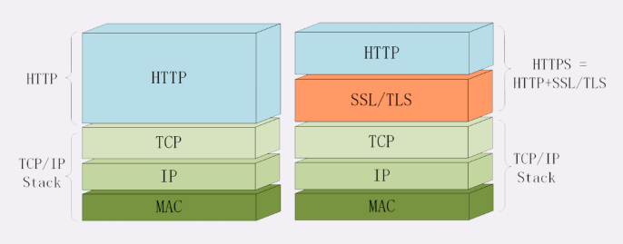
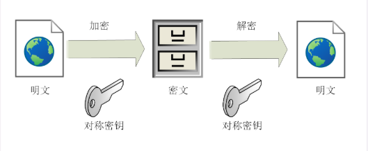
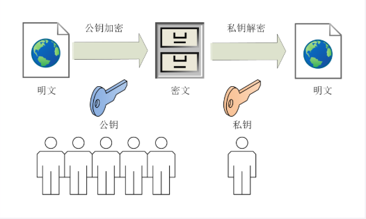
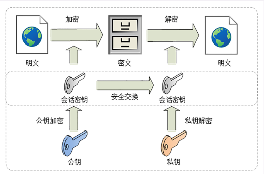
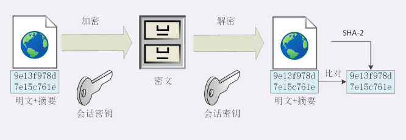
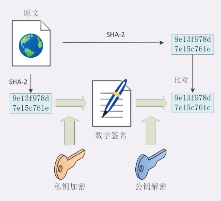
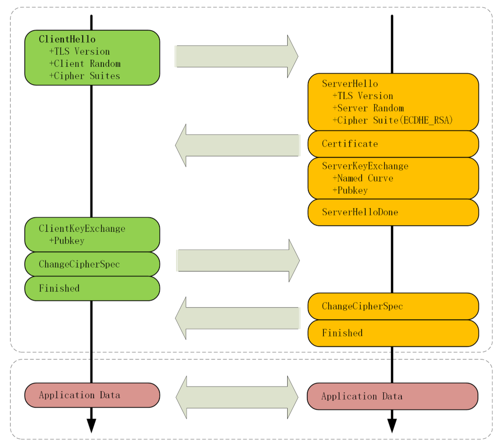
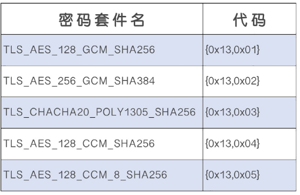
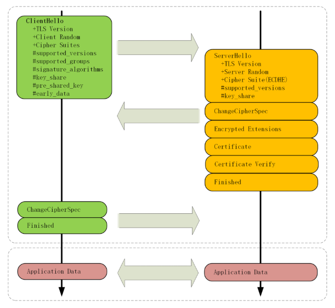

## 为什么要有 HTTPS？

由于 HTTP 天生“明文”的特点，整个传输过程完全透明，任何人都能够在链路中截获、修改或者伪造请求 / 响应报文，数据不具有可信性。

设想一下，你在网上购物，你的整个交易过程在互联网上都是裸奔的，是多么的可怕。

## 什么是安全？

通常认为，如果通信过程具备了四个特性，就可以认为是“安全”的，这四个特性是：**机密性、完整性，身份认证和不可否认。**

1. **机密性**，是指对数据的“保密”，只能由可信的人访问，对其他人是不可见的“秘密”，简单来说就是不能让不相关的人看到不该看的东西。通常我们就是用 Wireshark 利用此特性普获传输过程中的数据。

2. **完整性**（Integrity，也叫一致性）是指数据在传输过程中没有被篡改，不多也不少，“完完整整”地保持着原状。机密性虽然可以保护数据内容，但是不可避免的会被黑客篡改；设想一下，小明写信约小红在公园见，结果被小强（黑客）改了，说在商场见。

3. **身份认证**（Authentication）是指确认对方的真实身份，也就是“证明你真的是你”，保证消息只能发送给可信的人。设想一下，小明准备给小红写情书，结果被小强（黑客）拦截下来了，伪造小红说百日做梦。

4. **不可否认**（Non-repudiation/Undeniable），也叫不可抵赖，意思是不能否认已经发生过的行为，不能“说话不算数”“耍赖皮”。比如，小明借了小红一千元，没写借条，第二天矢口否认，小红也确实拿不出借钱的证据，只能认倒霉。另一种情况是小明借钱后还了小红，但没写收条，小红于是不承认小明还钱的事，说根本没还，要小明再掏出一千元。

所以，只有同时具备了**机密性、完整性、身份认证、不可否认**这四个特性，通信双方的利益才能有保障，才能算得上是真正的安全。

## 什么是 HTTPS？
HTTPS 其实是一个“非常简单”的协议，除了新的协议名为“https”，默认端口号 443，至于其他的什么请求 - 应答模式、报文结构、请求方法、URI、头字段、连接管理等等都完全沿用 HTTP，没有任何新的东西。

也就是说，除了协议名“http”和端口号 80 这两点不同，HTTPS 协议在语法、语义上和 HTTP 完全一样，优缺点也“照单全收”（当然要除去“明文”和“不安全”）。**HTTPS = HTTP + SSL/TLS**，SSL/TLS也应用在应用层上，只不过是给HTTP套了一层安全的壳。只要掌握SSL/TLS，HTTP自然手到擒来。



## SSL/TLS
SSL 即安全套接层（Secure Sockets Layer），在 OSI 模型中处于第 5 层（会话层），由网景公司于 1994 年发明，有 v2 和 v3 两个版本，而 v1 因为有严重的缺陷从未公开过。

SSL 发展到 v3 时已经证明了它自身是一个非常好的安全通信协议，于是互联网工程组 IETF 在 1999 年把它改名为 TLS（传输层安全，Transport Layer Security），正式标准化，版本号从 1.0 重新算起，所以 TLS1.0 实际上就是 SSLv3.1。

到今天 TLS 已经发展出了三个版本，分别是 2006 年的 1.1、2008 年的 1.2 和去年（2018）的 1.3，每个新版本都紧跟密码学的发展和互联网的现状，持续强化安全和性能，已经成为了信息安全领域中的权威标准。

目前应用的最广泛的 TLS 是 1.2，而之前的协议（TLS1.1/1.0、SSLv3/v2）都已经被认为是不安全的，各大浏览器即将在 2020 年左右停止支持，接下来主要针对的是 TLS1.2。TLS 基于著名的开源密码库 OpenSSL。

TLS 由**记录协议、握手协议、警告协议、变更密码规范协议、扩展协议**等几个子协议组成，综合使用了**对称加密、非对称加密、身份认证**等许多密码学前沿技术。

**浏览器和服务器在使用 TLS 建立连接时需要选择一组恰当的加密算法来实现安全通信，这些算法的组合被称为“密码套件”（cipher suite，也叫加密套件）。**

每个版本的加密套件有很多，客户端和服务器都支持非常多的密码套件，以一种来解释一下。
密码套件命名非常规范，格式很固定。**如“ECDHE-RSA-AES256-GCM-SHA384” ：“密钥交换算法 + 签名算法 + 对称加密算法 + 摘要算法”。**

完整的意思是：**“握手时使用 ECDHE 算法进行密钥交换，用 RSA 签名和身份认证，握手后的通信使用 AES 对称算法，密钥长度 256 位，分组模式是 GCM，摘要算法 SHA384 用于消息认证和产生随机数。”**

### 对称加密
“对称加密”很好理解，就是指加密和解密时使用的密钥都是同一个，是“对称”的。只要保证了密钥的安全，那整个通信过程就可以说具有了机密性。



TLS 里有非常多的对称加密算法可供选择，比如 RC4、DES、3DES、AES、ChaCha20 等，但前三种算法都被认为是不安全的，通常都禁止使用，目前常用的只有 AES 和 ChaCha20。

AES 的意思是“高级加密标准”（Advanced Encryption Standard），密钥长度可以是 128、192 或 256。它是 DES 算法的替代者，安全强度很高，性能也很好，而且有的硬件还会做特殊优化，所以非常流行，是应用最广泛的对称加密算法。

ChaCha20 是 Google 设计的另一种加密算法，密钥长度固定为 256 位，纯软件运行性能要超过 AES，曾经在移动客户端上比较流行，但 ARMv8 之后也加入了 AES 硬件优化，所以现在不再具有明显的优势，但仍然算得上是一个不错的算法。
#### 加密分组模式

对称算法还有一个“分组模式”的概念，它可以让算法用固定长度的密钥加密任意长度的明文，把小秘密（即密钥）转化为大秘密（即密文）。

最早有 ECB、CBC、CFB、OFB 等几种分组模式，但都陆续被发现有安全漏洞，所以现在基本都不怎么用了。最新的分组模式被称为 AEAD（Authenticated Encryption with Associated Data），在加密的同时增加了认证的功能，常用的是 GCM、CCM 和 Poly1305。

**把上面这些组合起来，就可以得到 TLS 密码套件中定义的对称加密算法。**
```js
// key 为密钥，plain明文
https://www.test.com/test?key=123456
// 意思是密钥长度为 128 位的 AES 算法，使用的分组模式是 CBC;
algo  = aes_128_cbc
plain = hello openssl
// 加密
enc = 93a024a94083bc39fb2c2b9f5ce27c09
// 解密
dec = hello openssl
```

### 非对称加密
对称加密看上去好像完美地实现了机密性，但其中**有一个很大的问题：如何把密钥安全地传递给对方，术语叫“密钥交换”。**

因为在对称加密算法中只要持有密钥就可以解密。如果你和网站约定的密钥在传递途中被黑客窃取，那他就可以在之后随意解密收发的数据，通信过程也就没有机密性可言了。

这个问题该怎么解决呢？

你或许会说：“把密钥再加密一下发过去就好了”，但传输“加密密钥的密钥”又成了新问题。这就像是“鸡生蛋、蛋生鸡”，可以无限递归下去。只用对称加密算法，是绝对无法解决密钥交换的问题的。

所以，就出现了非对称加密（也叫公钥加密算法）。

它有两个密钥，一个叫“公钥”（public key），一个叫“私钥”（private key）。两个密钥是不同的，“不对称”，公钥可以公开给任何人使用，而私钥必须严格保密。

公钥和私钥有个特别的“单向”性，虽然都可以用来加密解密，但公钥加密后只能用私钥解密，反过来，私钥加密后也只能用公钥解密。

非对称加密可以解决“密钥交换”的问题。**网站秘密保管私钥，在网上任意分发公钥，你想要登录网站只要用公钥加密就行了，密文只能由私钥持有者才能解密。而黑客因为没有私钥，所以就无法破解密文。**



非对称加密算法的设计要比对称算法难得多，在 TLS 里只有很少的几种，比如 DH、DSA、RSA、ECC 等。

RSA 可能是其中最著名的一个，几乎可以说是非对称加密的代名词，它的安全性基于“整数分解”的数学难题，使用两个超大素数的乘积作为生成密钥的材料，想要从公钥推算出私钥是非常困难的。

10 年前 RSA 密钥的推荐长度是 1024，但随着计算机运算能力的提高，现在 1024 已经不安全，普遍认为至少要 2048 位。

ECC（Elliptic Curve Cryptography）是非对称加密里的“后起之秀”，它基于“椭圆曲线离散对数”的数学难题，使用特定的曲线方程和基点生成公钥和私钥，子算法 ECDHE 用于密钥交换，ECDSA 用于数字签名。

目前比较常用的两个曲线是 P-256（secp256r1，在 OpenSSL 称为 prime256v1）和 x25519。P-256 是 NIST（美国国家标准技术研究所）和 NSA（美国国家安全局）推荐使用的曲线，而 x25519 被认为是最安全、最快速的曲线。

比起 RSA，ECC 在安全强度和性能上都有明显的优势。160 位的 ECC 相当于 1024 位的 RSA，而 224 位的 ECC 则相当于 2048 位的 RSA。因为密钥短，所以相应的计算量、消耗的内存和带宽也就少，加密解密的性能就上去了，对于现在的移动互联网非常有吸引力。

### 混合加密
到这里，你是不是认为可以抛弃对称加密，只用非对称加密来实现机密性呢？

很遗憾，虽然非对称加密没有“密钥交换”的问题，但因为它们都是基于复杂的数学难题，运算速度很慢，即使是 ECC 也要比 AES 差上好几个数量级。如果仅用非对称加密，虽然保证了安全，但通信速度有如乌龟、蜗牛，实用性就变成了零。

对比 AES 和 RSA 这两种算法的性能，下面列出了一次测试的结果：
```JS
// 对称加密 AES128 则是 13MB/S
aes_128_cbc enc/dec 1000 times : 0.97ms, 13.11MB/s
// 非对称加密1024位
rsa_1024 enc/dec 1000 times : 138.59ms, 93.80KB/s
rsa_1024/aes ratio = 143.17
// 非对称加密2048位
rsa_2048 enc/dec 1000 times : 840.35ms, 15.47KB/s
rsa_2048/aes ratio = 868.13
```

**那么用两个加密方式的混合加密，就可以取长补短，即保证了机密性，和安全的交换了密钥。**

这就是现在 TLS 里使用的混合加密方式，其实说穿了也很简单：
1. 在通信刚开始的时候使用非对称算法，比如 RSA、ECDHE，首先解决密钥交换的问题。
2. 然后用随机数产生对称算法使用的“会话密钥”（session key），再用公钥加密。因为会话密钥很短，通常只有 16 字节或 32 字节，所以慢一点也无所谓。（因为已经解决密钥交换的问题了）
3. 对方拿到密文后用私钥解密，取出会话密钥。这样，双方就实现了对称密钥的安全交换，后续就不再使用非对称加密，全都使用对称加密。



**不过这只是“万里长征的第一步”，还有完整性、身份认证、不可否认等特性没有实现，所以现在的通信还不是绝对安全。**

### 数字签名与证书
只保证了机密性，离安全还很远，黑客虽然拿不到会话密钥，无法破解密文，但可以通过窃听收集到足够多的密文，再尝试着修改、重组后发给网站。因为没有完整性保证，服务器只能“照单全收”，然后他就可以通过服务器的响应获取进一步的线索，最终就会破解出明文。

#### 摘要算法
实现完整性的手段主要是摘要算法（Digest Algorithm），也就是常说的散列函数、哈希函数（Hash Function）。

你可以把摘要算法近似地理解成一种特殊的压缩算法，它能够把任意长度的数据“压缩”成固定长度、而且独一无二的“摘要”字符串，就好像是给这段数据生成了一个数字“指纹”。

你一定在日常工作中听过、或者用过 MD5（Message-Digest 5）、SHA-1（Secure Hash Algorithm 1），它们就是最常用的两个摘要算法，能够生成 16 字节和 20 字节长度的数字摘要。但这两个算法的安全强度比较低，不够安全，在 TLS 里已经被禁止使用了。目前 TLS 推荐使用的是 SHA-1 的后继者：SHA-2。

#### 完整性
摘要算法保证了“数字摘要”和原文是完全等价的。所以，我们只要在原文后附上它的摘要，就能够保证数据的完整性。

比如，你发了条消息：“转账 1000 元”，然后再加上一个 SHA-2 的摘要。网站收到后也计算一下消息的摘要，把这两份“指纹”做个对比，如果一致，就说明消息是完整可信的，没有被修改。如果黑客在中间哪怕改动了一个标点符号，摘要也会完全不同，网站计算比对就会发现消息被窜改，是不可信的。

不过摘要算法不具有机密性，如果明文传输，那么黑客可以修改消息后把摘要也一起改了，网站还是鉴别不出完整性。

所以，**真正的完整性必须要建立在机密性之上，在混合加密系统里用会话密钥加密消息和摘要，这样黑客无法得知明文，也就没有办法动手脚了**

**这有个术语，叫哈希消息认证码（HMAC）**。通过用会话密钥加密消息和摘要，我们就很愉快的保证了数据的完整性了。


#### 数字签名
**加密算法结合摘要算法**，我们的通信过程可以说是比较安全了。但这里还有漏洞，就是通信的两个端点（endpoint）。

就像一开始所说的，黑客可以伪装成网站来窃取信息。而反过来，他也可以伪装成你，向网站发送支付、转账等消息，网站没有办法确认你的身份，钱可能就这么被偷走了。也就是说，怎么证明你是你？

**现实生活中，解决身份认证的手段是签名和印章，只要在纸上写下签名或者盖个章，就能够证明这份文件确实是由本人而不是其他人发出的。**

**可以利用非对称加密里的“私钥”，使用私钥再加上摘要算法，就能够实现“数字签名”，同时实现“身份认证”和“不可否认”。**

数字签名的原理其实很简单，就是把公钥私钥的用法反过来，之前是公钥加密、私钥解密，现在是私钥加密、公钥解密。

但又因为非对称加密效率太低，所以私钥只加密原文的摘要，这样运算量就小的多，而且得到的数字签名也很小，方便保管和传输。

只要你和网站互相交换公钥，就可以用“签名”和“验签”来确认消息的真实性，因为私钥保密，黑客不能伪造签名，就能够保证通信双方的身份。



举个例子，你用自己的私钥签名一个消息“我是小明”。网站收到后用你的公钥验签，确认身份没问题，于是也用它的私钥签名消息“我是某宝”。你收到后再用它的公钥验一下，也没问题，这样你和网站就都知道对方不是假冒的，后面就可以用混合加密进行安全通信了。

#### 数字证书和 CA
到现在，综合使用对称加密、非对称加密和摘要算法，我们已经实现了安全的四大特性，是不是已经完美了呢？

不是的，这里还有一个“公钥的信任”问题。因为谁都可以发布公钥，我们还缺少防止黑客伪造公钥的手段，也就是说，怎么来判断这个公钥就是你或者某宝的公钥呢？

真是“按下葫芦又起了瓢”，安全还真是个麻烦事啊，“一环套一环”的。

我们可以用类似密钥交换的方法来解决公钥认证问题，用别的私钥来给公钥签名，显然，这又会陷入“无穷递归”。

要解决这个问题，我们可以用第三方，这个“第三方”就是我们常说的 CA（Certificate Authority，证书认证机构）。它就像网络世界里的公安局、教育部、公证中心，具有极高的可信度，由它来给各个公钥签名，用自身的信誉来保证公钥无法伪造，是可信的。

## TLS1.2连接过程解析
在 HTTP 协议里，建立连接后，浏览器会立即发送请求报文。但现在是 HTTPS 协议，它需要再用另外一个“握手”过程，在 TCP 上建立安全连接，之后才是收发 HTTP 报文。

### TLS 协议的组成
TLS 包含几个子协议，你也可以理解为它是由几个不同职责的模块组成，比较常用的有**记录协议、警报协议、握手协议、变更密码规范协议等。**

1. **记录协议**（Record Protocol）规定了 TLS 收发数据的基本单位：记录（record）。它有点像是 TCP 里的 segment，所有的其他子协议都需要通过记录协议发出。但多个记录数据可以在一个 TCP 包里一次性发出，也并不需要像 TCP 那样返回 ACK。

2. **警报协议**（Alert Protocol）的职责是向对方发出警报信息，有点像是 HTTP 协议里的状态码。比如，protocol_version 就是不支持旧版本，bad_certificate 就是证书有问题，收到警报后另一方可以选择继续，也可以立即终止连接。

3. **握手协议**（Handshake Protocol）是 TLS 里最复杂的子协议，要比 TCP 的 SYN/ACK 复杂的多，浏览器和服务器会在握手过程中协商 TLS 版本号、随机数、密码套件等信息，然后交换证书和密钥参数，最终双方协商得到会话密钥，用于后续的混合加密系统。

4. **变更密码规范协议**（Change Cipher Spec Protocol），它非常简单，就是一个“通知”，告诉对方，后续的数据都将使用加密保护。那么反过来，在它之前，数据都是明文的。

下面的这张图简要地描述了 TLS 的握手过程，其中每一个“框”都是一个记录，多个记录组合成一个 TCP 包发送。所以，最多经过两次消息往返（4 个消息）就可以完成握手，然后就可以在安全的通信环境里发送 HTTP 报文，实现 HTTPS 协议。



### ECDHE 握手过程
1. 在 TCP 建立连接之后，浏览器会首先发一个“Client Hello”消息，也就是跟服务器“打招呼”。里面有客户端的版本号、支持的密码套件，还有一个随机数（Client Random），用于后续生成会话密钥。 
```js
// 握手协议（Handshake Protocol）
// 意思就是：“我这边有这些这些信息，你看看哪些是能用的，关键的随机数可得留着。”
Handshake Protocol: Client Hello
    Version: TLS 1.2 (0x0303)
    Random: 1cbf803321fd2623408dfe…
    Cipher Suites (17 suites) //通信使用的密码套件列表
        Cipher Suite: TLS_ECDHE_RSA_WITH_AES_128_GCM_SHA256 (0xc02f)
        Cipher Suite: TLS_ECDHE_RSA_WITH_AES_256_GCM_SHA384 (0xc030)
```
2. 服务器收到“Client Hello”后，会返回一个“Server Hello”消息。把版本号对一下，也给出一个随机数（Server Random），然后从客户端的列表里选一个作为本次通信使用的密码套件，在这里它选择了“TLS_ECDHE_RSA_WITH_AES_256_GCM_SHA384”。
```js
// “版本号对上了，可以加密，你的密码套件挺多，我选一个最合适的吧，
// 就用椭圆曲线加 RSA、AES、SHA384。我也给你一个随机数，你也得留着。
// ECDHE 算法进行密钥交换
// RSA：非对称加密算法签名和身份认证
// AES：对称加密算法用于握手后的加密通信，长度256位
// GCM：分组模式
// SHA384：摘要算法（哈希算法）用于消息认证和产生随机数
Handshake Protocol: Server Hello
    Version: TLS 1.2 (0x0303)
    Random: 0e6320f21bae50842e96…
    Cipher Suite: TLS_ECDHE_RSA_WITH_AES_256_GCM_SHA384 (0xc030)
```
3. 然后，服务器为了证明自己的身份，就把证书也发给了客户端（Server Certificate）。
4. 接下来是一个关键的操作，因为服务器选择了 ECDHE 算法，**所以它会在证书后发送“Server Key Exchange”消息，里面是椭圆曲线的公钥（Server Params），用来实现密钥交换算法，再加上自己的私钥签名认证。**
```js
// 这相当于说：“刚才我选的密码套件有点复杂，所以再给你个算法的参数，
// 和刚才的随机数一样有用，别丢了。为了防止别人冒充，我又盖了个章。”
Handshake Protocol: Server Key Exchange
    EC Diffie-Hellman Server Params
        Curve Type: named_curve (0x03)
        Named Curve: x25519 (0x001d)
        Pubkey: 3b39deaf00217894e...
        Signature Algorithm: rsa_pkcs1_sha512 (0x0601)
        Signature: 37141adac38ea4...
```
5. 之后是“Server Hello Done”消息，服务器说：“我的信息就是这些，打招呼完毕。”
- 这样第一个消息往返就结束了（两个 TCP 包），结果是客户端和服务器通过明文共享了三个信息：Client Random、Server Random 和 Server Params。

- 客户端这时也拿到了服务器的证书，那这个证书是不是真实有效的呢？

- 并不是，而是开始走证书链逐级验证，确认证书的真实性，再用证书公钥验证签名，就确认了服务器的身份：“刚才跟我打招呼的不是骗子，可以接着往下走。”
6. 然后，客户端按照密码套件的要求，也生成一个椭圆曲线的公钥（Client Params），用“Client Key Exchange”消息发给服务器。
```js
// 生成椭圆曲线的公钥（Client Params）
// 用“Client Key Exchange”消息发给服务器。
Handshake Protocol: Client Key Exchange
    EC Diffie-Hellman Client Params
        Pubkey: 8c674d0e08dc27b5eaa…
```
- 现在客户端和服务器手里都拿到了密钥交换算法的两个参数（Client Params、Server Params），就用 ECDHE 算法一阵算，算出了一个新的东西，叫“Pre-Master”，其实也是一个随机数。

- 现在客户端和服务器手里有了三个随机数：Client Random、Server Random 和 Pre-Master。

- 用这三个作为原始材料，就可以生成用于加密会话的主密钥，叫“Master Secret”。而黑客因为拿不到“Pre-Master”，所以也就得不到主密钥。
```js
// Master Secret 计算公式
// “PRF”是伪随机数函数，它基于密码套件里的最后一个参数，
// 比如这次的 SHA384，通过摘要算法来再一次强化随机性。
master_secret = PRF(pre_master_secret, "master secret",
                    ClientHello.random + ServerHello.random)
```
- 三个随机数保证了真正的“完全随机”“不可预测”，把三个不可靠的随机数混合起来，那么“随机”的程度就非常高了，足够让黑客难以猜测。

- 主密钥有 48 字节，但它也不是最终用于通信的会话密钥，还会再用 PRF 扩展出更多的密钥，比如客户端发送用的会话密钥（client_write_key）、服务器发送用的会话密钥（server_write_key）等等，避免只用一个密钥带来的安全隐患。

7. 有了主密钥和派生的会话密钥，握手就快结束了。客户端发一个“Change Cipher Spec”，然后再发一个“Finished”消息，把之前所有发送的数据做个摘要，再加密一下，让服务器做个验证。
- 意思就是告诉服务器：“后面都改用对称算法加密通信了啊，用的就是打招呼时说的 AES，加密对不对还得你测一下。”

8. 服务器也是同样的操作，发“Change Cipher Spec”和“Finished”消息，双方都验证加密解密 OK，握手正式结束，后面就收发被加密的 HTTP 请求和响应了。


### RSA 握手过程
刚才说的其实是如今主流的 TLS 握手过程，这与传统的握手有两点不同。
1. 使用 ECDHE 实现密钥交换，而不是 RSA，所以会在服务器端发出“Server Key Exchange”消息。

2. 因为使用了 ECDHE，客户端可以不用等到服务器发回“Finished”确认握手完毕，立即就发出 HTTP 报文，省去了一个消息往返的时间浪费。这个叫“TLS False Start”，意思就是“抢跑”，和“TCP Fast Open”有点像，都是不等连接完全建立就提前发应用数据，提高传输的效率。


### 双向认证
不过上面说的是“单向认证”握手过程，只认证了服务器的身份，而没有认证客户端的身份。这是因为通常单向认证通过后已经建立了安全通信，用账号、密码等简单的手段就能够确认用户的真实身份。

但为了防止账号、密码被盗，有的时候（比如网上银行）还会使用 U 盾给用户颁发客户端证书，实现“双向认证”，这样会更加安全。

双向认证的流程也没有太多变化，只是在“Server Hello Done”之后，“Client Key Exchange”之前，客户端要发送“Client Certificate”消息，服务器收到后也把证书链走一遍，验证客户端的身份。

### 小结一下 HTTPS/TLS 的握手
1. HTTPS 协议会先与服务器执行 TCP 握手，然后执行 TLS 握手，才能建立安全连接；

2. 握手的目标是安全地交换对称密钥，需要三个随机数，第三个随机数“Pre-Master”必须加密传输，绝对不能让黑客破解；

3. “Hello”消息交换随机数，“Key Exchange”消息交换“Pre-Master”；

4. “Change Cipher Spec”之前传输的都是明文，之后都是对称密钥加密的密文。

### 总结一下TLS的握手过程(ECDHE, 非RSA)
1. **第一阶段：** C/S两端共享Client Random、Server Random 和 Server Params信息
- 客户端 --> 服务器：客户端的版本号、支持的密码套件，还有一个随机数（Client Random）

- 服务端 --> 客户端：对一下客户端的版本号、选择的客户端列表的密码套件如：TLS_ECDHE_RSA_WITH_AES_256_GCM_SHA384、随机数随机数（Server Random）

- 服务端 --> 客户端：服务端证书（Server Certificate）

- 服务端 --> 客户端：发送Server Key Exchange类型的请求，携带椭圆曲线的公钥（Server Params）用以实现密钥交换算法，另附私钥签名

- 服务端 --> 客户端：发送完毕

2. **第二阶段：** 客户端拿着服务端证书链逐级验证，再用证书的公钥验证签名，服务端身份验证成功（证书合法）
- 客户端 --> 服务端：发送Client Key Exchange类型的请求，携带椭圆曲线的公钥（Client Params）用以实现秘钥交换算法

3. **第三阶段：** 主密钥生成
客户端、服务端分别使用Client Params、Server Params 通过 ECDHE算法计算出随机值pre-master；

然后用 Client Random、Server Random 和 Pre-Master三个值作为原材料，用PRF伪随机数函数（利用密码套件的摘要算法再次强化结果值master secret的随机性）计算出主密钥 Master Secret；

主密钥并不是会话秘钥，还会再用PRF扩展出更多的密钥，比如客户端发送用的会话密钥（client_write_key）、服务器发送用的会话密钥（server_write_key）；

- 客户端 --> 服务端：客户端发一个“Change Cipher Spec”，然后再发一个“Finished”消息，把之前所有发送的数据做个摘要，再加密一下，让服务器做个验证；

- 服务端 --> 客户端：服务器也是同样的操作，发“Change Cipher Spec”和“Finished”消息，双方都验证加密解密 OK，握手正式结束。

## TLS1.3特性解析
TLS1.2 已经是 10 年前（2008 年）的“老”协议了，虽然历经考验，但毕竟“岁月不饶人”，在安全、性能等方面已经跟不上如今的互联网了。

于是经过四年、近 30 个草案的反复打磨，TLS1.3 终于在（2018 年）“粉墨登场”，再次确立了信息安全领域的新标准。

**TLS1.3三大特性：兼容、安全与性能。**

### 最大化兼容性
TLS1.3 会向后兼容，防止直接用新版本导致1.2握手失败，直接来看一下“Client Hello”消息后面的扩展，只是因为服务器不支持 1.3，所以就“后向兼容”降级成了 1.2。
```js
Handshake Protocol: Client Hello
    Version: TLS 1.2 (0x0303)
    // Extension，扩展协议，老版本不认识可以直接忽略
    // “supported_versions”扩展，标记了 TLS 版本号，用以区分新旧协议。
    Extension: supported_versions (len=11)
        Supported Version: TLS 1.3 (0x0304)
        Supported Version: TLS 1.2 (0x0303)
```
### 强化安全
TLS1.2 在十来年的应用中获得了许多宝贵的经验，陆续发现了很多的漏洞和加密算法的弱点，所以 TLS1.3 就在协议里修补了这些不安全因素。比如伪随机数函数由 PRF 升级为 HKDF（HMAC-based Extract-and-Expand Key Derivation Function），同时精简了安全套件。



特别说明一下废除 RSA 和 DH 密钥交换算法的原因。

浏览器默认会使用 ECDHE 而不是 RSA 做密钥交换，这是因为它不具有“前向安全”（Forward Secrecy）。

**假设有这么一个很有耐心的黑客，一直在长期收集混合加密系统收发的所有报文。如果加密系统使用服务器证书里的 RSA 做密钥交换，一旦私钥泄露或被破解（使用社会工程学或者巨型计算机），那么黑客就能够使用私钥解密出之前所有报文的“Pre-Master”，再算出会话密钥，破解所有密文。**

而 ECDHE 算法在每次握手时都会生成一对临时的公钥和私钥，每次通信的密钥对都是不同的，也就是“一次一密”，即使黑客花大力气破解了这一次的会话密钥，也只是这次通信被攻击，之前的历史消息不会受到影响，仍然是安全的。

所以现在主流的服务器和浏览器在握手阶段都已经不再使用 RSA，改用 ECDHE，而 TLS1.3 在协议里明确废除 RSA 和 DH 则在标准层面保证了“前向安全”。

### 提升性能
HTTPS 建立连接时除了要做 TCP 握手，还要做 TLS 握手，在 1.2 中会多花两个消息往返（2-RTT），可能导致几十毫秒甚至上百毫秒的延迟，在移动网络中延迟还会更严重。

现在因为密码套件大幅度简化，也就没有必要再像以前那样走复杂的协商流程了。TLS1.3 压缩了以前的“Hello”协商过程，删除了“Key Exchange”消息，把握手时间减少到了“1-RTT”，效率提高了一倍。

那么它是怎么做的呢？

其实具体的做法还是利用了扩展。客户端在“Client Hello”消息里直接用“supported_groups”带上支持的曲线，比如 P-256、x25519，用“key_share”带上曲线对应的客户端公钥参数，用“signature_algorithms”带上签名算法。

服务器收到后在这些扩展里选定一个曲线和参数，再用“key_share”扩展返回服务器这边的公钥参数，就实现了双方的密钥交换，后面的流程就和 1.2 基本一样了。



除了标准的“1-RTT”握手，TLS1.3 还引入了“0-RTT”握手，用“pre_shared_key”和“early_data”扩展，在 TCP 连接后立即就建立安全连接发送加密消息，不过这需要有一些前提条件，暂且了解一下。

### 握手分析
先来看一张图吧，然后根据图来分析流程。


1. 在 TCP 建立连接之后，浏览器首先还是发一个“Client Hello”。
```js
// 因为 1.3 的消息兼容 1.2，所以开头的版本号、支持的密码套件
// 和随机数（Client Random）结构都是一样的（不过这时的随机数是 32 个字节）。
Handshake Protocol: Client Hello
    Version: TLS 1.2 (0x0303)
    Random: cebeb6c05403654d66c2329…
    Cipher Suites (18 suites)
        Cipher Suite: TLS_AES_128_GCM_SHA256 (0x1301)
        Cipher Suite: TLS_CHACHA20_POLY1305_SHA256 (0x1303)
        Cipher Suite: TLS_AES_256_GCM_SHA384 (0x1302)
    // “supported_versions”表示这是 TLS1.3
    Extension: supported_versions (len=9)
        Supported Version: TLS 1.3 (0x0304)
        Supported Version: TLS 1.2 (0x0303)
    // “supported_groups”是支持的曲线
    Extension: supported_groups (len=14)
        Supported Groups (6 groups)
            Supported Group: x25519 (0x001d)
            Supported Group: secp256r1 (0x0017)
    // key_share”是曲线对应的参数。
    Extension: key_share (len=107)
        Key Share extension
            Client Key Share Length: 105
            Key Share Entry: Group: x25519
            Key Share Entry: Group: secp256r1
```
2. 服务器收到“Client Hello”同样返回“Server Hello”消息，还是要给出一个随机数（Server Random）和选定密码套件。
```js
// 大概意思：“还真让你给猜对了，虽然还是按老规矩打招呼，但咱们来个‘旧瓶装新酒’。
// 刚才你给的我都用上了，我再给几个你缺的参数，这次加密就这么定了。”
Handshake Protocol: Server Hello
    Version: TLS 1.2 (0x0303)
    Random: 12d2bce6568b063d3dee2…
    Cipher Suite: TLS_AES_128_GCM_SHA256 (0x1301)
    // supported_versions”里确认使用的是 TLS1.3，
    Extension: supported_versions (len=2)
        Supported Version: TLS 1.3 (0x0304)
    // 然后在“key_share”扩展带上曲线和对应的公钥参数。
    Extension: key_share (len=36)
        Key Share extension
            Key Share Entry: Group: x25519, Key Exchange length: 32
```
- 这时只交换了两条消息，客户端和服务器就拿到了四个共享信息：Client Random 和 Server Random、Client Params 和 Server Params，两边就可以各自用 ECDHE 算出“Pre-Master”，再用 HKDF 生成主密钥“Master Secret”，效率比 TLS1.2 提高了一大截。

3. 在算出主密钥后，服务器立刻发出“Change Cipher Spec”消息，比 TLS1.2 提早进入加密通信，后面的证书等就都是加密的了，减少了握手时的明文信息泄露。

- 这里 TLS1.3 还有一个安全强化措施，多了个“Certificate Verify”消息，用服务器的私钥把前面的曲线、套件、参数等握手数据加了签名，作用和“Finished”消息差不多。但由于是私钥签名，所以强化了身份认证和和防窜改。

4. 这两个“Hello”消息之后，客户端验证服务器证书，再发“Finished”消息，就正式完成了握手，开始收发 HTTP 报文。

#### 小结一下 TLS1.3 的新特性
1. 为了兼容 1.1、1.2 等“老”协议，TLS1.3 会“伪装”成 TLS1.2，新特性在“扩展”里实现；

2. 1.1、1.2 在实践中发现了很多安全隐患，所以 TLS1.3 大幅度删减了加密算法，只保留了 ECDHE、AES、ChaCha20、SHA-2 等极少数算法，强化了安全；

3. TLS1.3 也简化了握手过程，完全握手只需要一个消息往返，提升了性能。

## HTTPS的优化
通过前两讲的学习，你可以看到，HTTPS 连接大致上可以划分为两个部分，第一个是建立连接时的非对称加密握手，第二个是握手后的对称加密报文传输。

有以下几种优化方案
1. 硬件优化
2. 软件优化
3. 协议优化

## 归纳 HTTPS 知识点

### 什么是安全？
通讯过程中具备密码安全学的四个特性，就可以认为是“安全”的。这四个特性分别是：
1. 机密性：简单来说就是小明和小红的对话内容是加密的，通讯时用的是火星文，只有他们自己知道如何解密；
2. 完成性：数据是不可篡改，不多也不少的；比如小明写信约小红在公园见，结果信被小强拦截下来改成商场了；
3. 身份验证：确认对方的身份，就是“证明你真的是你”？小明给小红写情书，结果被小强（黑客）拦截下来了，伪造小红说百日做梦。
4. 不可否认：不能否认已经发生过的行为，比如小明和小红借了1000块钱，第二天就矢口否认，小红也确实拿不出借钱的证据，只能认倒霉。

### 什么是 HTTPS？
HTTPS = HTTP + SSL/TLS，SSL/TLS也应用在应用层（会话层）上，只不过是给HTTP套了一层安全的壳。只要掌握SSL/TLS，也就掌握了HTTPS。


TLS 其实就是有很多子协议组成，组成一个密码套件，密码套件命名非常规范，格式很固定。如“ECDHE-RSA-AES256-GCM-SHA384” ：“密钥交换算法 + 签名算法 + 对称加密算法 + 摘要算法”。

完整的意思是：“握手时使用 ECDHE 算法进行密钥交换，用 RSA 签名和身份认证，握手后的通信使用 AES 对称算法，密钥长度 256 位，分组模式是 GCM，摘要算法 SHA384 用于消息认证和产生随机数。”

### 对称加密
加密解密都使用同一个密钥，目前常用的只有 AES 和 ChaCha20。
但是有一个很大的问题：**如何把密钥安全地传递给对方，术语叫“密钥交换”。**

### 非对称加密
非对称加密可以解决“密钥交换”的问题。**网站（服务器）秘密保管私钥，在网上任意分发公钥，你想要登录网站只要用公钥加密就行了，密文只能由私钥持有者才能解密。而黑客因为没有私钥，所以就无法破解密文。**

RSA 是最著名的一种，不过由于它的安全性基于“整数分解”的数学难题，基于两个超大素数乘积作为生成密钥的材料，想要根据公钥推出私钥是非常困难的；计算过程非常复杂，运算速度很慢。实用性几乎为0；但目前主流使用的是ECC，比起 RSA，ECC 在安全强度和性能上都有明显的优势。
```js
// 对称加密 AES128 则是 13MB/S
aes_128_cbc enc/dec 1000 times : 0.97ms, 13.11MB/s
// 非对称加密1024位
rsa_1024 enc/dec 1000 times : 138.59ms, 93.80KB/s
rsa_1024/aes ratio = 143.17
// 非对称加密2048位
rsa_2048 enc/dec 1000 times : 840.35ms, 15.47KB/s
rsa_2048/aes ratio = 868.13
```

### 混合加密（TLS 握手预备知识）
既然非对称加密能够解决密钥交换的问题，那我们完全可以先用**非对称加密**进行密钥交换，再用**对称加密**进行通讯即可。

因为非对称密钥有单向性，所谓的单向性，就是公钥加密私钥解密，私钥加密公钥解密；这样就能把对称密钥的安全交换了，后面加密解密都用对称密钥。

具体的做法是：
- 在通信刚开始的时候使用非对称算法，比如 RSA、ECDHE，首先解决密钥交换的问题。
- 再用随机数产生对称算法使用的“会话密钥”（session key），再用公钥加密。（只有对方的私钥能解密）
- 拿到密文后用私钥解密，取出会话密钥。这样，双方就实现了对称密钥的安全交换，后续就不再使用非对称加密，全都使用对称加密。

但是，还会存在另外两个问题：
1. 怎么证明你是你？即身份验证
2. 怎么证明这个数据是你发的？数字签名/不可否认
3. 这个数据有没有被改过？完整性。

对于完整性，采用的是摘要算法，也是常说的散列函数/哈希函数。

摘要算法只能进行加密，没有解密。所以就能通过“数字摘要”来保证数据的完整性。

不过摘要算法不具有机密性，如果明文传输也不安全，因为我们已经通过非对称加密把“会话密钥”（session key）安全交换了。所以可以利用会话密钥（对称加密）进行加密解密。这样就可以保证数据的完整性了。

那身份认证和不可否认呢？

现实生活中我们要解决这两个问题，用签名和盖章；因为混合加密用的“公钥”和“私钥”都具有单向性，完全可以同时实现“身份认证”和“不可否认”的数字签名。

数字签名的原理其实很简单，就是把公钥私钥的用法反过来，之前是公钥加密、私钥解密，现在是私钥加密、公钥解密。

但又因为非对称加密效率太低，所以私钥只加密原文的摘要，这样运算量就小的多，而且得到的数字签名也很小，方便保管和传输。

签名和公钥一样完全公开，任何人都可以获取。但这个签名只有用私钥对应的公钥才能解开，拿到摘要后，再比对原文验证完整性，就可以像签署文件一样证明消息确实是你发的。


### TLS 握手过程
1. **第一阶段：** C/S两端共享Client Random、Server Random 和 Server Params信息
- 客户端 --> 服务器：客户端的版本号、支持的密码套件，还有一个随机数（Client Random）

- 服务端 --> 客户端：对一下客户端的版本号、选择的客户端列表的密码套件如：TLS_ECDHE_RSA_WITH_AES_256_GCM_SHA384、随机数随机数（Server Random）

- 服务端 --> 客户端：服务端证书（Server Certificate）

- 服务端 --> 客户端：发送Server Key Exchange类型的请求，携带椭圆曲线的公钥（Server Params）用以实现密钥交换算法，另附私钥签名（预防别人假冒我，签个名盖个章）。

- 服务端 --> 客户端：发送完毕

2. **第二阶段：** 客户端拿着服务端证书链逐级验证，再用证书的公钥验证签名，服务端身份验证成功（证书合法）
- 客户端 --> 服务端：发送Client Key Exchange类型的请求，携带椭圆曲线的公钥（Client Params）用以实现秘钥交换算法

3. **第三阶段：** 主密钥生成
客户端、服务端分别使用Client Params、Server Params 通过 ECDHE算法计算出随机值pre-master；

然后用 Client Random、Server Random 和 Pre-Master（Pre Random）三个值（随机数）作为原材料，用PRF伪随机数函数（利用密码套件的摘要算法再次强化结果值master secret的随机性）计算出主密钥 Master Secret；

主密钥并不是会话秘钥，还会再用PRF扩展出更多的密钥，比如客户端发送用的会话密钥（client_write_key）、服务器发送用的会话密钥（server_write_key）；避免只用一个密钥带来的安全隐患。

- 客户端 --> 服务端：客户端发一个“Change Cipher Spec”，然后再发一个“Finished”消息，把之前所有发送的数据做个摘要，再加密一下，让服务器做个验证；

- 服务端 --> 客户端：服务器也是同样的操作，发“Change Cipher Spec”和“Finished”消息，双方都验证加密解密 OK，握手正式结束。


## 前端安全
同源策略可以隔离各个站点之间的 DOM 交互、页面数据和网络通信，虽然严格的同源策略会带来更多的安全，但是也束缚了 Web。这就需要在安全和自由之间找到一个平衡点，所以我们默认页面中可以引用任意第三方资源，然后又引入 CSP 策略来加以限制；默认 XMLHttpRequest 和 Fetch 不能跨站请求资源，然后又通过 CORS 策略来支持其跨域。

不过支持页面中的第三方资源引用和 CORS 也带来了很多安全问题，其中最典型的就是 XSS 攻击。

### 什么是 XSS 攻击
XSS 全称是 Cross Site Scripting，为了与“CSS”区分开来，故简称 XSS，翻译过来就是“跨站脚本”。XSS 攻击是指黑客往 HTML 文件中或者 DOM 中注入恶意脚本，从而在用户浏览页面时利用注入的恶意脚本对用户实施攻击的一种手段。

最开始的时候，这种攻击是通过跨域来实现的，所以叫“跨域脚本”。但是发展到现在，往 HTML 文件中注入恶意代码的方式越来越多了，所以是否跨域注入脚本已经不是唯一的注入手段了，但是 XSS 这个名字却一直保留至今。

当页面被注入了恶意 JavaScript 脚本时，浏览器无法区分这些脚本是被恶意注入的还是正常的页面内容，所以恶意注入 JavaScript 脚本也拥有所有的脚本权限。下面我们就来看看，如果页面被注入了恶意 JavaScript 脚本，恶意脚本都能做哪些事情。

1. 可以窃取 Cookie 信息。恶意 JavaScript 可以通过“document.cookie”获取 Cookie 信息，然后通过 XMLHttpRequest 或者 Fetch 加上 CORS 功能将数据发送给恶意服务器；恶意服务器拿到用户的 Cookie 信息之后，就可以在其他电脑上模拟用户的登录，然后进行转账等操作。

2. 可以监听用户行为。恶意 JavaScript 可以使用“addEventListener”接口来监听键盘事件，比如可以获取用户输入的信用卡等信息，将其发送到恶意服务器。黑客掌握了这些信息之后，又可以做很多违法的事情。

3. 可以通过修改 DOM 伪造假的登录窗口，用来欺骗用户输入用户名和密码等信息。

4. 还可以在页面内生成浮窗广告，这些广告会严重地影响用户体验。

### 防止攻击
不信任用户输入，<script>alert('你被xss攻击了')</script>

改成&lt;script&gt;alert(&#39;你被xss攻击了&#39;)&lt;/script&gt;

或者使用 HttpOnly 属性；

还有内容安全策略( CSP )详细文档：https://developer.mozilla.org/zh-CN/docs/Web/HTTP/CSP

