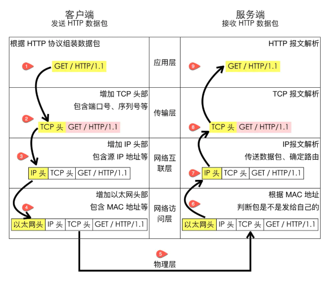
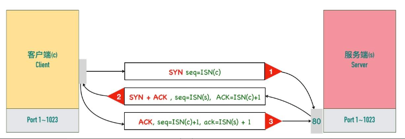
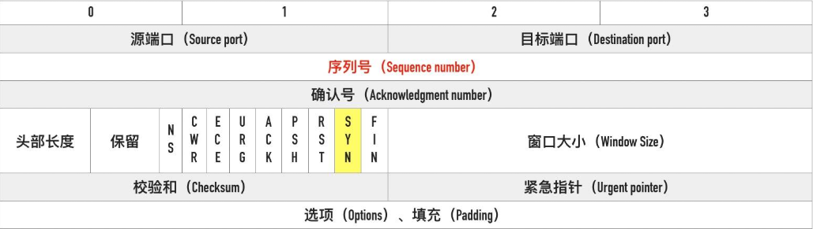
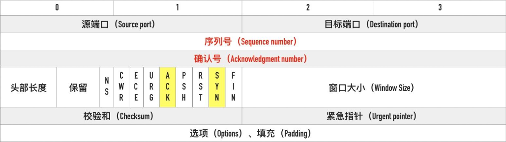
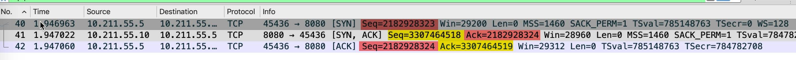
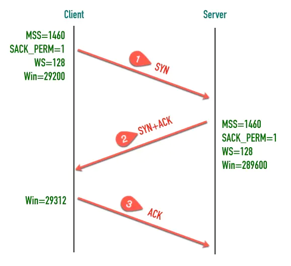
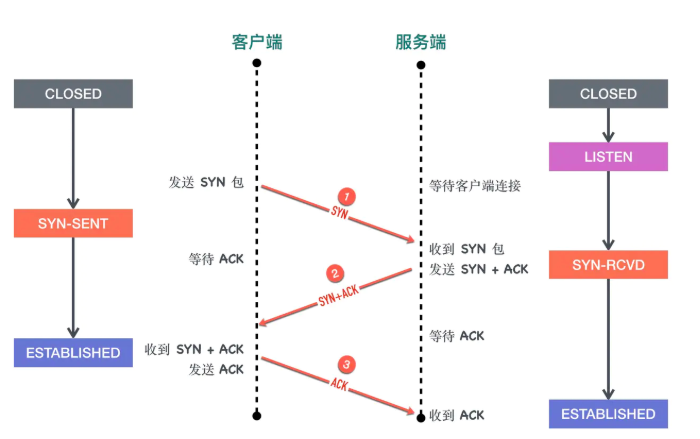
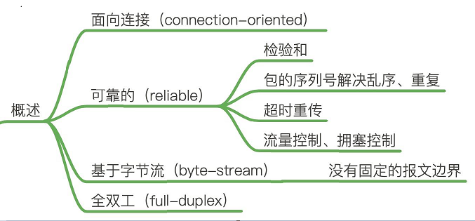

## TCP/IP 网络分层
先来看下网络通讯的分层吧

## 分层的好处是什么呢？
分层的本质是通过分离关注点而让复杂问题简单化，通过分层可以做到：
1. 各层独立：限制了依赖关系的范围，各层之间使用标准化的接口，各层不需要知道上下层是如何工作的，增加或者修改一个应用层协议不会影响传输层协议
2. 灵活性更好：比如路由器不需要应用层和传输层，分层以后路由器就可以只用加载更少的几个协议层
3. 易于测试和维护：提高了可测试性，可以独立的测试特定层，某一层有了更好的实现可以整体替换掉
4. 能促进标准化：每一层职责清楚，方便进行标准化

### TCP 是面向连接的协议
一开始学习 TCP 的时候，我们就被告知 TCP 是面向连接的协议，那什么是面向连接，什么是无连接呢？
1. 面向连接（connection-oriented）：面向连接的协议要求正式发送数据之前需要通过「握手」建立一个逻辑连接，结束通信时也是通过有序的四次挥手来断开连接。
2. 无连接（connectionless）：无连接的协议则不需要

### 三次握手建立连接
建立连接的过程是通过「三次握手」来完成的，顾名思义，通过三次数据交换建立一个连接。 通过三次握手协商好双方后续通信的起始序列号、窗口缩放大小等信息。先来看一张图吧；

三次握手的最重要的是交换彼此的 ISN（初始序列号），序列号怎么计算来的可以暂时不用深究，我们需要重点掌握的是包交互过程中序列号变化的原理。

1. 客户端发送的一个段是 SYN 报文，这个报文只有 SYN 标记被置位。

SYN 报文不携带数据，但是它占用一个序号，下次发送数据序列号要加一。客户端会随机选择一个数字作为初始序列号（ISN）

为什么 SYN 段不携带数据却要消耗一个序列号呢？

这是一个好问题，不占用序列号的段是不需要确认的（都没有内容确认个啥），比如 ACK 段。SYN 段需要对方的确认，需要占用一个序列号。后面讲到四次挥手那里 FIN 包也有同样的情况，在那里我们会用一个图来详细说明。

**凡是消耗序列号的 TCP 报文段，一定需要对端确认。如果这个段没有收到确认，会一直重传直到达到指定的次数为止。**

2. 服务端收到客户端的 SYN 段以后，将 SYN 和 ACK 标记都置位

SYN 标记的作用与步骤 1 中的一样，也是同步服务端生成的初始序列号。ACK 用来告知发送端之前发送的 SYN 段已经收到了，「确认号」字段指定了发送端下次发送段的序号，这里等于客户端 ISN 加一。 与前面类似 SYN + ACK 端虽然没有携带数据，但是因为 SYN 段需要被确认，所以它也要消耗一个序列号。

3. 客户端发送三次握手最后一个 ACK 段，这个 ACK 段用来确认收到了服务端发送的 SYN 段。因为这个 ACK 段不携带任何数据，且不需要再被确认，这个 ACK 段不消耗任何序列号。看下完整的握手流程，如下图：

除了交换彼此的初始序列号，三次握手的另一个重要作用是交换一些辅助信息，比如最大段大小（MSS）、窗口大小（Win）、窗口缩放因子（WS)、是否支持选择确认（SACK_PERM）等等。

#### 初始序列号（Initial Sequence Number, ISN）
初始的序列号并非从 0 开始，通信双方各自生成，一般情况下两端生成的序列号不会相同。生成的算法是 ISN 随时间而变化，会递增的分配给后续的 TCP 连接的 ISN。

一个建议的算法是设计一个假的时钟，每 4 微妙对 ISN 加一，溢出 2^32 以后回到 0，这个算法使得猜测 ISN 变得非常困难。

ISN 能设置成一个固定值呢？

答案是不能，TCP 连接四元组（源 IP、源端口号、目标 IP、目标端口号）唯一确定，所以就算所有的连接 ISN 都是一个固定的值，连接之间也是不会互相干扰的。但是会有几个严重的问题
1. 出于安全性考虑。如果被知道了连接的ISN，很容易构造一个在对方窗口内的序列号，源 IP 和源端口号都很容易伪造，这样一来就可以伪造 RST 包，将连接强制关闭掉了。如果采用动态增长的 ISN，要想构造一个在对方窗口内的序列号难度就大很多了。

2. 因为开启 SO_REUSEADDR 以后端口允许重用，收到一个包以后不知道新连接的还是旧连接的包因为网络的原因姗姗来迟，造成数据的混淆。如果采用动态增长的 ISN，那么可以保证两个连接的 ISN 不会相同，不会串包。

#### 三次握手的状态变化
三次握手过程的状态变化图如下

1. 对于客户端而言：
- 初始的状态是处于 CLOSED 状态。CLOSED 并不是一个真实的状态，而是一个假想的起点和终点。
- 客户端调用 connect 以后会发送 SYN 同步报文给服务端，然后进入 SYN-SENT 阶段，客户端将保持这个阶段直到它收到了服务端的确认包。
- 如果在 SYN-SENT 状态收到了服务端的确认包，它将发送确认服务端 SYN 报文的 ACK 包，同时进入 ESTABLISHED 状态，表明自己已经准备好发送数据。

2. 对于服务端而言：
- 初始状态同样是 CLOSED 状态
- 在执行 bind、listen 调用以后进入 LISTEN状态，等待客户端连接。
- 当收到客户端的 SYN 同步报文以后，会回复确认同时发送自己的 SYN 同步报文，这时服务端进入 SYN-RCVD 阶段等待客户端的确认。
- 当收到客户端的确认报文以后，进入ESTABLISHED 状态。这时双方可以互相发数据了。

另外，TCP同时打开的情况极少，暂不展开。

### TCP 协议是可靠的
IP 是一种无连接、不可靠的协议：它尽最大可能将数据报从发送者传输给接收者，但并不保证包到达的顺序会与它们被传输的顺序一致，也不保证包是否重复，甚至都不保证包是否会达到接收者。

TCP 要想在 IP 基础上构建可靠的传输层协议，必须有一个复杂的机制来保障可靠性。 主要有下面几个方面：
- 对每个包提供校验和，校验不完整就会丢弃；
- 包的序列号解决了接收数据的乱序、重复问题
- 超时重传，TCP 发送数据后会启动一个定时器，等待对端确认收到这个数据包。
- 流量控制、拥塞控制

### TCP 是面向字节流的协议
TCP 是一种字节流（byte-stream）协议，流的含义是没有固定的报文边界。也就是说大小不固定。

### TCP 是全双工的协议
在 TCP 中发送端和接收端可以是客户端/服务端，也可以是服务器/客户端，通信的双方在任意时刻既可以是接收数据也可以是发送数据，每个方向的数据流都独立管理序列号、滑动窗口大小、MSS 等信息。

### 小结
TCP 是一个可靠的（reliable）、面向连接的（connection-oriented）、基于字节流（byte-stream）、全双工（full-duplex）的协议。发送端在发送数据以后启动一个定时器，如果超时没有收到对端确认会进行重传，接收端利用序列号对收到的包进行排序、丢弃重复数据，TCP 还提供了流量控制、拥塞控制等机制保证了稳定性。

